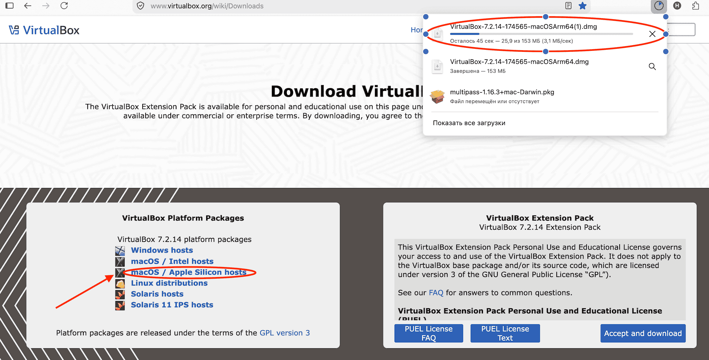
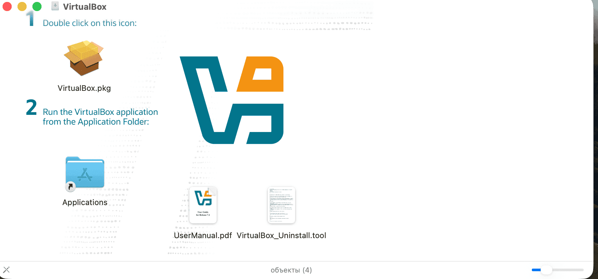
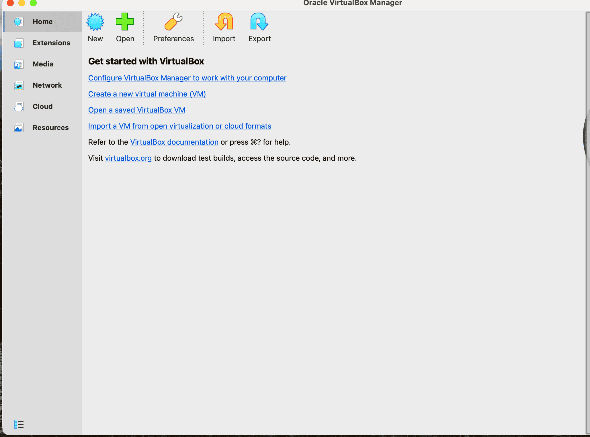
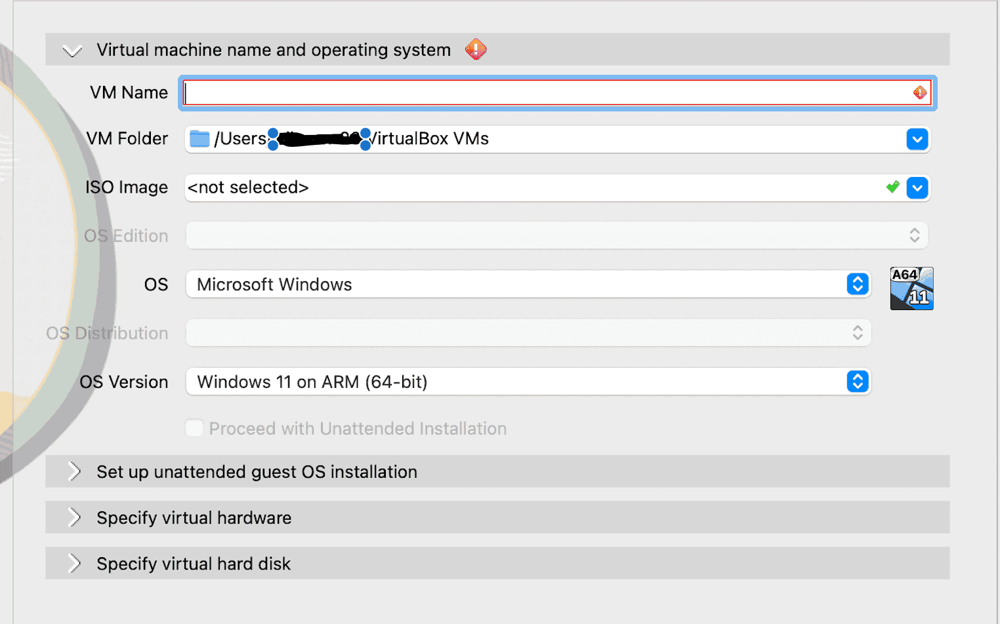
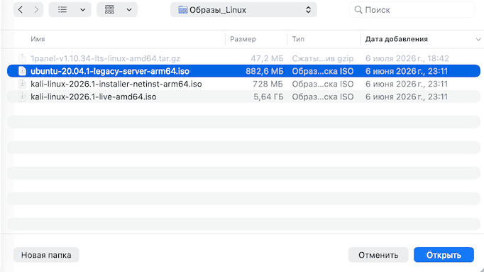
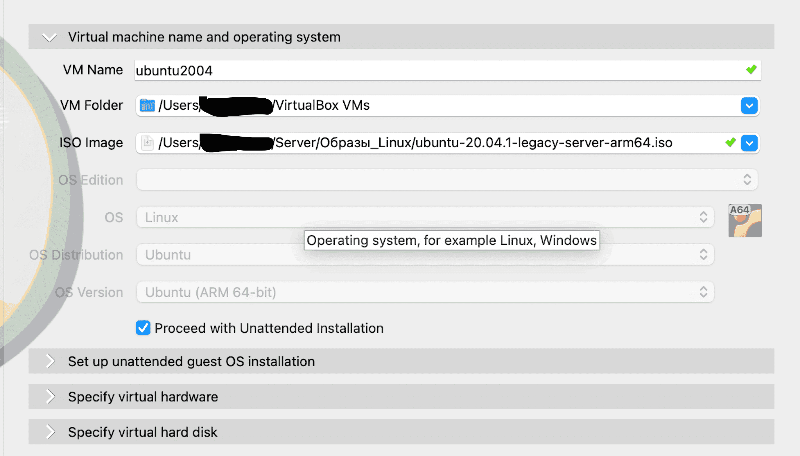
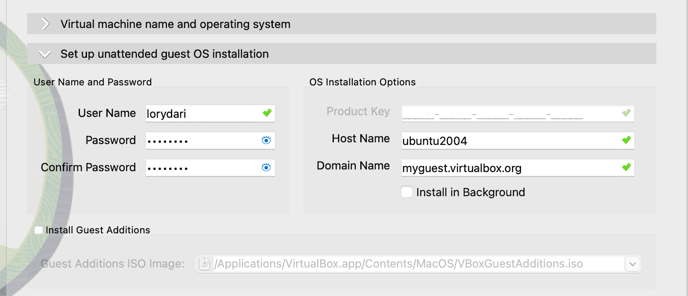
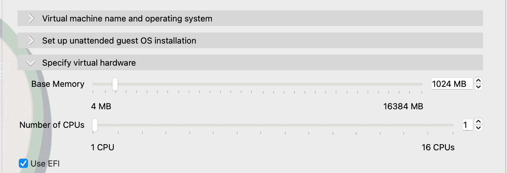
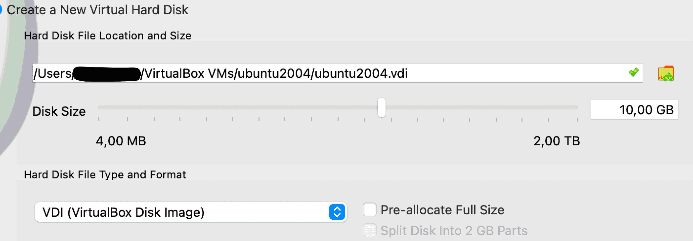

# Установка VirtualBox на macbook m1

Установим и развернем первыю виртаульнаю машину с помощью VirtualBox (VB)

## 1 Установка VB 

- Cкачали образ VB на macbook

- Запустили VB следуя инструкциям

## 2 Находим и скачиваем официальный образ

- [нашли нужный образ](https://cdimage.ubuntu.com/ubuntu-legacy-server/releases/20.04/release/) для нашего компьютера 

`ubuntu-20.04.1-legacy-server-arm64.iso	2020-07-31 16:52 	842M	Legacy server install image for 64-bit ARM (ARMv8/AArch64) computers (standard download)`

- Скачали образ [Ubuntu 20.04 Server LTS](https://cdimage.ubuntu.com/ubuntu-legacy-server/releases/20.04/release/ubuntu-20.04.1-legacy-server-arm64.iso) без графического интерфейса 

## 3 Настройка и первый запуск VM

- Открыли VB

- Выбираем New

- в ISO IMAGE выбираем скачанный образ

Далее настраиваем 

- Set up unattended guest OS installation
в поле username -указываем
в поле password - указываем
в поле Host Name -указываем

- Specify virtual  hardware
выбираем объём CPU и memory

- Specify virtual  hard disk
выбираем объём hard disk

- Запустили виртуальную машину с помощью VirtualBox и установили Ubuntu 20.04 Server LTS

во время установки будут ине сложные интсрукции по установке раскладки клавиатуры и времени и разметки диски - действуйте согласно инструкции

если требуется разметка диска в ручную вот [пример](02-install-ubuntu.md)

