# Сети в Linux

## Введение

для разбора как устроены сети в Linux надо будет установить несколкьо виртуальных машин

Настройка [статических маршрутов](./docs/RUS/static_routing_RUS.md)

## Part 1. Инструмент **ipcalc**

[утилита ipcalc](./docs/RUS/ipcalc_RUS.md)

- Подняли виртуальную машину ws1 и установили  **ipcalc**
`sudo apt install ipcalc`
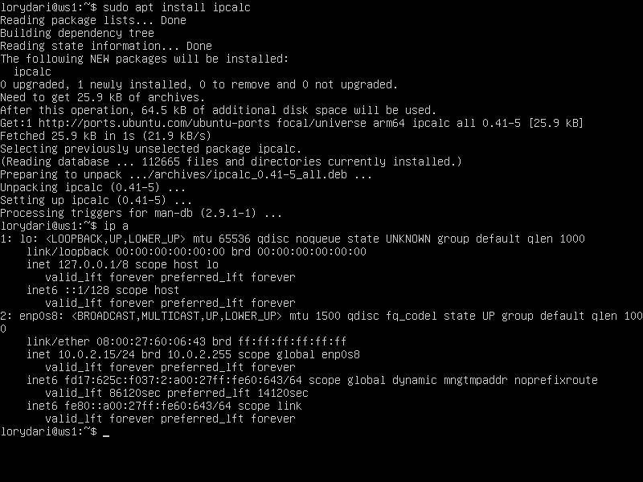

### 1.1. Сети и маски

- 1) Адрес сети *192.167.38.54/13* :
  - Адрес сети: 192.160.0.0/13
  - Диапазон: 192.160.0.0 - 192.167.255.255
  - Маска: 255.248.0.0

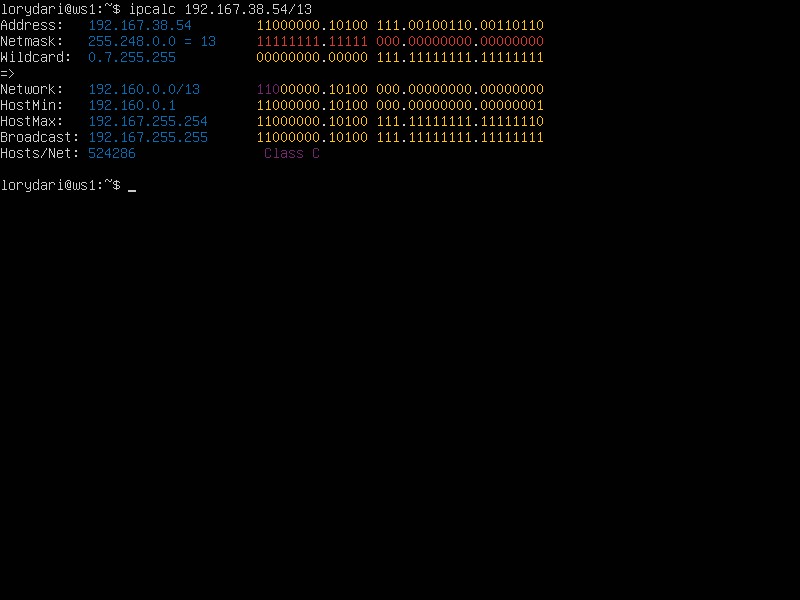


- 2) Перевод маски *255.255.255.0* 
  - в префиксную /24 и двоичную запись 11111111.11111111.11111111.00000000, 
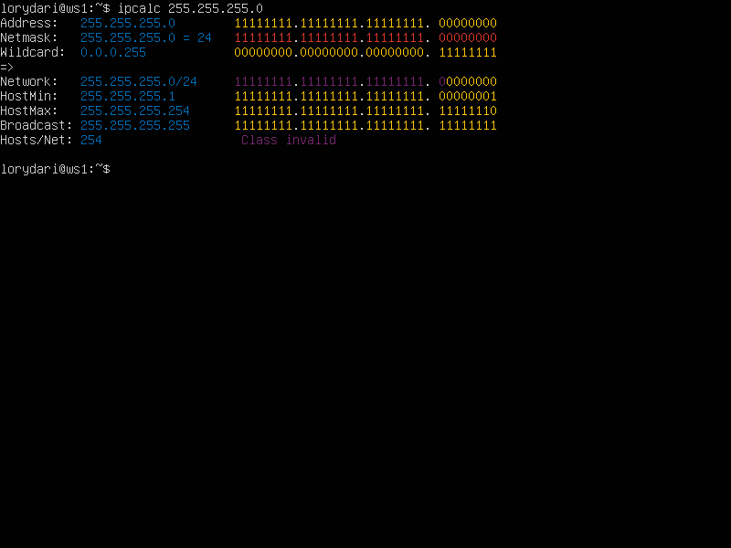
   - */15* в обычную 255.254.0.0  и двоичную 11111111.11111110.00000000.00000000 
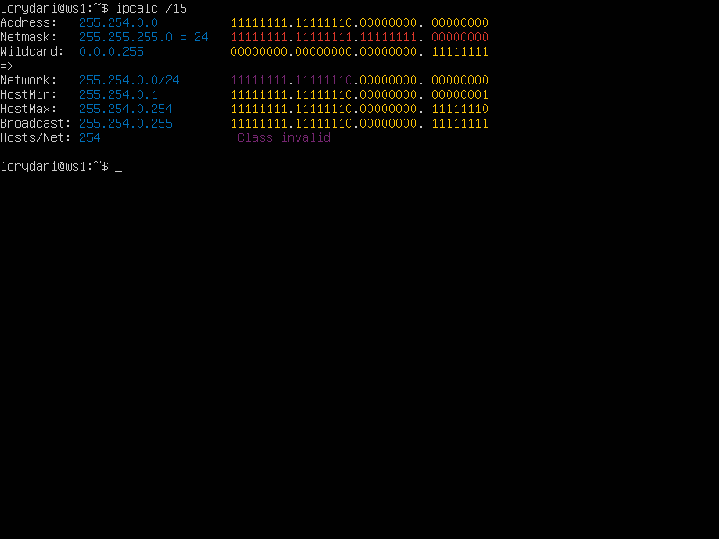
  - *11111111.11111111.11111111.11110000* в обычную 255.255.255.240 (11110000 = 128 + 64 + 32 + 16 = 240) и префиксную /28
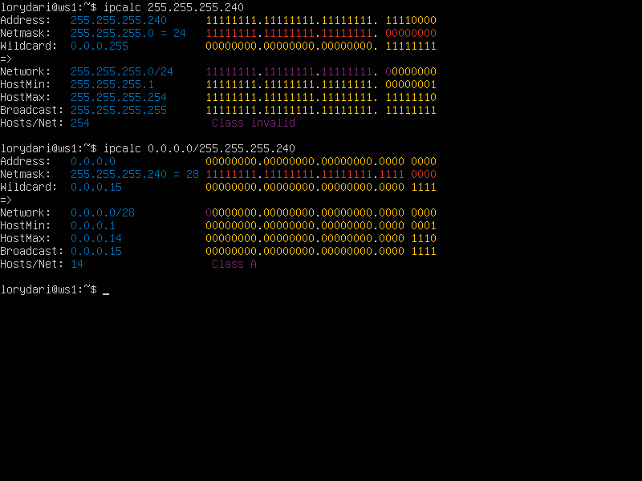
- 3) Минимальный и максимальный хост в сети *12.167.38.4* при масках: 
  - */8* Минимальный 12.0.0.1 и максимальный хост 12.255.255.254 
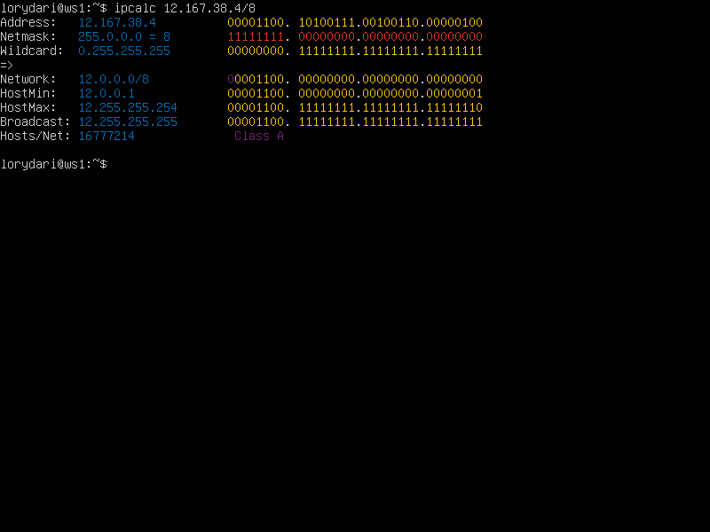
  - *11111111.11111111.00000000.00000000*, Сеть: 12.167.0.0/16 Минимальный хост: 12.167.0.1 Максимальный хост: 12.167.255.254

  - *255.255.254.0* Сеть: 12.167.38.0/23 Минимальный хост: 12.167.38.1 Максимальный хост: 12.167.39.254
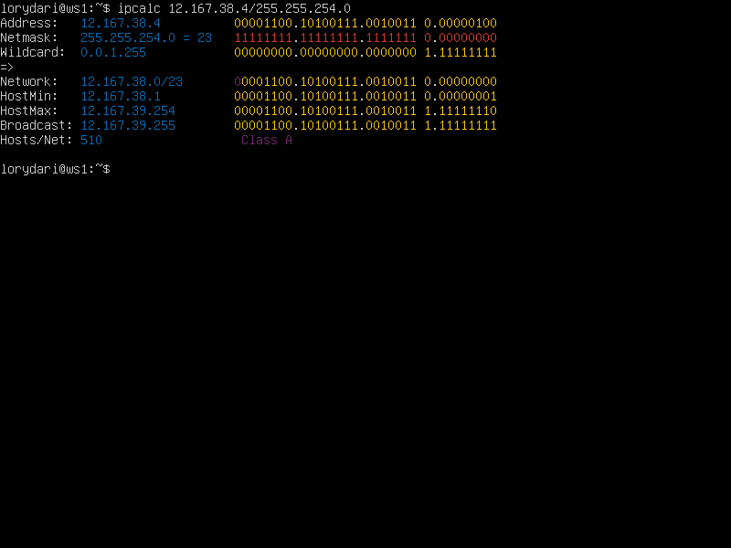
  - */4* Сеть: 0.0.0.0/4 Минимальный хост: 0.0.0.1 Максимальный хост: 15.255.255.254
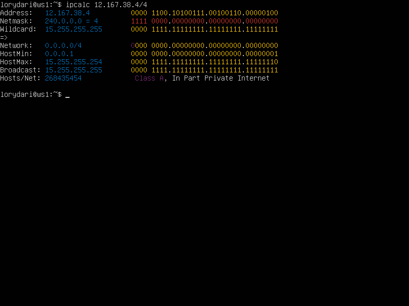

### 1.2. localhost
Определи можно ли обратиться к приложению, работающему на localhost, со следующими IP: 
- 194.34.23.100 - ❌ НЕТ (публичный IP-адрес, не входит в диапазон localhost)

  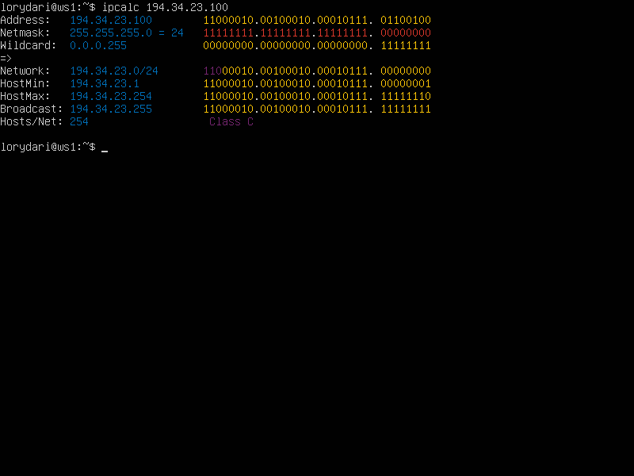

- 127.0.0.2 - ✅ ДА (входит в диапазон 127.0.0.0/8, зарезервированный для loopback)
- 127.1.0.1 - ✅ ДА (входит в диапазон 127.0.0.0/8)
- 128.0.0.1 - ❌ НЕТ (не входит в диапазон localhost 127.0.0.0/8)

  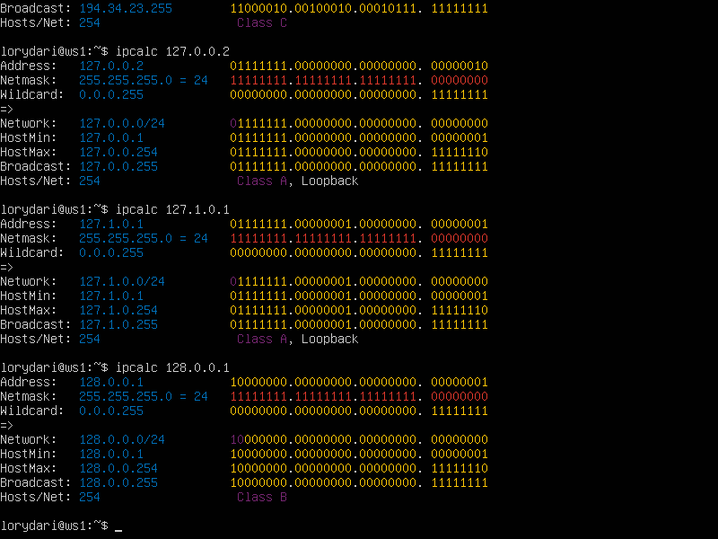 \
Примечание: 
Диапазон localhost - это вся сеть 127.0.0.0/8 (от 127.0.0.1 до 127.255.255.254).

### 1.3. Диапазоны и сегменты сетей

- 1) Какие из перечисленных IP можно использовать в качестве публичного, а какие только в качестве частных: 
   - Частные сети: *10.0.0.45*,  *192.168.4.2*, *172.20.250.4*,   *172.16.255.255*, *10.10.10.10*
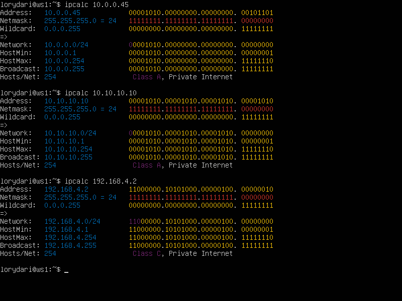
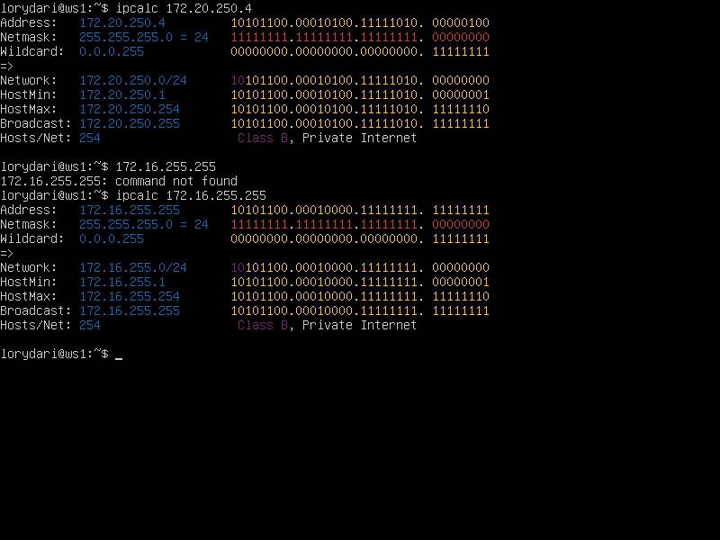
  - Публичные: *134.43.0.2*, *172.0.2.1*, *192.172.0.1*, *172.68.0.2*,  *192.169.168.1*
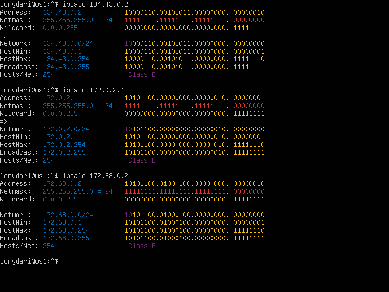
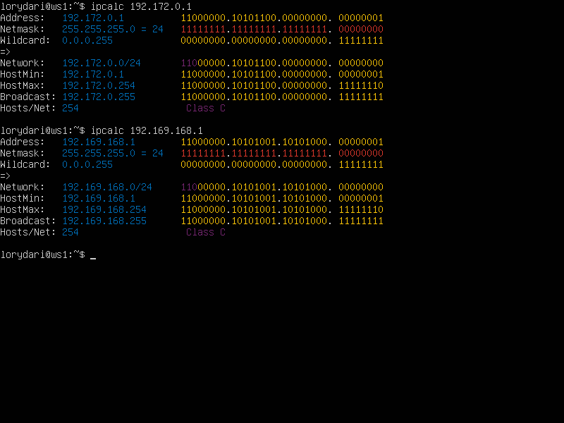

Примечание:
 Частные IP-адреса строго определены стандартом RFC 1918 и используются только внутри локальных сетей. \
 Их нельзя маршрутизировать в интернете. \
Три диапазона частных адресов: 
  -  10.0.0.0 - 10.255.255.255 10.0.0.0/8 ~16 млн Крупные корпоративные сети
  - 172.16.0.0 - 172.31.255.255 172.16.0.0/12 ~1 млн Средние организации
  - 192.168.0.0 - 192.168.255.255 192.168.0.0/16 ~65 тыс Домашние сети, малый бизнес. 


- 2) Какие из перечисленных IP-адресов шлюза возможны у сети *10.10.0.0/18*: *10.0.0.1*, *10.10.0.2*, *10.10.10.10*, *10.10.100.1*, *10.10.1.255* \
Параметры сети:
  - Сеть: 10.10.0.0/18
  - Диапазон хостов: 10.10.0.1 - 10.10.63.254
  - Широковещательный адрес: 10.10.63.255 

- Анализ адресов шлюза:
  - 10.0.0.1 - ❌ НЕТ (вне диапазона сети)
  - 10.10.0.2 - ✅ ДА (входит в диапазон 10.10.0.1 - 10.10.63.254)
  - 10.10.10.10 - ✅ ДА (входит в диапазон)
  - 10.10.100.1 - ❌ НЕТ (10.10.100.1 > 10.10.63.254, вне диапазона)
  - 10.10.1.255 - ✅ ДА (входит в диапазон)

  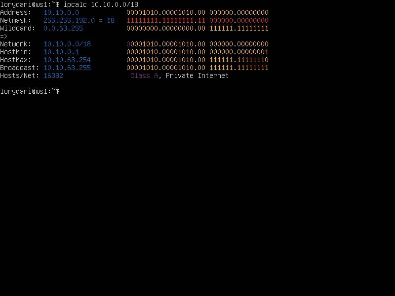

## Part 2. Статическая маршрутизация между двумя машинами

- Подними две виртуальные машины (далее -- ws1 и ws2).
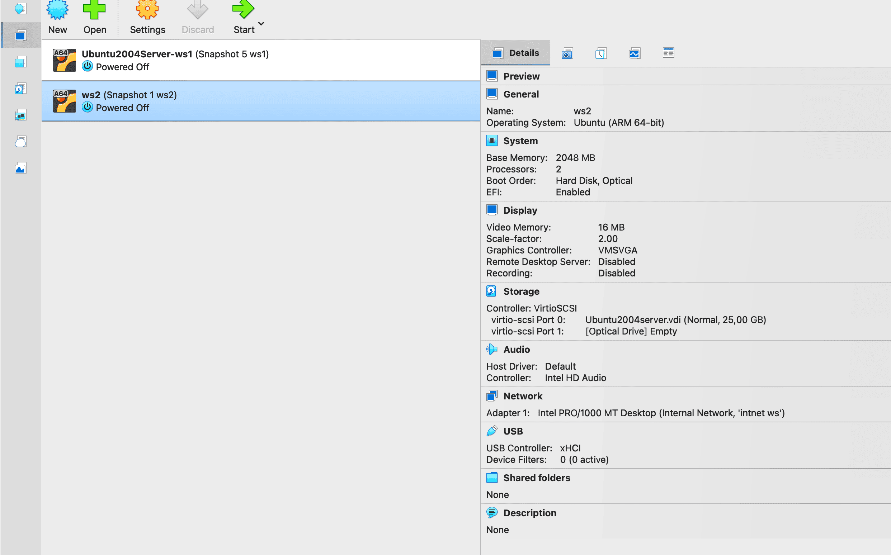
- С помощью команды `ip a` посмотри существующие сетевые интерфейсы.
- ws1 \
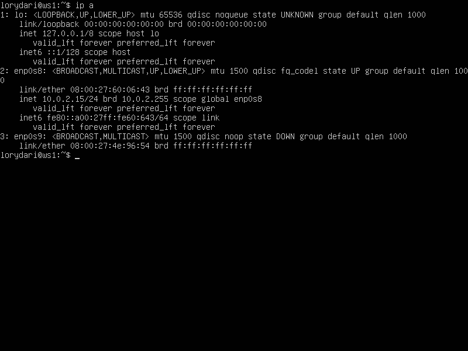
- ws2 \


- Имя сетевого интерфейса enp0s8, соответствующий внутренней сети, на обеих машинах следующие адреса и маски: 

  - ws1 — *192.168.100.10*, маска */16*

    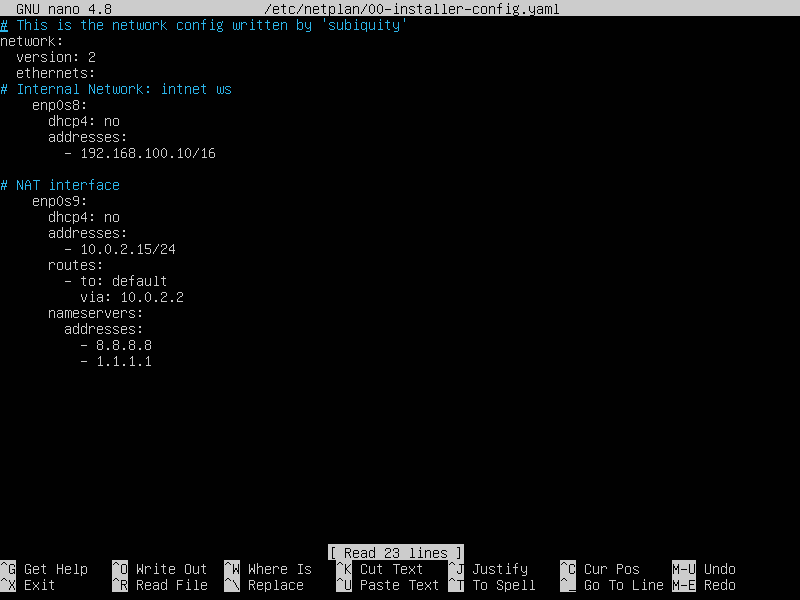 
  
  - ws2 — *172.24.116.8*, маска */12*. 

    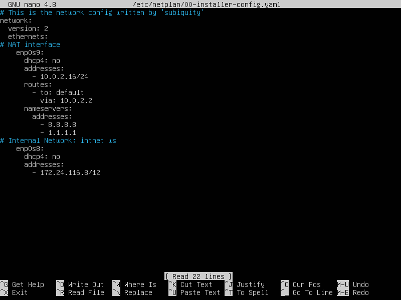


- Выполнили команду `netplan apply` для перезапуска сервиса сети. и выполнили команду `ip a` 

- Имя сетевого интерфейса enp0s9, соответствующий NAT соединению следующие адреса и маски:
  
  - ws1 *10.0.2.15*, маска */24*, 
 
    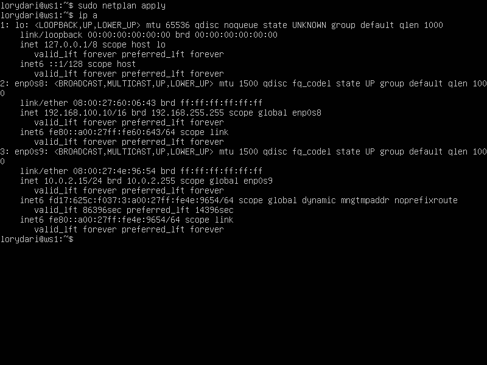 

  - ws2 — *10.0.2.16*, маска */24*.

    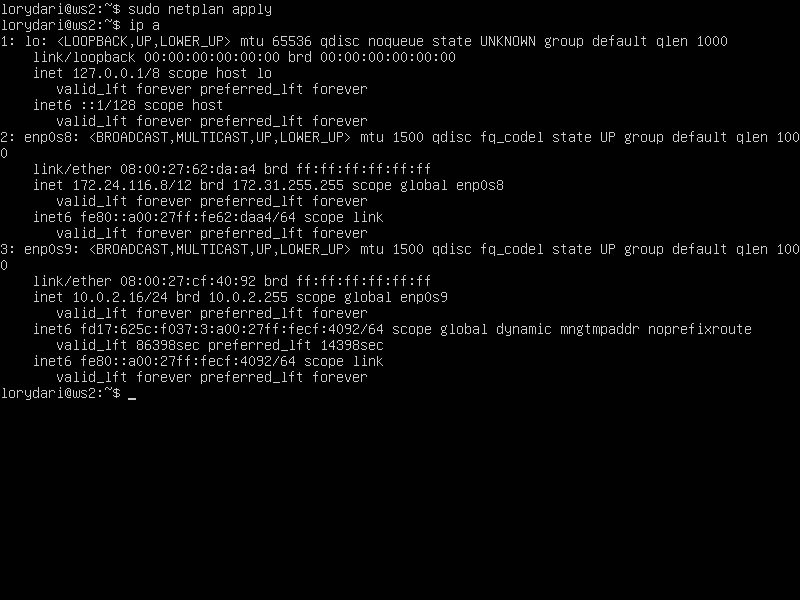

### 2.1. Добавление статического маршрута вручную

- Добавление статического маршрута от одной машины до другой и обратно при помощи команды вида `ip r add`. 
  - ws1 \
  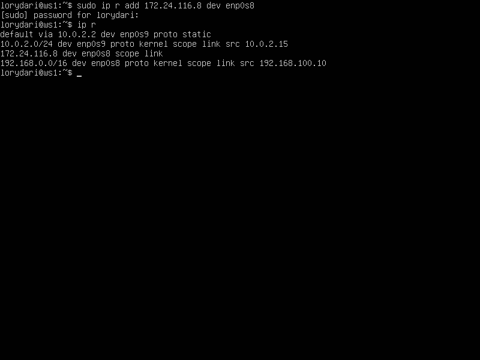

  - ws2 \
  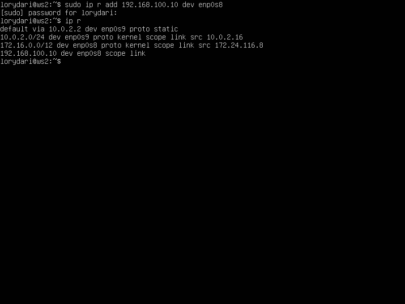
- Пропинговали соединение между машинами. 
  - ws1 \
  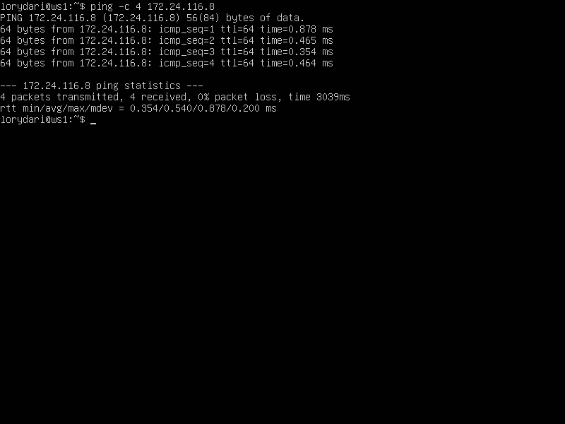

  - ws2 \
  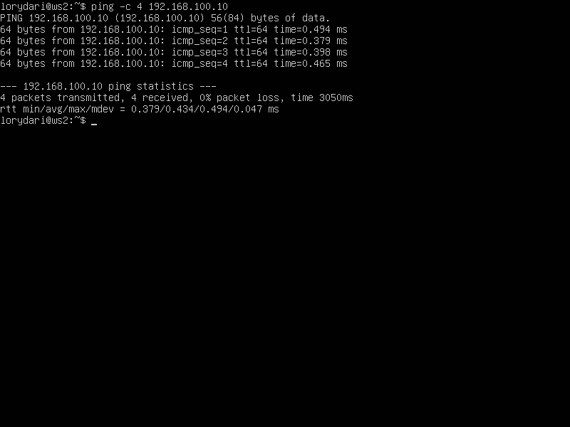

### 2.2. Добавление статического маршрута с сохранением

- Перезапустили машину и ввели `ip r` в итоге маршруты не сохранились на обоих машинах: 
    - ws1 \
  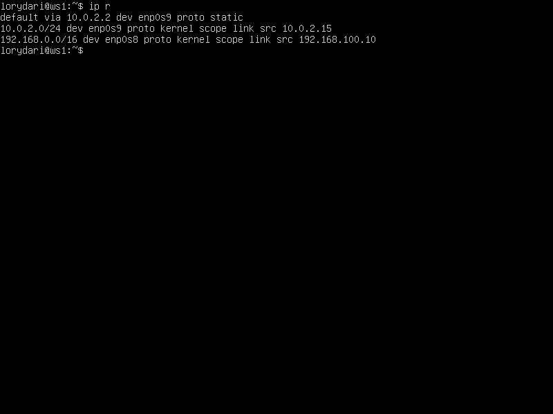

    - ws2 \
  

- Чтобы сохранить маршруты на постоянной основе, добавим статический маршрут от одной машины до другой с помощью файла 
`sudo nano /etc/netplan/00-installer-config.yaml`. 
[00-installer-config.yaml](./configs/etc/netplan/00-installer-config.yaml)

  - ws1 \
  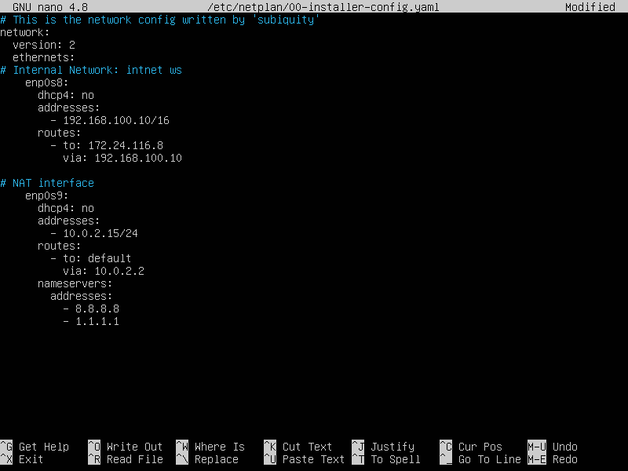

  - ws2 \
  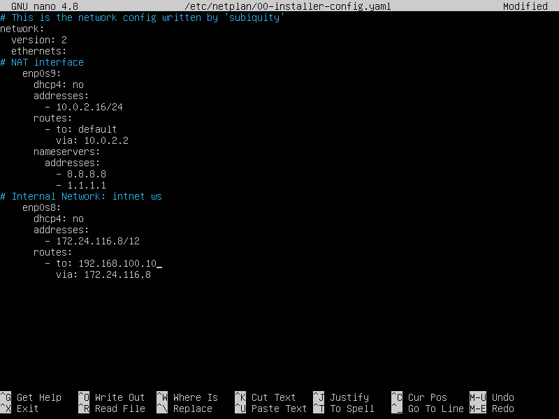

- Пропинговали соединение между машинами:
  - ws1 \
  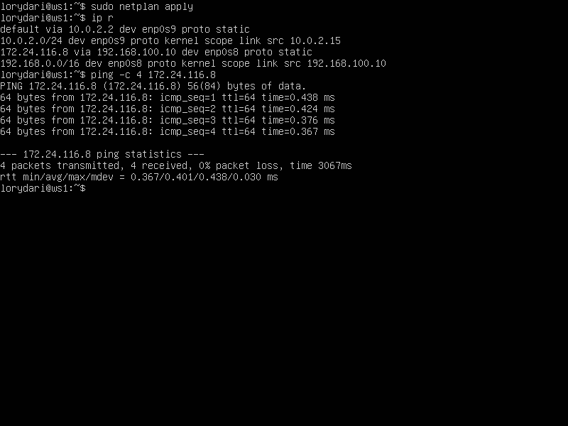

  - ws2 \
  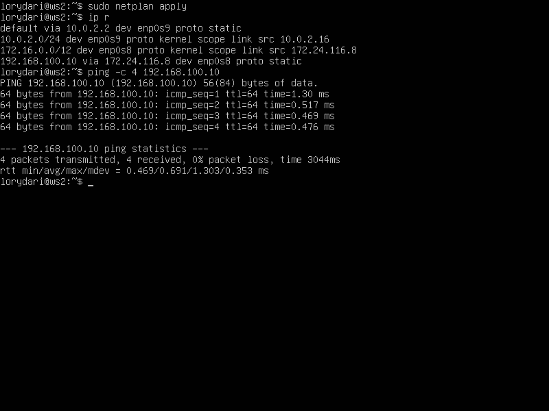

## Part 3. Утилита **iperf3**

[утилита iperf](./docs/RUS/iperf3_RUS.md)

### 3.1. Скорость соединения
- Переведём скорость :
  - 8 Mbps = 1 MB/s, (1 байт = 8 бит, 8/8) 
  - 100 MB/s = 819200 Kbps, (1 MB = 1024 KB, 1 байт = 8 бит, 100 * 1024 * 8 = 819200)
  - 1 Gbps = 1000 Mbps в десятичной системе. (1 Gb = 1000 Mb (или 1024 Mb в двоичной системе))

### 3.2. Утилита **iperf3**
*iperf3* - это утилита командной строки для измерения пропускной способности сети между двумя устройствами. Она позволяет оценить скорость передачи данных между клиентским и серверным устройствами.
- Установим утилиту **iperf3**
`sudo apt install iperf3 -y`
- Запускаем на ws1 в режиме сервера с выводом результата в MB/s: iperf3 -s -f M
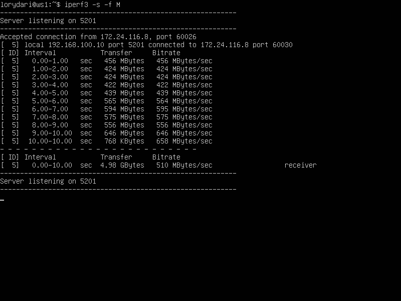
- Запускаем на ws2 в режиме клиента: iperf3 -c 192.168.100.10
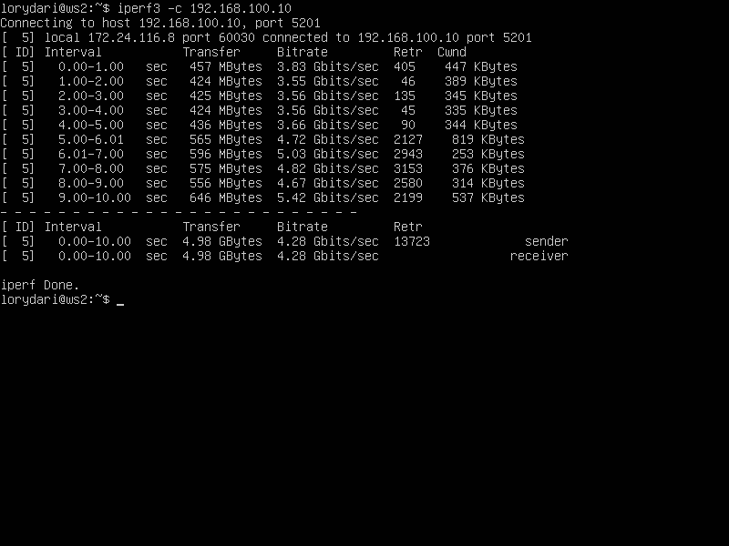
- Измеряем скорость соединения между ws1 и ws2 = 510 MBytes/sec

## Part 4. Сетевой экран

[Firewall](./docs/RUS/firewall_RUS.md)

### 4.1. Утилита **iptables**

- Создаем файл */etc/firewall.sh*, имитирующий файрвол, на ws1 и ws2:
`sudo nano /etc/firewall.sh`

[firewall.sh](./configs/firewall.sh)

```shell
#!/bin/sh

# Удаление всех правил в таблице «filter» (по умолчанию).
iptables -F
iptables -X
```
- Добавили в файл подряд следующие правила:
  - 1) На ws1 примени стратегию, когда в начале пишется запрещающее правило, а в конце пишется разрешающее правило (это касается пунктов 4 и 5). \
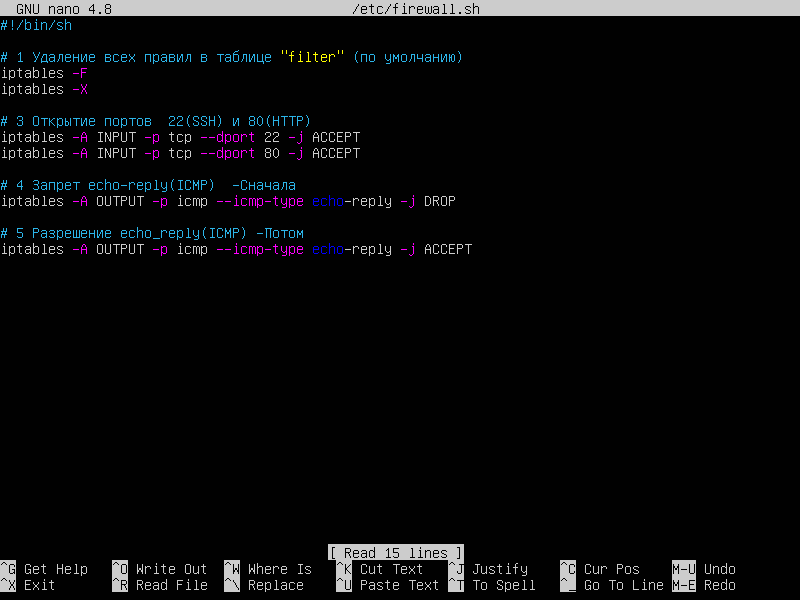
  - 2) На ws2 примени стратегию, когда в начале пишется разрешающее правило, а в конце пишется запрещающее правило (это касается пунктов 4 и 5). \
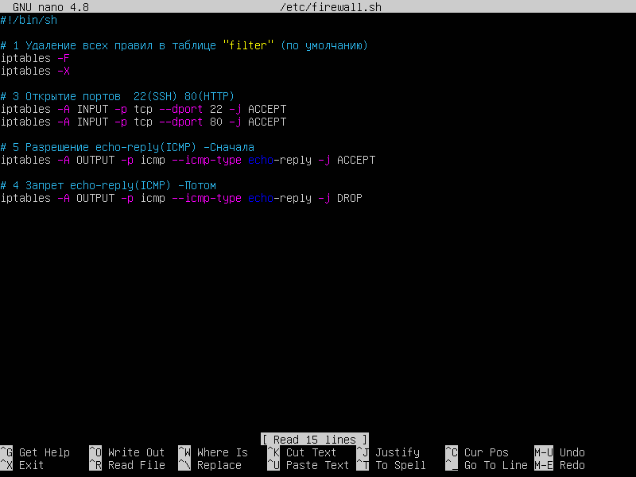
  - 3) Открой на машинах доступ для порта 22 (ssh) и порта 80 (http).
  - 4) Запрети *echo reply* (машина не должна «пинговаться», т. е. должна быть блокировка на OUTPUT).
  - 5) Разреши *echo reply* (машина должна «пинговаться»).

- Запустили файлы на обеих машинах командами: `chmod +x /etc/firewall.sh` \ `/etc/firewall.sh`. \
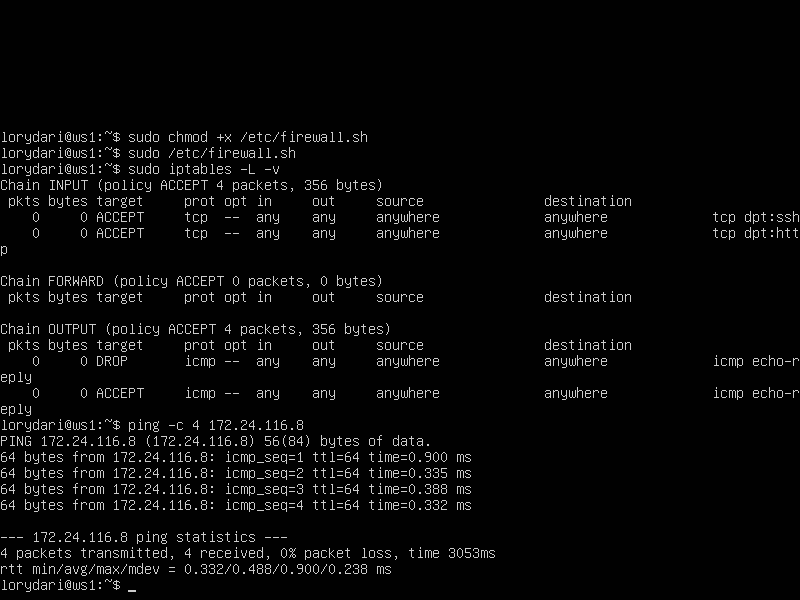 \

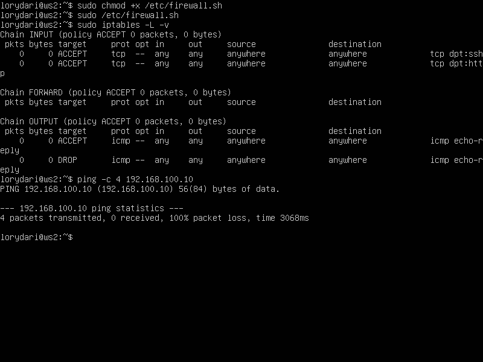

*Объяснение разницы между стратегиями:*
- ws1 (запрет → разрешение):

  - Правило 4 (DROP) идёт первым
  - Правило 5 (ACCEPT) идёт вторым

**Результат:** *iptables применяет правила сверху вниз и останавливается на первом совпадении* \
Пакеты echo-reply блокируются первым правилом (DROP) \
Второе правило (ACCEPT) никогда не выполняется \
*Машина НЕ пингуется (не отправляет echo-reply)*

- ws2 (разрешение → запрет):

  - Правило 5 (ACCEPT) идёт первым
  - Правило 4 (DROP) идёт вторым
Пакеты echo-reply разрешаются первым правилом (ACCEPT)
Второе правило (DROP) никогда не выполняется
*Машина пингуется (отправляет echo-reply)*

**Вывод**: *В iptables важен порядок правил. Применяется первое подходящее правило, остальные игнорируются.*

### 4.2. Утилита **nmap**

- Командой **ping** найдем машину, которая не «пингуется», после чего утилитой **nmap** покажим, что хост машины запущен.

*Проверка: в выводе nmap должно быть сказано: `Host is up`*.
  - ws2 - не пингуется - Host is up есть

  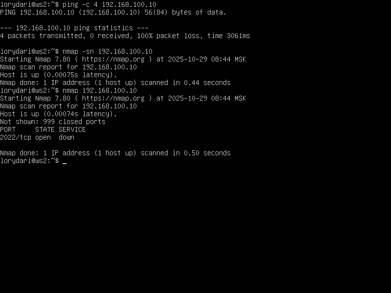

  - ws1 - пингуется 

  

- Сохранили дампы образов виртуальных машин 

  - ws1-Snapshot 

  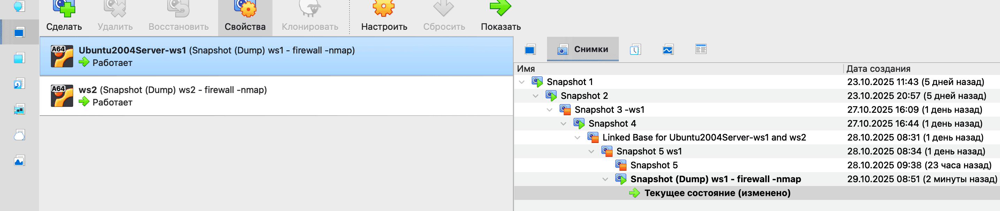

  - ws2-Snapshot

  


## Part 5. Статическая маршрутизация сети

Пример работы сети [network_routing](./docs/RUS/network_routing_RUS.md)

Настроим нашу Сеть: 

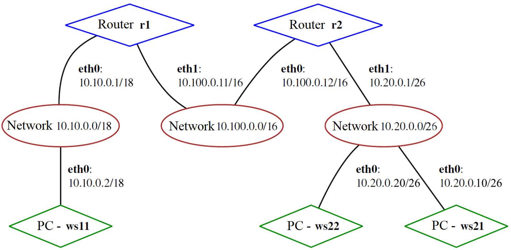

- Подняли пять виртуальных машин (3 рабочие станции (ws11, ws21, ws22) и 2 роутера (r1, r2)). 

  

### 5.1. Настройка адресов машин
- Настроили конфигурации машин в *etc/netplan/00-installer-config.yaml* согласно сети на рисунке.
  - ws11 

  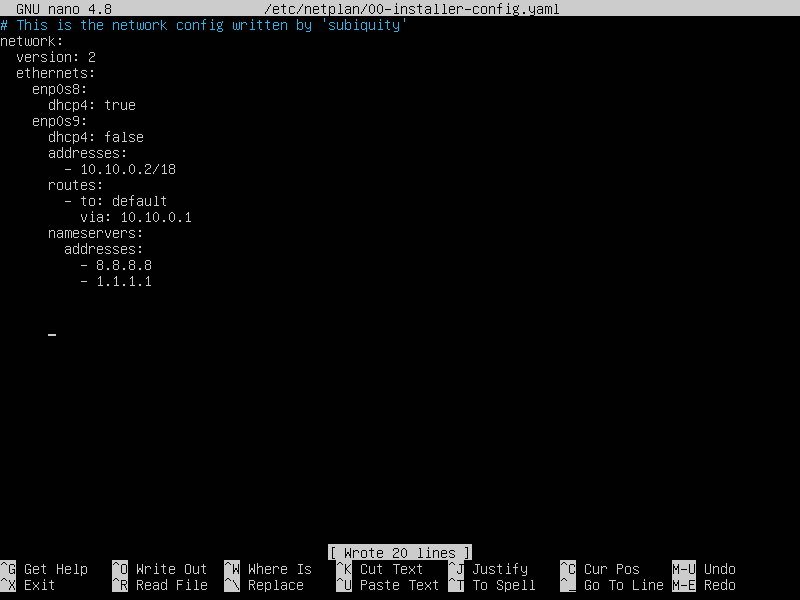

  - ws21 
  
  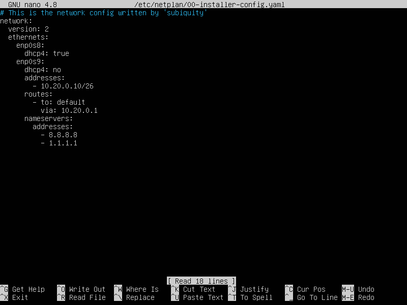

  - ws22

  
  
  - r1 

  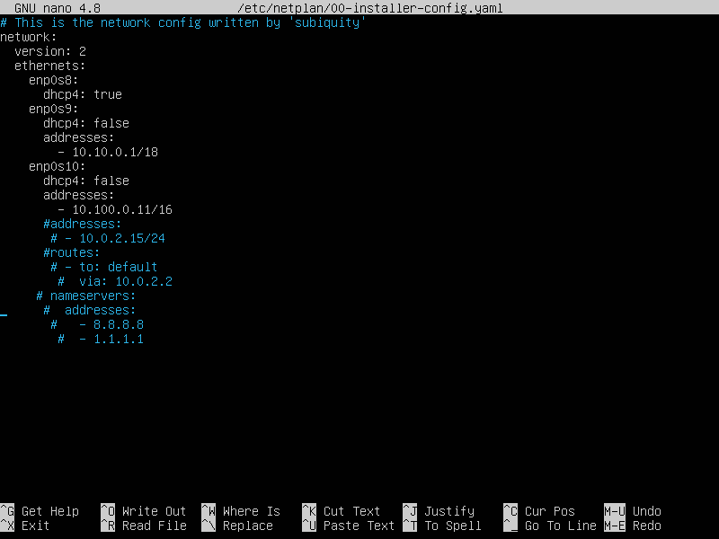
  - r2 

  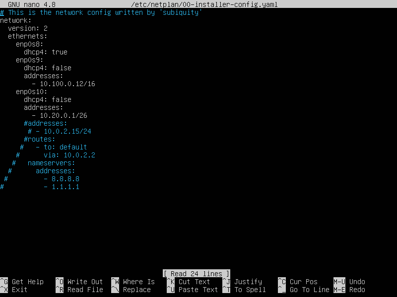

- Перезапустили сервис сети. Ошибок нет. 

- Командой `ip -4 a` проверили, что адрес машины задан верно. 
  
  - ws11 

  
  
  - ws21 

  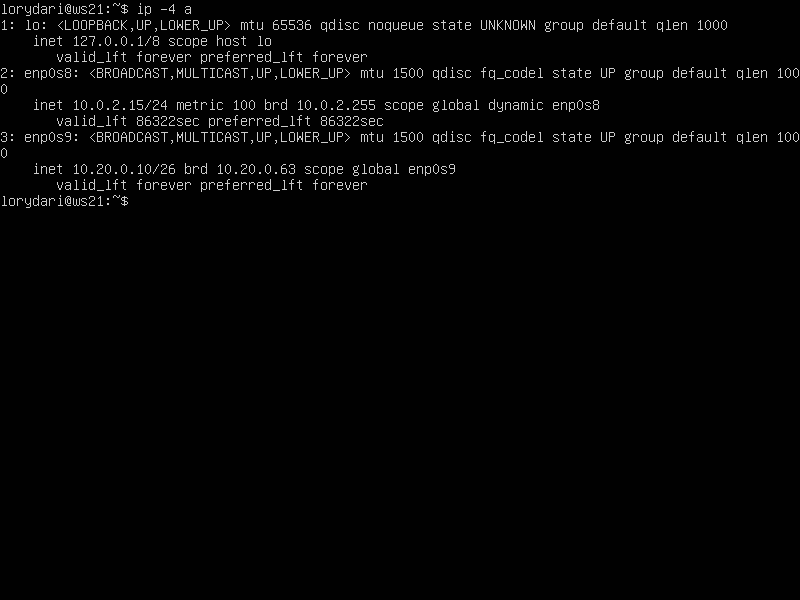
  
  - ws22 

  
  
  - r1 

  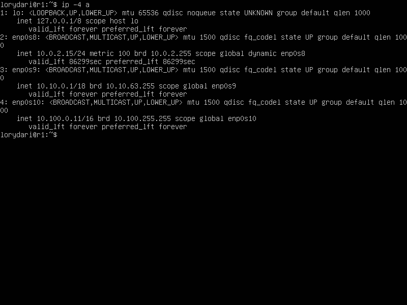
  
  - r2 

  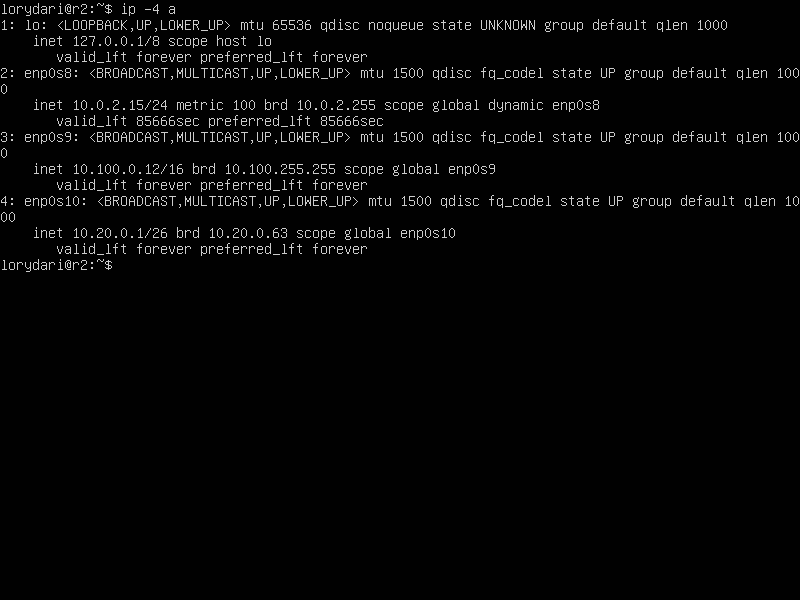

  - Также пропинговали ws22 с ws21. 

  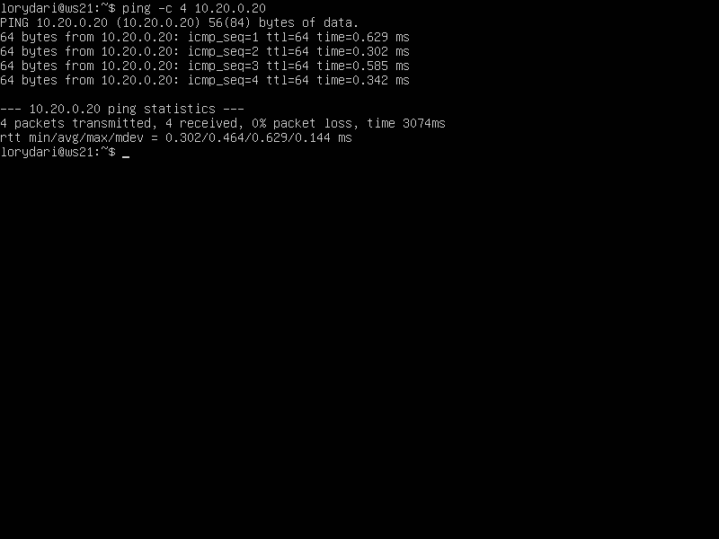
  
  - Аналогично пропинговали r1 с ws11. 

  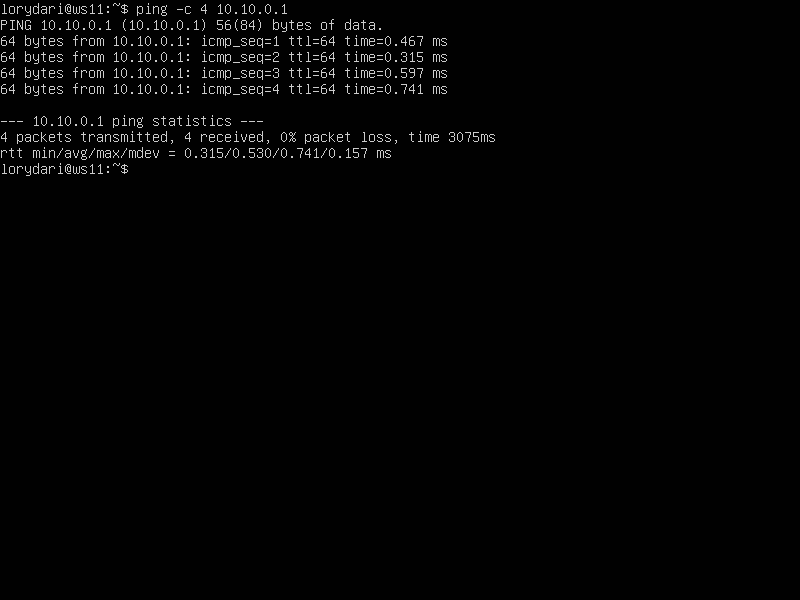


### 5.2. Включение переадресации IP-адресов
- Для включения переадресации IP выполнили команду на роутерах:

`sysctl -w net.ipv4.ip_forward=1`

*При таком подходе переадресация не будет работать после перезагрузки системы.*

  - r1 

  
  
  - r2 
  
  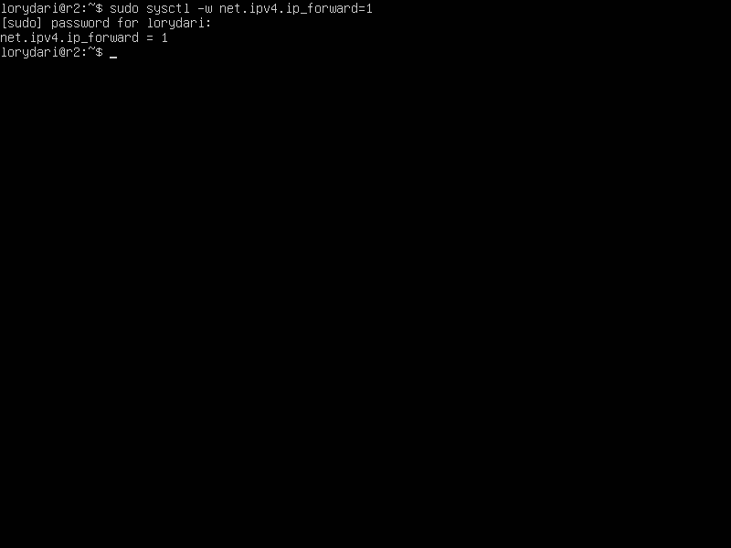

- Открыли файл */etc/sysctl.conf* и добавили в него следующую строку:
`net.ipv4.ip_forward = 1`

*При использовании этого подхода, IP-переадресация включена на постоянной основе.*

  - r1 
  
  
  
  - r2 

  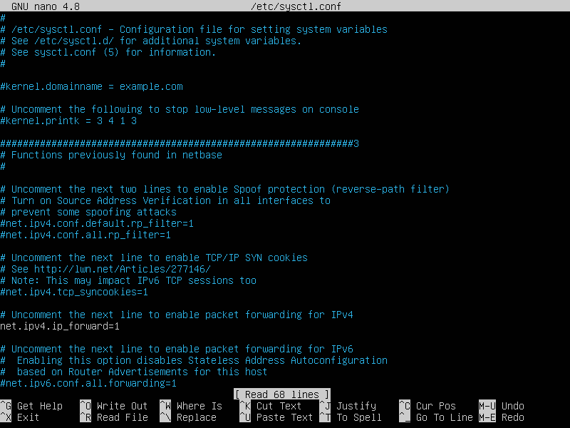


### 5.3. Установка маршрута по умолчанию

Пример вывода команды `ip r` после добавления шлюза:
```
default via 10.10.0.1 dev eth0
10.10.0.0/18 dev eth0 proto kernel scope link src 10.10.0.2
```
- Настроили маршрут по умолчанию (шлюз) для рабочих станций. 
Для этого добавли `default` перед IP-роутера в файле конфигураций.

  - ws11:

  

  - ws21:
  
  
  
  - ws22:
  
  

- Вызвали `ip r` и  добавился маршрут в таблицу маршрутизации.
  
  - ws11:
  
  
  
  - ws21:
  
  
  
  - ws22:
  
  

- Пропинговали с ws11 роутер r2 и покажем на r2, что пинг доходит. 

Для этого используем команду:
`tcpdump -tn -i eth0`

  

- Видим, что пакеты доходят, несмотря на то, что на ws11 написано, что r2 не пингуется:

  

### 5.4. Добавление статических маршрутов

- Добавим в роутеры r1 и r2 статические маршруты в файле конфигураций. 

- Пример для r1 маршрута в сетку 10.20.0.0/26:

```shell
# Добавь в конец описания сетевого интерфейса eth1:
- to: 10.20.0.0
  via: 10.100.0.12
```
- скрины с содержанием изменённого файла *etc/netplan/00-installer-config.yaml* для роутера r1

  

- скрины с содержанием изменённого файла *etc/netplan/00-installer-config.yaml* для роутера r2

  

- Вызовим `ip r` и покажем таблицы с маршрутами на обоих роутерах. 
  - Пример таблицы на r1:
```
10.100.0.0/16 dev eth1 proto kernel scope link src 10.100.0.11

10.20.0.0/26 via 10.100.0.12 dev eth1

10.10.0.0/18 dev eth0 proto kernel scope link src 10.10.0.1
```

  

- Пример таблицы на r12:

  

- Запустим команды на ws11:

`ip r list 10.10.0.0/[маска сети]` и `ip r list 0.0.0.0/0`


Почему для адреса 10.10.0.0/\[маска сети\] был выбран маршрут, отличный от 0.0.0.0/0, хотя он попадает под маршрут по умолчанию.

- **Ответ**:
В Linux маршрутизация работает по принципу longest prefix match (совпадение самой длинной маски). \
Маршрут 10.10.0.0/18 имеет маску /18 (более специфичная) \
Маршрут 0.0.0.0/0 имеет маску /0 (менее специфичная, default) \
Когда пакет идёт к адресу из сети 10.10.0.0/18 (например, 10.10.0.5): \
Система проверяет все маршруты \
Находит два совпадения: \
10.10.0.0/18 — совпадает, маска /18 \
0.0.0.0/0 — совпадает (любой адрес), маска /0 \
Выбирает более специфичный (с большей маской): 10.10.0.0/18 \
Пакет отправляется напрямую через dev enp0s8, без шлюза.

- **Вывод**: *Специфичные маршруты имеют приоритет над маршрутом по умолчанию. Локальная сеть доступна напрямую, без роутера*.


### 5.5. Построение списка маршрутизаторов

Пример вывода утилиты **traceroute** после добавления шлюза:
```
1 10.10.0.1 0 ms 1 ms 0 ms
2 10.100.0.12 1 ms 0 ms 1 ms
3 10.20.0.10 12 ms 1 ms 3 ms
```
- Запустим на r1 команду дампа:
`tcpdump -tnv -i eth0`


- При помощи утилиты **traceroute** построили список маршрутизаторов на пути от ws11 до ws21.\
`traceroute 10.20.0.10`


- Принцип работы traceroute (для отчёта):
traceroute использует поле TTL (Time To Live) в IP-пакетах: 

  - Первый пакет: TTL = 1\
ws11 отправляет пакет с TTL=1\
r1 получает пакет, уменьшает TTL на 1 (становится 0)\
r1 отбрасывает пакет и отправляет ICMP Time Exceeded обратно ws11\
ws11 узнаёт IP первого роутера: 10.10.0.1

  - Второй пакет: TTL = 2
ws11 отправляет пакет с TTL=2\
r1 получает, уменьшает до TTL=1, пересылает дальше\
r2 получает, уменьшает до TTL=0, отбрасывает\
r2 отправляет ICMP Time Exceeded обратно\
ws11 узнаёт IP второго роутера: 10.100.0.12

  - Третий пакет: TTL = 3
Доходит до ws21\
ws21 отвечает ICMP Port Unreachable (или ICMP Echo Reply если используется -I)\
ws11 узнаёт, что достиг цели: 10.20.0.10

- **Вывод**: *traceroute постепенно увеличивает TTL, чтобы каждый роутер на пути "отозвался" сообщением ICMP Time Exceeded*.

### 5.6. Использование протокола **ICMP** при маршрутизации

- Запустили на r1 перехват сетевого трафика, проходящего через eth0 с помощью команды: \
`tcpdump -n -i enp0s9 icmp`

- Пропинговали с ws11 несуществующий IP (например, *10.30.0.111*) с помощью команды: \
`ping -c 1 10.30.0.111`


**Объяснение:**
- ws11 отправляет пакет на 10.30.0.111
- r1 получает пакет, проверяет таблицу маршрутизации
- r1 **не знает** маршрут к сети 10.30.0.0
- r1 отправляет обратно **ICMP Destination Net Unreachable**

- Сохранили dump виртуальных машин


## Part 6. Динамическая настройка IP с помощью **DHCP**

[DHCP](./docs/RUS/DHCP_RUS.md)

- Для r2 настроили в файле */etc/dhcp/dhcpd.conf* конфигурацию службы **DHCP**:
  - 1) Указали адрес маршрутизатора по умолчанию, DNS-сервер и адрес внутренней сети. \
  Пример файла для r2:

```shell
subnet 10.100.0.0 netmask 255.255.0.0 {}

subnet 10.20.0.0 netmask 255.255.255.192
{
    range 10.20.0.2 10.20.0.50;
    option routers 10.20.0.1;
    option domain-name-servers 10.20.0.1;
}
```

  

  - 2) В файле *resolv.conf* пропиши `nameserver 8.8.8.8`.

  

  

- Перезагрузили службу **DHCP** командой \
`systemctl restart isc-dhcp-server`. 

- Машину ws21 перезагрузили при помощи `reboot` и через `ip a` покажем, что она получила адрес. 

- Также пропинговали ws22 с ws21.

  

- Укажим MAC-адрес у ws11, для этого в *etc/netplan/00-installer-config.yaml* \
надо добавить строки: `macaddress: 10:10:10:10:10:BA`, `dhcp4: true`.


- Проверим командой `ip a show enp0s9`, что MAC-адрес у ws11 отображается.


- Для r1 настроим аналогично r2, но сделай выдачу адресов с жесткой привязкой к MAC-адресу (ws11). \
Проведем аналогичные тесты.

  

- Перезагрузили службу **DHCP** командой \
`systemctl restart isc-dhcp-server`.

  

- Машину ws11 перезагрузили при помощи `reboot` и через `ip a` покажем, что она получила адрес.

  

- На машине ws21 запросим обновление ip адреса, \
команда `sudo dhclient -r` освободит ip-адрес, \
команда `sudo dhclient` отправит запрос на получение нового адреса у DHCP сервера.

  


- При настройке DHCP сервера использовались опции:

  - subnet: это ключевое слово, которое позволяет определить подсеть и её параметры

  - range: определяет диапазон IP-адресов, который может быть назначен клиентам

  - option routers: задает IP-адрес шлюза по умолчанию

  - option domain-name-servers: определяет DNS-серверы, которые будут предоставляться клиентам

  - host: позволяет назначить опции для конкретного хоста по его MAC-адресу

- Сохранили дампы образов виртуальных машин.

  


## Part 7. **NAT**

[NAT](./docs/RUS/NAT_RUS.md)

*В данном задании используются виртуальные машины из Части 5.*

- В файле */etc/apache2/ports.conf* на ws22 и r1 \
измени строку `Listen 80` на `Listen 0.0.0.0:80`, то есть сделаем сервер Apache2 общедоступным.

  - на r1 :

  

  - на ws22 :

  

- Запустили веб-сервер Apache командой \
`service apache2 start` \
проверили статус \
`sudo service apache2 status`на ws22 и r1.
  - на r1 :

  

  - на ws22 :

  

- Добавили в фаервол `sudo nano /etc/firewall.sh`, созданный по аналогии с фаерволом из Части 4, на r2 следующие правила:

    - 1) Удаление правил в таблице filter — `iptables -F`;

    - 2) Удаление правил в таблице «NAT» — `iptables -F -t nat`;

    - 3) Отбрасывать все маршрутизируемые пакеты — `iptables --policy FORWARD DROP`.

    

- Запустили файл также, как в Части 4.
`sudo chmod +x /etc/firewall.sh` `sudo /etc/firewall.sh`

- Проверили соединение между ws22 и r1 командой `ping`.

  

*При запуске файла с этими правилами, ws22 не «пингуется» с r1.*

Добавим в файл ещё одно правило:

  - 4) Разрешить маршрутизацию всех пакетов протокола **ICMP**.

  

- Запустим файл также, как в Части 4.

- Проверим соединение между ws22 и r1 командой `ping`.

  

*При запуске файла с этими правилами, ws22  «пингуется» с r1.*

- Добавим в файл ещё два правила:

  - 5) Включим **SNAT**, а именно маскирование всех локальных IPиз локальной сети, находящейся за r2 (по обозначениям из Части 5 — сеть 10.20.0.0).
*Совет: стоит подумать о маршрутизации внутренних пакетов, а также внешних пакетов с установленным соединением.*
  - 6) Включи **DNAT** на 8080 порт машины r2 и добавить к веб-серверу Apache, запущенному на ws22, доступ извне сети.
*Совет: стоит учесть, что при попытке подключения возникнет новое tcp-соединение, предназначенное ws22 и 80 порту.*


- Запустим файл также, как в Части 4. `chmod +x /etc/firewall.sh` \ `/etc/firewall.sh`

*Перед тестированием рекомендуется отключить сетевой интерфейс **NAT** (его наличие можно проверить командой `ip a`) в VirtualBox, если он включен.*
- Проверили соединение по TCP для **SNAT**: для этого с ws22 подключиться к серверу Apache на r1 командой:
`telnet [адрес] [порт]` `telnet 10.100.0.11 80`

  

- Проверили соединение по TCP для **DNAT**: для этого с r1 подключиться к серверу Apache на ws22 командой `telnet 10.100.0.12 8080` (обращаться по адресу r2 и порту 8080).

  

- Сохранили дампы образов виртуальных машин.

  


## Part 8. Дополнительно. Знакомство с **SSH Tunnels**

*В данном задании используются виртуальные машины из Части 5.*

- Запустили на r2 фаервол с правилами из Части 7.


- Запустили веб-сервер **Apache** на ws22 только на localhost (то есть в файле */etc/apache2/ports.conf* 
изменили строку `Listen 80` на `Listen localhost:80`).


- Проверили статус веб-сервер **Apache** 


- Воспользуемся *Local TCP forwarding* с ws21 до ws22, чтобы получить доступ к веб-серверу на ws22 с ws21. 

  - на ws21 командой `ssh -L 8080:localhost:80 -p 2022 lorydari@10.20.0.20`

  

- Воспользуемся *Remote TCP forwarding* c ws11 до ws22, чтобы получить доступ к веб-серверу:

  - На ws21 и ws22 — разрешите remote forwarding отредактируйте  SSH-сервер: \
`sudo nano /etc/ssh/sshd_config`\
`GatewayPorts yes`\
`AllowTcpForwarding yes`


  - на ws22 Воспользуемся командой `ssh -R 9090:localhost:80 lorydari@10.10.0.2 -p 2022`
  
  

- Для проверки, сработало ли подключение в обоих предыдущих пунктах, перейди во второй терминал (например, клавишами Alt + F2) и выполни команду:
`telnet 127.0.0.1 [локальный порт]`

   - на ws21 

   

   - на ws11 

   

- Сохранили дампы образов виртуальных машин.

  

