# Отчет по проекту "Мониторинг"

## Введение
В данном проекте был настроен полноценный стек мониторинга для приложения, развернутого в Docker Swarm. Были реализованы сбор метрик и логов, их визуализация в Grafana, а также настройка оповещений о критических событиях через Alertmanager.

---

## Part 1. Получение метрик и логов

### 1.1 Использовать Docker Swarm из первого проекта

- Скопировали файлы из проекта DO7 - Dockerfiles и docker-compose.yml и добавили новый image:do9-1-metrics

### 1.2. Интеграция Micrometer в приложение

Для сбора бизнес-метрик в 4 сервиса (`booking-service`, `session-service`, `gateway-service`, `report-service`) добавлена зависимость `micrometer-registry-prometheus` + `spring-boot-starter-actuator`, а эндпоинт `/actuator/prometheus` открыт через настройки в `application.properties`.

Реализованы следующие счётчики:

| Метрика (имя в Prometheus) | Сервис | Что считает |
|---|---|---|
| `rabbitmq_messages_sent_total` | booking-service | отправленные в RabbitMQ сообщения |
| `rabbitmq_messages_processed_total` | report-service | обработанные из RabbitMQ сообщения |
| `bookings_created_total` | booking-service | успешно созданные бронирования |
| `gateway_requests_total` | gateway-service | все запросы, дошедшие до gateway |
| `auth_requests_total` | session-service | запросы на авторизацию (`/authorize`) |

**Где физически лежит код (файлы для проверки):**

- `services/booking-service/pom.xml` — зависимости Micrometer [pom.xml](./services/booking-service/pom.xml)

- `services/booking-service/src/main/resources/application.properties` — настройки actuator [application.properties](./services/booking-service/src/main/resources/application.properties)

- `services/booking-service/.../Statistics/AppMetrics.java` — [регистрация счётчиков](./services/booking-service/src/main/java/com/s21/devops/sample/bookingservice/Statistics/AppMetrics.java) `rabbitmq_messages_sent_total`, `bookings_created_total`

- `services/booking-service/.../Statistics/QueueProducer.java` — [вызов счётчика после отправки в очередь](./services/booking-service/src/main/java/com/s21/devops/sample/bookingservice/Statistics/QueueProducer.java)

- `services/booking-service/.../Service/BookingServiceImplementation.java` — [вызов счётчика после успешного сохранения брони](./services/booking-service/src/main/java/com/s21/devops/sample/bookingservice/Service/BookingServiceImplementation.java)

- `services/session-service/.../Statistics/AppMetrics.java` + Controller/SessionController.java [счётчик](./services/session-service/src/main/java/com/s21/devops/sample/sessionservice/Statistics/AppMetrics.java)  `auth_requests_total`

- `services/gateway-service/.../Statistics/GatewayMetricsFilter.java` — фильтр, считающий [gateway_requests_total](./services/gateway-service/src/main/java/com/s21/devops/sample/gatewayservice/Statistics/GatewayMetricsFilter.java) для всех запросов

- `services/report-service/.../Statistics/AppMetrics.java` + `Statistics/QueueConsumer.java` — счётчик [rabbitmq_messages_processed_total](./services/report-service/src/main/java/com/s21/devops/sample/reportservice/Statistics/AppMetrics.java)

Для сбора кастомных метрик приложения на Java была использована библиотека Micrometer. 
*Метрики доступны для сбора Prometheus по эндпоинту `/actuator/prometheus`.*

- Пересобрали проект `docker compose build`

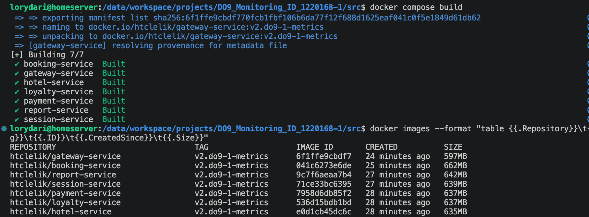


- НЕ Забыли обновить образы `docker images --format "table {{.Repository}}\t{{.Tag}}\t{{.ID}}\t{{.CreatedSince}}\t{{.Size}}`" в Docker Hub

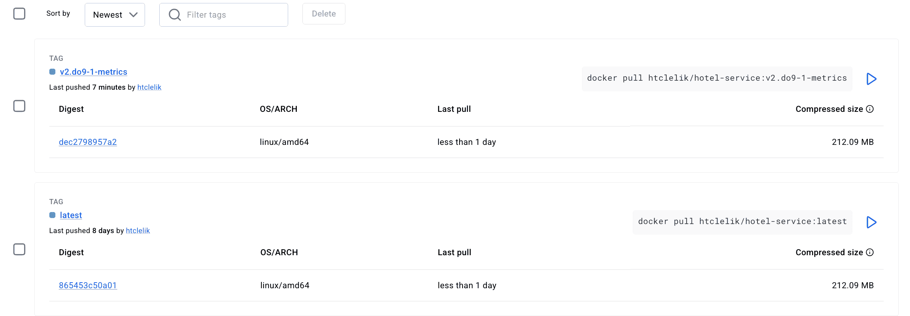

- Обновили `docker-compose-swarm.yml` скрипты запуска и инициализации и `Vagrantfile`
- Подняли виртуальные машины 
- Зашли в `vagrant ssh master-do9` и проверили сервисы

**Проверка вручную:**

```bash
curl http://<host>:<порт-сервиса>/actuator/prometheus
```
Эта команда напрямую обращается к эндпоинту Micrometer у конкретного сервиса и выводит все зарегистрированные метрики в текстовом Prometheus-формате — так можно убедиться, что метрика вообще существует, ещё до того, как её начнёт собирать сам Prometheus.

`curl -i http://localhost:30001/actuator/prometheus`

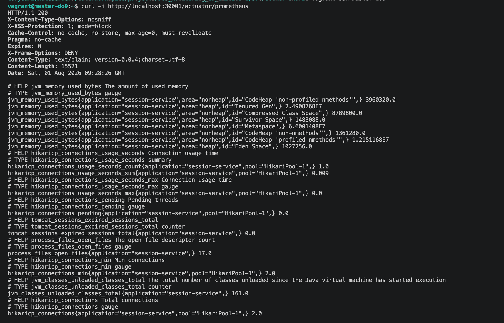

`curl -i http://localhost:30007/actuator/prometheus`

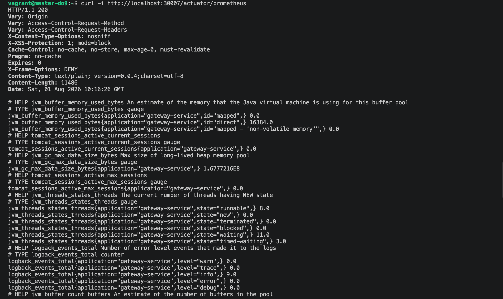


- зашли на worker - где находятся отсальные сервисы  и првоерили вручную

```bash
vagrant@worker-do9-2:~$ docker ps
CONTAINER ID   IMAGE                                       COMMAND                  CREATED        STATUS        PORTS      NAMES
b166e5189769   portainer/agent:2.19.5                      "./agent"                26 hours ago   Up 26 hours              portainer_agent.qv7jgbv27eubf0hqexr8b0ah9.j756pr5kl763e97foo46movz4
4d0eaf9a9628   htclelik/booking-service:v2.do9-1-metrics   "/__cacert_entrypoin…"   26 hours ago   Up 26 hours   8083/tcp   s21_booking-service.1.r0xtn1gd172729tda8snxqdaf
40ddf943d035   htclelik/report-service:v2.do9-1-metrics    "/__cacert_entrypoin…"   26 hours ago   Up 26 hours   8086/tcp   s21_report-service.1.p32s7h09x4bclhaem5eztb3w0
d4db2d86c11b   htclelik/payment-service:v2.do9-1-metrics   "/__cacert_entrypoin…"   26 hours ago   Up 26 hours   8084/tcp   s21_payment-service.1.5wb8a8xi58s9xclg5yj6yx2f6
```

`docker exec -it 4d0eaf9a9628 sh -c "wget -qO- http://localhost:8083/actuator/prometheus"`

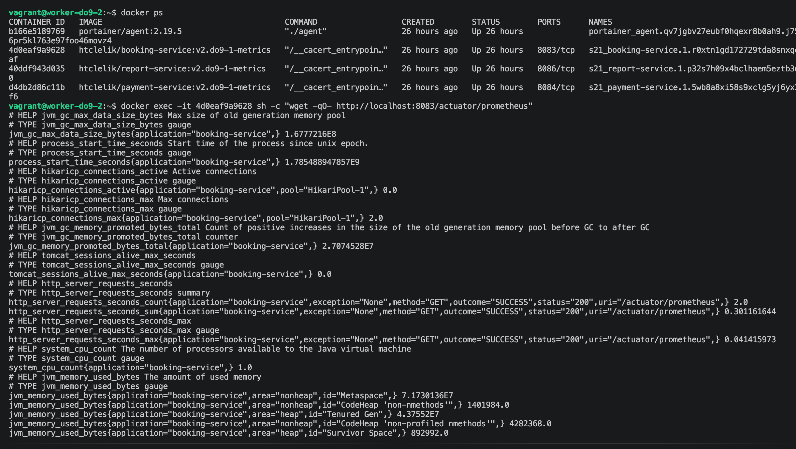

`docker exec -it 40ddf943d035 sh -c "wget -qO- http://localhost:8086/actuator/prometheus"`

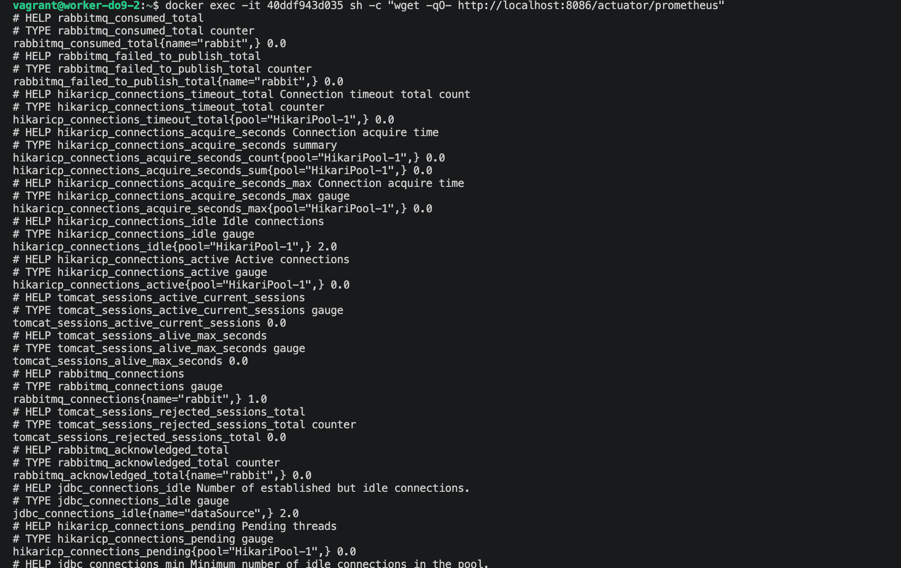
---


### 1.3. Добавление логов приложения с помощью Loki
Для сбора логов в контейнеры с приложениями был добавлен агент **Promtail**. Он считывает логи из стандартного вывода (stdout/stderr) контейнеров и отправляет их в Loki.

Для сбора логов выбран агент **Promtail** (а не Docker Loki-driver-плагин) — по двум причинам: во-первых, это архитектура, описанная в методических материалах курса ("ядро Loki + агенты"); во-вторых, Promtail деплоится как обычный сервис стека (`mode: global`), а не требует ручной установки плагина на каждой ноде Swarm по SSH.

> На момент сдачи Promtail находится в статусе end-of-life (с 2 марта 2026, официальный преемник — Grafana Alloy), но продолжает штатно работать. Используется последняя выпущенная версия образа: `grafana/promtail:3.6.11`.

**Как это работает:** Promtail подключается к Docker-сокету на каждой ноде, автоматически обнаруживает все запущенные контейнеры (без ручного перечисления сервисов), читает их логи и пушит в Loki (`http://loki:3100/loki/api/v1/push`), проставляя метки `container_name` и `service` для удобных LogQL-запросов.

- `monitoring-stack/promtail/promtail-config.yml` — конфигурация [Promtail](./docker-swarm/shared/monitoring-stack/promtail/promtail-config.yml) (discovery + relabeling)

- `monitoring-stack/loki/loki-config.yml` — конфигурация самого [Loki](./docker-swarm/shared/monitoring-stack/loki/loki-config.yml)

**Проверка вручную:**

```bash
curl -G -s "http://<manager-ip>:3100/loki/api/v1/query_range" \
  --data-urlencode 'query={service="booking-service"}'
```
Эта команда напрямую опрашивает API Loki через LogQL-запрос — селектор `{service="booking-service"}` фильтрует только логи нужного сервиса по метке, которую проставил Promtail.

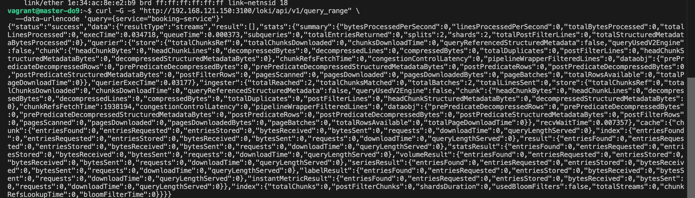

---
### 1.4. Создание стека мониторинга в Docker Swarm

Был создан файл [docker-stack-monitoring.yml](./docker-swarm/shared/monitoring-stack/docker-stack-monitoring.yml) для развертывания стека. В него вошли следующие сервисы:

*   **Prometheus Server** (порт 9090)
*   **Loki** (порт 3100)
*   **Promtail** (для сбора логов и отправки в Loki)
*   **node_exporter** (сбор метрик хостов/нод)
*   **blackbox_exporter** (проверка доступности эндпоинтов, например, google.com)
*   **cAdvisor** (сбор метрик Docker-контейнеров)

*Пример конфигурации [prometheus.yml](./docker-swarm/shared/monitoring-stack/prometheus/prometheus.yml) внутри стека:*

*Пример конфигурации [blackbox.yml](./docker-swarm/shared/monitoring-stack/blackbox/blackbox.yml) внутри стека:*

- Развернули стэк с помощью скрипта [install_monitoring](./docker-swarm/shared/monitoring-stack/install_monitoring.sh)

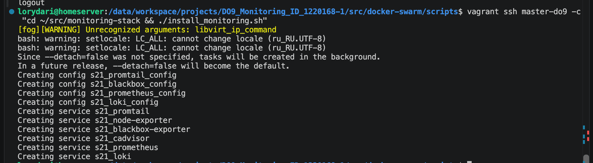

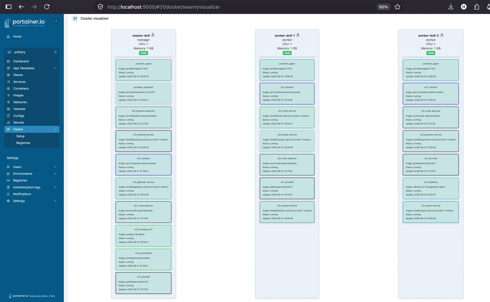

- Проверка получения метрик
После развертывания стека (`docker stack deploy -c docker-stack-monitoring.yml monitoring`) метрики успешно начали поступать в Prometheus.

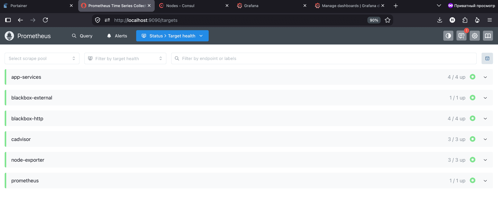
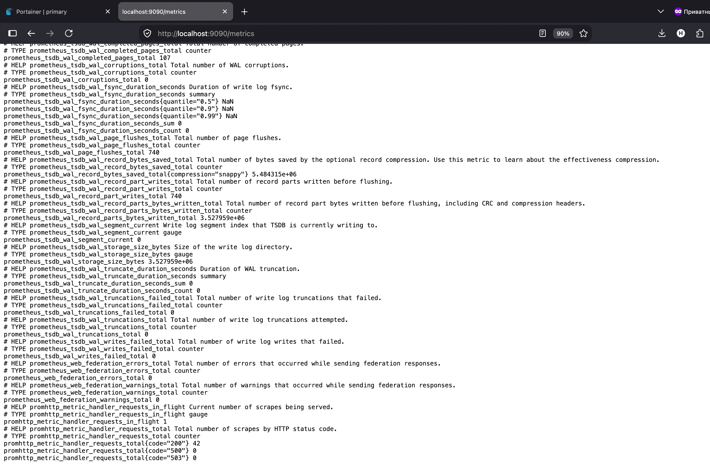
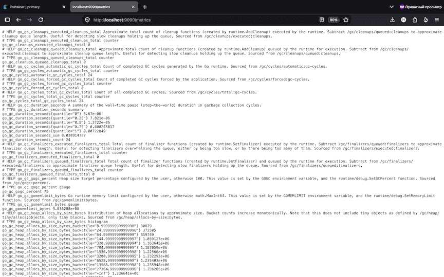

---

## Part 2. Визуализация

### 2.1. Развертывание Grafana
Grafana была добавлена как новый сервис в стек мониторинга (`image: grafana/grafana:latest`, порт 3000). В качестве Data Sources были добавлены Prometheus и Loki.

### 2.2. Создание дашборда
Был создан дашборд "Infrastructure & App Monitoring" со следующими панелями и PromQL/LogQL запросами:

**Метрики инфраструктуры (node_exporter & cAdvisor):**
1.  **Количество нод:** `count(node_uname_info)`
2.  **Количество контейнеров:** `count(container_last_seen)`
3.  **Количество стеков:** `count(count by (container_label_com_docker_stack_namespace) (container_last_seen))`
4.  **Использование CPU по сервисам:** `sum(rate(container_cpu_usage_seconds_total{name!=""}[5m])) by (name)`
5.  **Использование CPU по ядрам и узлам:** `sum(rate(node_cpu_seconds_total{mode!="idle"}[5m])) by (instance, cpu)`
6.  **Затраченная RAM:** `node_memory_MemTotal_bytes - node_memory_MemAvailable_bytes`
7.  **Доступная и занятая память:** `node_memory_MemAvailable_bytes` (доступная) и `node_memory_MemTotal_bytes - node_memory_MemAvailable_bytes` (занятая)
8.  **Количество CPU:** `count(node_cpu_seconds_total{mode="idle"})`

**Метрики доступности (blackbox_exporter):**
9.  **Доступность google.com:** `probe_success{instance="https://google.com"}`

**Бизнес-метрики приложения (Micrometer):**
10. **Количество отправленных сообщений в rabbitmq:** `rabbitmq_messages_sent_total`
11. **Количество обработанных сообщений в rabbitmq:** `rabbitmq_messages_processed_total`
12. **Количество бронирований:** `app_bookings_total`
13. **Количество полученных запросов на gateway:** `gateway_requests_total`
14. **Количество полученных запросов на авторизацию:** `auth_requests_total`

**Логи (Loki):**
15. **Логи приложения:** 
    ```logql
    {service=~"s21_.+"} |~ "WARN|ERROR"
    ```

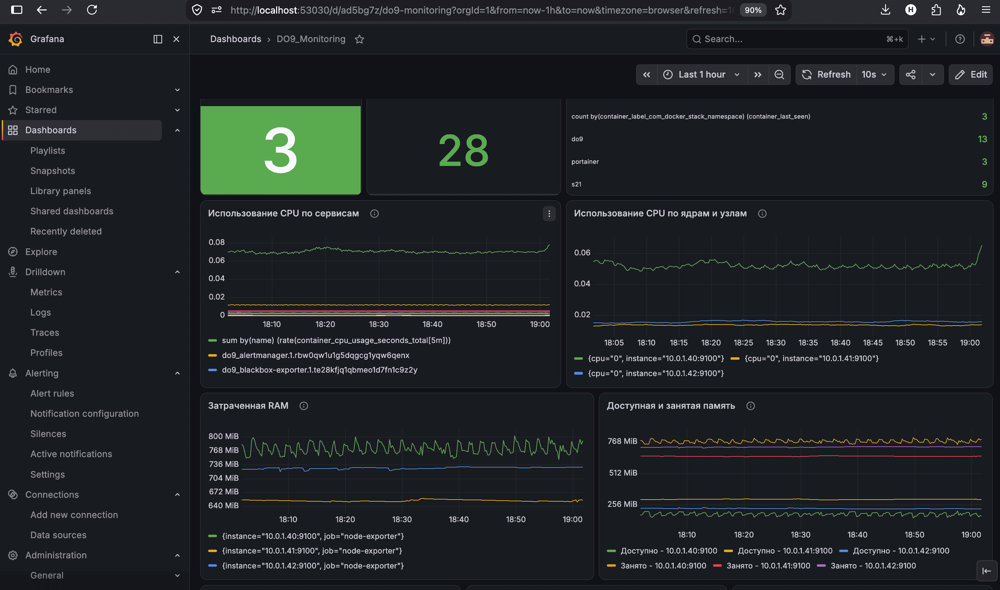
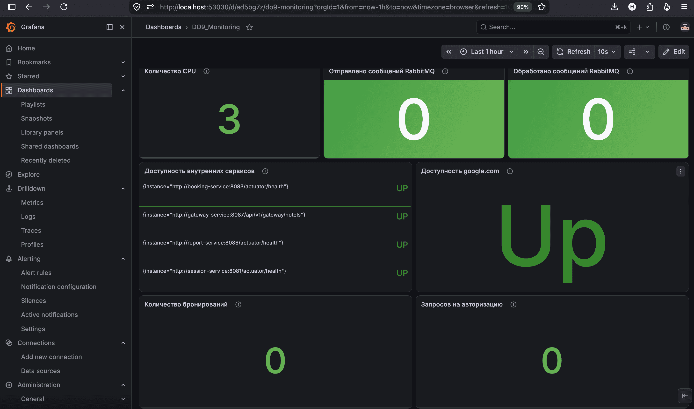
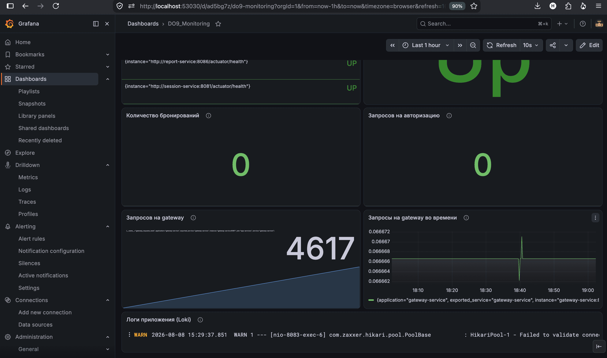

---

## Part 3. Отслеживание критических событий

### 3.1. Развертывание Alertmanager
Alertmanager был добавлен в стек мониторинга. В конфигурацию Prometheus (`prometheus.yml`) был добавлен блок `alerting` для связи с Alertmanager, а также подключен файл с правилами алертов (`alert_rules.yml`).

### 3.2. Настройка критических событий (Alert Rules)

Был создан файл [alert_rules.yml](./docker-swarm/shared/monitoring-stack/prometheus/alert_rules.yml)

### 3.3. Настройка оповещений (Email и Telegram)
В конфигурационном файле [alertmanager.yml](./docker-swarm/shared/monitoring-stack/alertmanager/alertmanager.yml) были настроены маршруты (routes) и получатели (receivers) для отправки уведомлений на личную почту и в Telegram-бот.

```yaml
global:
  resolve_timeout: 5m

route:
  group_by: ['alertname']
  group_wait: 10s
  group_interval: 10s
  receiver: 'combined-notifications'

receivers:
  - name: 'combined-notifications'
    email_configs:
      - to: 'my_personal_email@example.com'
        from: 'alertmanager@example.com'
        smarthost: 'smtp.gmail.com:587'
        auth_username: 'my_personal_email@example.com'
        auth_password: 'app_password' # Используется App Password для Gmail
    telegram_configs:
      - bot_token: '123456789:ABCdefGHIjklMNOpqrsTUVwxyz'
        api_url: 'https://api.telegram.org'
        chat_id: 123456789
        parse_mode: 'HTML'
        message: '{{ .GroupLabels.alertname }}: {{ .Annotations.summary }}'
```

### 3.4. Проверка срабатывания оповещений
Для проверки был искусственно создан тест для контейнера чтобы убедиться, что уведомления доходят.

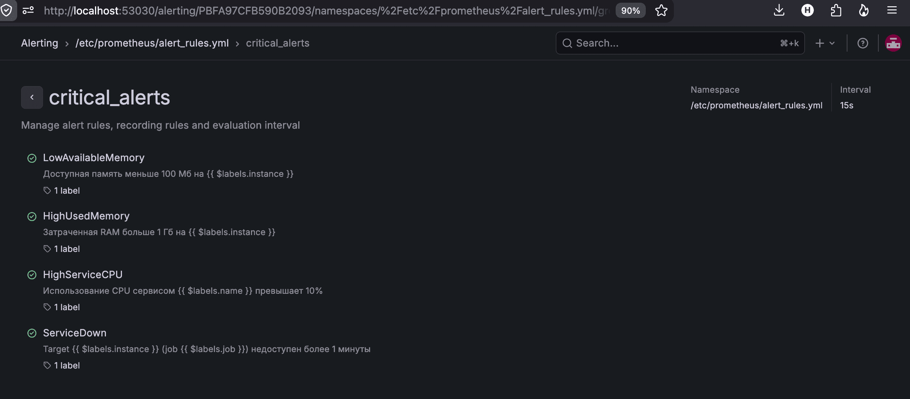
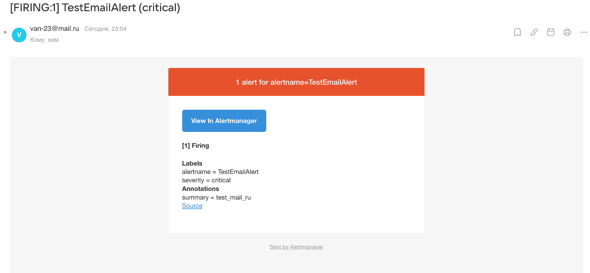
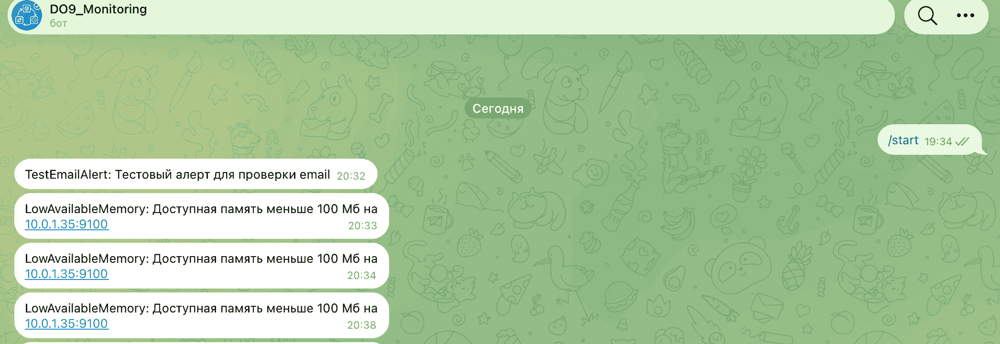
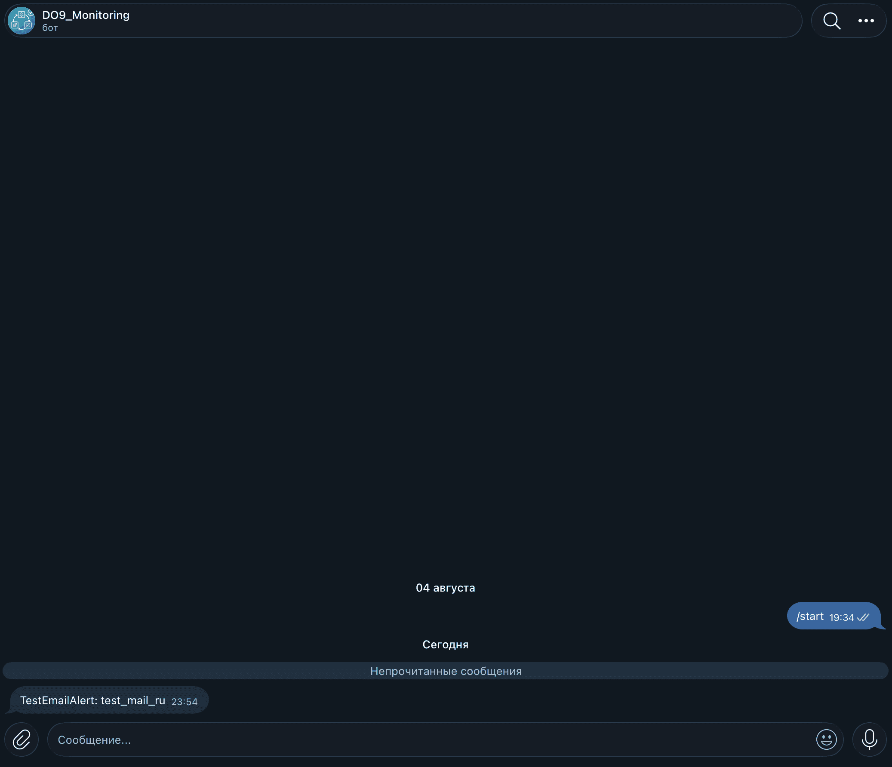

---

## Заключение
В ходе выполнения проекта был успешно настроен комплексный мониторинг. Prometheus собирает метрики инфраструктуры и приложения, Loki агрегирует логи. Grafana предоставляет единую точку визуализации, а Alertmanager гарантирует быстрое реагирование на инциденты через Email и Telegram.
```


