## Simple Monitoring

В данном проекте мы познакомимся с простыми элеменатми мониторинга файловой сиситемы и различные дашборды от файлов до самой системы

> Все скрипты будем запускать в операционной системе **Ubuntu Linux** - предварительно развернем виртуальную машину

### **GoAccess**

GoAccess — это анализатор логов, который может работать с ними в реальном времени, визуализировать информацию и отдавать ее через терминал или через браузер в виде веб-странички. 

### **Prometheus**

Базы данных временных рядов, как следует из их названия, представляют собой системы баз данных, специально разработанные для обработки данных, связанных со временем.

Большинство систем использует реляционные базы данных, основанные на таблицах. 
Базы данных временных рядов работают по-другому.
Данные по-прежнему хранятся в «коллекциях», но эти коллекции имеют общий знаменатель: они агрегируются с течением времени.
По сути, это означает, что для каждой точки, которую можно сохранить, есть связанная с ней метка времени.

Prometheus — это база данных временных рядов, к которой можно присоединить целую экосистему инструментов, чтобы расширить ее функционал. \
Prometheus создан, чтобы мониторить самые разные системы: серверы, базы данных, отдельные виртуальные машины, да почти что угодно.

### **Grafana**

Grafana — платформа для визуализации, мониторинга и анализа данных.
Grafana позволяет пользователям создавать *дашборды* с *панелями*, каждая из которых отображает определенные показатели в течение установленного периода времени.
Каждый *дашборд* универсален, поэтому его можно настроить для конкретного проекта.

*Панель* — базовый элемент визуализации выбранных показателей.

*Дашборд* — набор отдельных панелей, размещенных в сетке с набором переменных (например, имя сервера, приложения и т. д.).


## 1. Генератор файлов


Попрактикуемся в работе с файлами в bash-скриптах. 
Как раз может быть полезно при подготовке тестового окружения для настройки задач мониторинга.

Напишим bash-скрипт. Скрипт запускается с 6 параметрами. Пример запуска скрипта: \
`main.sh /opt/test 4 az 5 az.az 3kb` 

**Параметр 1** — это абсолютный путь. \
**Параметр 2** — количество вложенных папок. \
**Параметр 3** — список букв английского алфавита, используемый в названии папок (не более 7 знаков). \
**Параметр 4** — количество файлов в каждой созданной папке. \
**Параметр 5** — список букв английского алфавита, используемый в имени файла и расширении (не более 7 знаков для имени, не более 3 знаков для расширения). \
**Параметр 6** — размер файлов (в килобайтах, но не более 100).  

Имена папок и файлов должны состоять только из букв, указанных в параметрах, и использовать каждую из них хотя бы один раз.  
Длина этой части имени должна быть от четырех знаков, плюс дата запуска скрипта в формате DDMMYY, отделённая нижним подчёркиванием, например: \
**./aaaz_021121/**, **./aaazzzz_021121** 

При этом если для имени папок или файлов были заданы символы `az`, то в названии файлов или папок не может быть обратной записи: \
**./zaaa_021121/**, т. е. порядок указанных символов в параметре должен сохраняться.

При запуске скрипта в месте, указанном в Параметре 1, должны быть созданы папки и файлы в них с соответствующими именами и размером.  
Скрипт должен остановить работу, если в файловой системе (в разделе /) останется 1 Гб свободного места.  
Запиши лог-файл с данными по всем созданным папкам и файлам (полный путь, дата создания, размер для файлов).

[**01-Scripts**](./src/01/)

## 2. Засорение файловой системы

Напишим bash-скрипт. Скрипт запускается с 3 параметрами. Пример запуска скрипта: \
`main.sh az az.az 3Mb`

**Параметр 1** — список букв английского алфавита, используемый в названии папок (не более 7 знаков). \
**Параметр 2** — список букв английского алфавита, используемый в имени файла и расширении (не более 7 знаков для имени, не более 3 знаков для расширения). \
**Параметр 3** — размер файла (в Мегабайтах, но не более 100).  

Имена папок и файлов должны состоять только из букв, указанных в параметрах, и использовать каждую из них хотя бы 1 раз.  
Длина этой части имени должна быть от 5 знаков, плюс дата запуска скрипта в формате DDMMYY, отделённая нижним подчёркиванием, например: \
**./aaazz_021121/**, **./aaazzzz_021121** 

При этом если для имени папок или файлов были заданы символы `az`, то в названии файлов или папок не может быть обратной записи: \
**./zaaa_021121/**, т. е. порядок указанных в параметре символов должен сохраняться.

При запуске скрипта в различных (любых, кроме путей, содержащих **bin** или **sbin**) местах файловой системы должны быть созданы папки с файлами.
Количество вложенных папок — до 100. Количество файлов в каждой папке — случайное число (для каждой папки своё).  
Скрипт должен остановить работу, когда в файловой системе (в разделе /) останется 1 Гб свободного места.  
Свободное место в файловой системе определять командой: `df -h /`  

Запиши лог-файл с данными по всем созданным папкам и файлам (полный путь, дата создания, размер для файлов).  
В конце работы скрипта выведи на экран время начала работы скрипта, время окончания и общее время его работы. Дополни этими данными лог-файл.

[**02-Scripts**](./src/02/)

## 3. Очистка файловой системы

Напишим bash-скрипт. Скрипт запускается с 1 параметром.
Скрипт должен уметь очистить систему от созданных в [2](#2-засорение-файловой-системы) папок и файлов 3 способами:

1. По лог файлу
2. По дате и времени создания
3. По маске имени (т. е. символы, нижнее подчёркивание и дата).  

Способ очистки задается при запуске скрипта, как параметр со значением 1, 2 или 3.

*При удалении по дате и времени создания пользователем вводятся времена начала и конца с точностью до минуты. Удаляются все файлы, созданные в указанном временном промежутке. Ввод может быть реализован как через параметры, так и во время выполнения программы.*

[**03-Scripts**](./src/03/)

## 4. Генератор логов

Создадим логи, которые можно будет анализировать.

Напишим bash-скрипт или программу на С, генерирующие 5 файлов логов **nginx** в *combined* формате.
Каждый лог должен содержать информацию за один день.

За день должно быть сгенерировано случайное число записей от 100 до 1000.
Для каждой записи должны случайным образом генерироваться:

1. IP (любые корректные, т. е. не должно быть ip вида 999.111.777.777)
2. Коды ответа (200, 201, 400, 401, 403, 404, 500, 501, 502, 503)
3. Методы (GET, POST, PUT, PATCH, DELETE)
4. Даты (в рамках заданного дня лога, должны идти по увеличению)
5. URL запроса агента
6. Агенты (Mozilla, Google Chrome, Opera, Safari, Internet Explorer, Microsoft Edge, Crawler and bot, Library and net tool)

В комментариях к скрипту/программе укажим, что означает каждый из использованных кодов ответа.

[**04-Scripts**](./src/04/)

## 5. Мониторинг

Теперь, когда у нас есть файлы для анализа, мы можем приступить непосредственно к мониторингу.

Напишим bash-скрипт для разбора логов **nginx** из [4](#4-генератор-логов) через **awk**.

Скрипт запускается с 1 параметром, который принимает значение 1, 2, 3 или 4.
В зависимости от значения параметра выведи:

1. Все записи, отсортированные по коду ответа;
2. Все уникальные IP, встречающиеся в записях;
3. Все запросы с ошибками (код ответа — 4хх или 5хх);
4. Все уникальные IP, которые встречаются среди ошибочных запросов.

[**05-Scripts**](./src/05/)

## 6. **GoAccess**

Смотреть на результаты трудов в консоли, конечно, неплохо, но почему бы дополнительно не воспользоваться готовым решением, предоставляющим удобный интерфейс?

С помощью утилиты GoAccess получим ту же информацию, что и в [5](#5-мониторинг).

[**06-Scripts**](./src/06/)

Открой веб-интерфейс утилиты на локальной машине [goaccess_report](./src/test/).
К примеру можно запустить через Vs Code через встроенный "Go Live Server"

## 7. **Prometheus** и **Grafana**

Перейдем к мониторингу состояние системы в целом.

Прежде чем настроим Prometeus и Grafana - 

### Установим Docker Compose

запуск [main.sh](./src/07/main7.sh)

[install docker](./src/07/docker.sh)

### Установи и настрой **Prometheus** и **Grafana** на виртуальную машину.

[prometeus, grafana](./src/07/components.sh)

### Получи доступ к веб-интерфейсам **Prometheus** и **Grafana** с локальной машины.

Пробросим ssh туннели [instruction](./src/07/instruction.sh)

### Добавь на дашборд **Grafana** отображение ЦПУ, доступной оперативной памяти, свободное место и кол-во операций ввода/вывода на жестком диске.

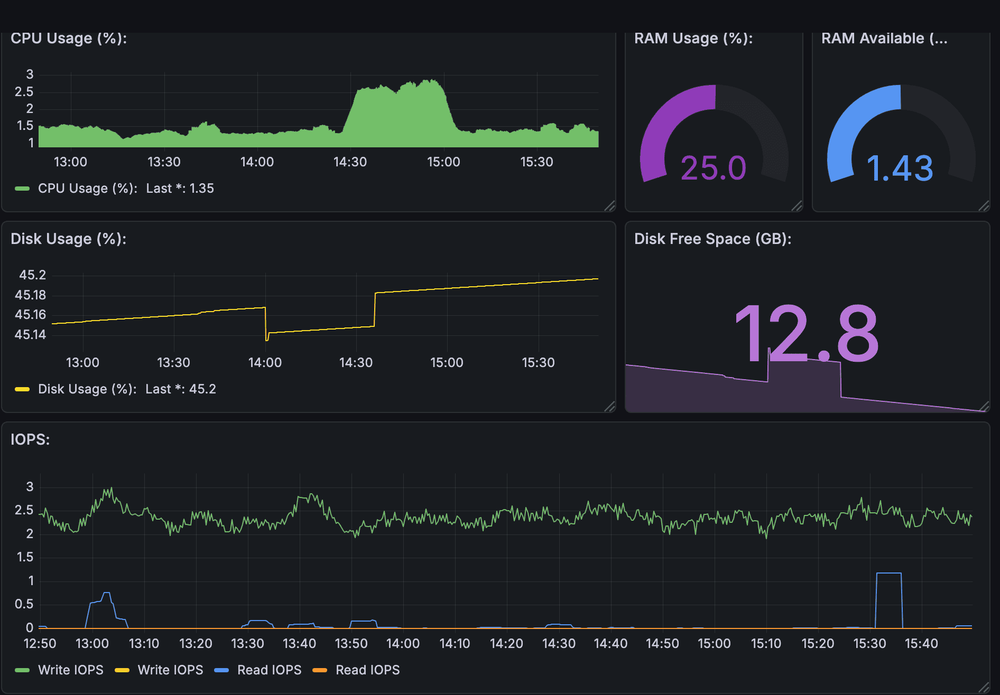


### Посмотри на нагрузку жесткого диска (место на диске и операции чтения/записи).

Запусти свой bash-скрипт из [2](#2-засорение-файловой-системы).

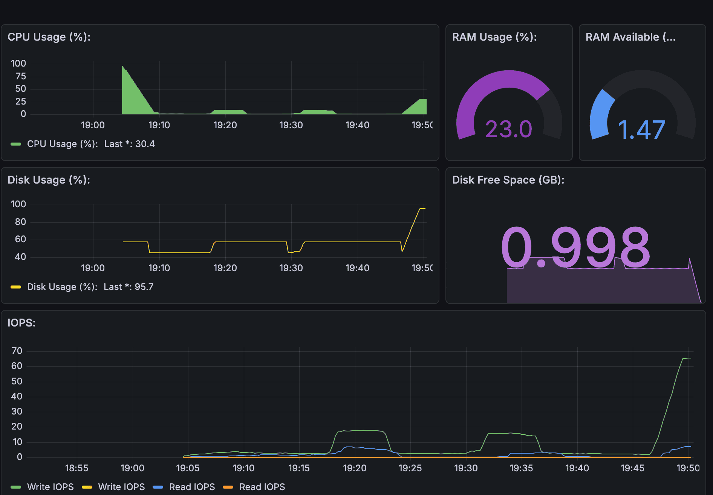

### Установи утилиту **stress** и запусти команду `stress -c 2 -i 1 -m 1 --vm-bytes 32M -t 10s`

 Посмотри на нагрузку жесткого диска, оперативной памяти и ЦПУ.

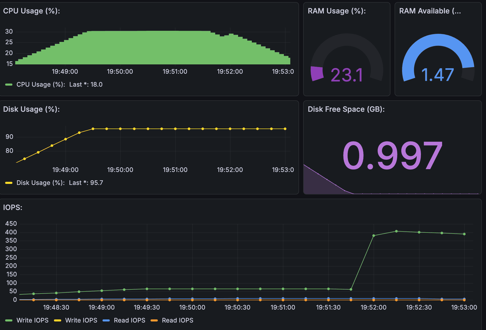

## 8. Готовый дашборд

### 8.1. Установим готовый дашборд *Node Exporter Quickstart and Dashboard* с официального сайта **Grafana Labs**.

Node Exporter Quickstart and Dashboard с официального сайта Grafana Labs [ID 13978]

Импортируем Node Exporter с официального сайта Grafana Labs[ID 13978].
1. Перейдите в меню **Dashboards** > **Manage** > **Import**.
2. Вставьте в поле **Grafana.com Dashboard ID** значение **13978**.
3. Нажмите кнопку **Import**.

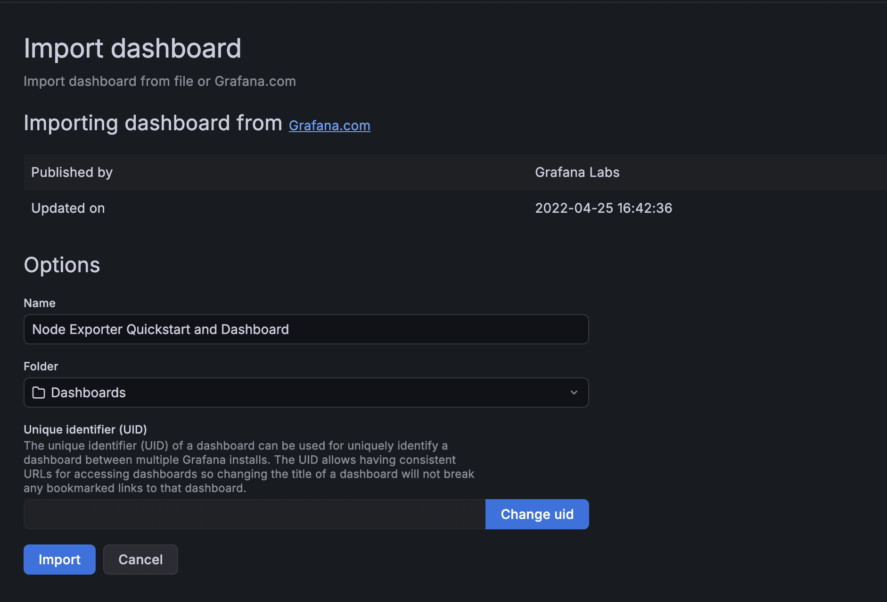

- в Grafana:

Connections → Data sources → Add new data source → Prometheus

В поле Prometheus server URL укажи:

http://prometheus:9090

Именно так, потому что в Compose:
```
prometheus:
  container_name: prometheus
```

В результате вы увидите новый дашборд, в котором отображаются метрики, собранные Node Exporter.

### 8.2. Проведем те же тесты, что и в [7](#7-prometheus-и-grafana).

Проведем тестирование нагрузки на сервер , как в предыдущей части

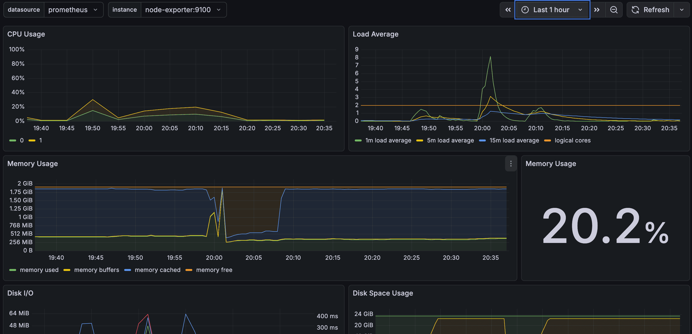

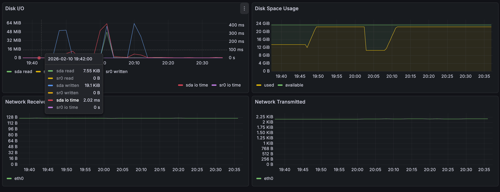

### 8.3. Запустиv ещё одну виртуальную машину, находящуюся в одной сети с текущей.

Запустим ещё одну виртуальную машину ws2, находящуюся в одной сети с текущей.
Запустим тест нагрузки сети с помощью утилиты iperf3.
на ws2 - как сервер будет слушать на порту 5201

```bash
iperf3 -s
```
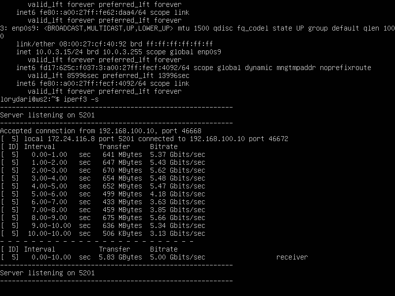

на ws1 - как клиент по умолчанию будет слушать порт 5201

```bash
iperf3 -c 172.24.116.8
```

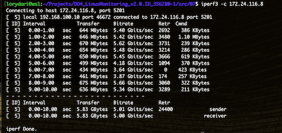

- Посмотрим на нагрузку сетевого интерфейса на dashboard Node Exporter Quickstart

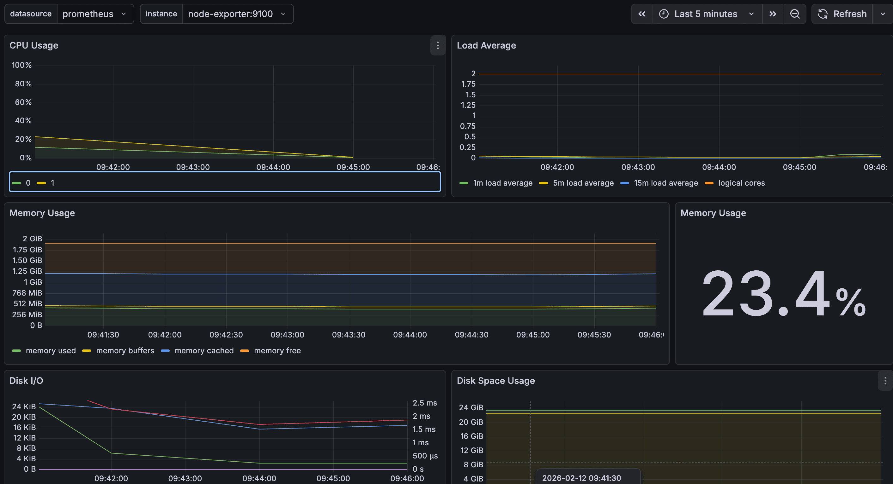

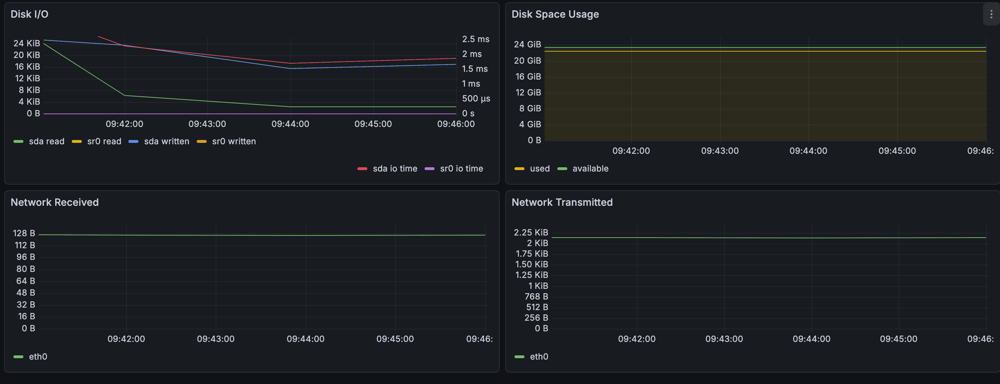


## 9. Дополнительно. Свой *node_exporter*

Анализировать систему с помощью специальных утилит полезно и удобно, но хотелось понять, как же они работают.

Напишим bash-скрипт или программу на С, собирающие информацию по базовым метрикам системы (ЦПУ, оперативная память, жесткий диск (объем)).

Скрипт или программа будет формировать html страничку по формату **Prometheus**, которую будет отдавать **nginx**. 

Саму страничку обновлять можно как внутри bash-скрипта или программы (в цикле), так и при помощи утилиты cron, но не чаще, чем раз в 3 секунды.

- Кастомный Node Exporter для Prometheus

Описание
Bash-скрипт, который собирает базовые системные метрики (CPU, RAM, Disk) и предоставляет их в формате Prometheus через веб-сервер Nginx. Метрики обновляются каждые 3 секунды и доступны для сбора Prometheus.

- Установка и настройка nginx

Запустим скрипт по установке nginx [config_nginx.sh](./src/09/config_nginx.sh)

```bash
./config_nginx.sh
```

- Установка Systemd service

```bash
sudo nano /etc/systemd/system/custom_node_exporter.service
```
```
[Unit]
Description=Custom Node Exporter
After=network.target

[Service]
User=YOUR_USER
Group=YOUR_USER
WorkingDirectory=/path/to/script
ExecStart=/usr/bin/bash /path/to/script/main.sh
Restart=always
RestartSec=5
StandardOutput=append:/var/log/custom_node_exporter.log
StandardError=append:/var/log/custom_node_exporter.log

[Install]
WantedBy=multi-user.target
```

```bash
sudo systemctl daemon-reload
sudo systemctl start custom_node_exporter
sudo systemctl enable custom_node_exporter
sudo systemctl status custom_node_exporter
```

### 9.2. Поменяем конфигурационный файл **Prometheus**, чтобы он собирал информацию с созданной странички.

```bash
# Узнать IP Docker host
ip addr show docker0 | grep "inet "

# Отредактировать prometheus.yml
sudo nano /opt/prometheus_stack/prometheus/prometheus.yml
```
```
global:
  scrape_interval: 15s
  evaluation_interval: 15s

scrape_configs:
  # Стандартный node-exporter (в Docker)
  - job_name: node
    scrape_interval: 5s
    static_configs:
    - targets: ['node-exporter:9100']

  # Кастомный node_exporter (на хосте)
  - job_name: custom_node_exporter
    scrape_interval: 3s
    static_configs:
    - targets: ['172.17.0.1:9200']  # Для Docker Desktop

    metrics_path: /
```

- Запустим основной скрипт [main.sh](./src/09/main9.sh)

```bash
./main9.sh
```

- Перезагрузим docker

```bash
docker compose restart prometheus

# Метрики доступны
curl http://localhost:9200

# Content-Type правильный
curl -I http://localhost:9200

```
```bash
# Проверяем статус
sudo systemctl status custom_node_exporter
sudo systemctl restart custom_node_exporter
sudo journalctl -u custom_node_exporter -f
```
- Настраиваем дашборд

Проверяем работу
Prometheus собирает метрики
http://localhost:9090/targets - должен быть UP

открываем Grafana 
http://localhost:3000/
и настраиваем 
через команды запросы

```
# CPU Usage (%)
node_cpu_usage_percent

# RAM Used (GB)
node_memory_used_megabytes / 1024

# Disk Used (GB)
node_disk_used_kilobytes / 1024 / 1024
```

### 9.3. Проведем те же тесты, что и в [7](#7-prometheus-и-grafana).

```bash
# Запускаем тест нагрузки
stress -c 4 -m 2 --vm-bytes 512M -t 60s
```
Смотрим монитор

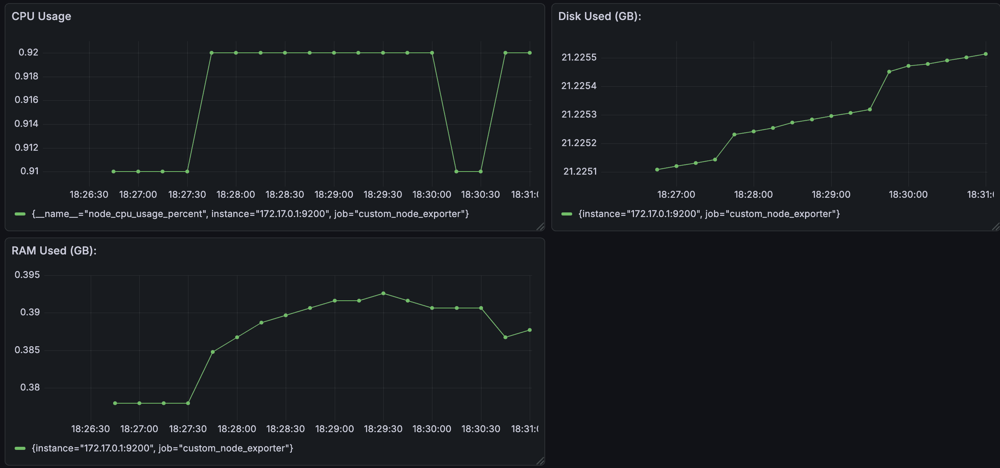
