# Simple Docker

## 1. Готовый докер

- Скачивание официального образа nginx
```
docker pull nginx
```

- Проверка наличия образа
```
docker images nginx
```

- Создание и запуск контейнера
```
docker run -d nginx d607865cd608
```


-  Проверка, что контейнер запущен
```
docker ps
```
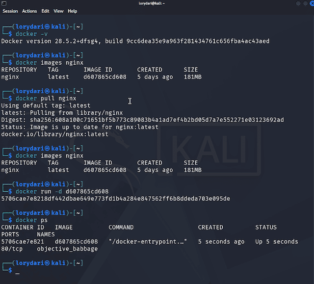

-  Информация о контейнере (docker inspect)
```
docker inspect 5706cae7e821
docker inspect --size 5706cae7e821 | grep -E '"SizeRootFs"|"SizeRw"'
```
- **Размер контейнера (SizeRootFs):** 180,953,022 байт (~185 MB)

- **Слой записи (SizeRw):** 1095 байт

- **Замапленные порты:** 80/tcp (на момент первого 
запуска без `-p` порты не замаплены)

- **IP контейнера:** 172.17.0.2

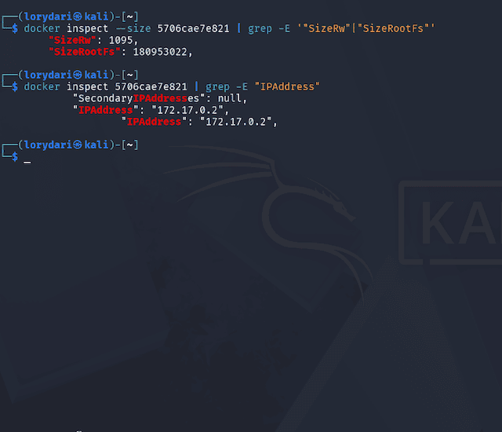

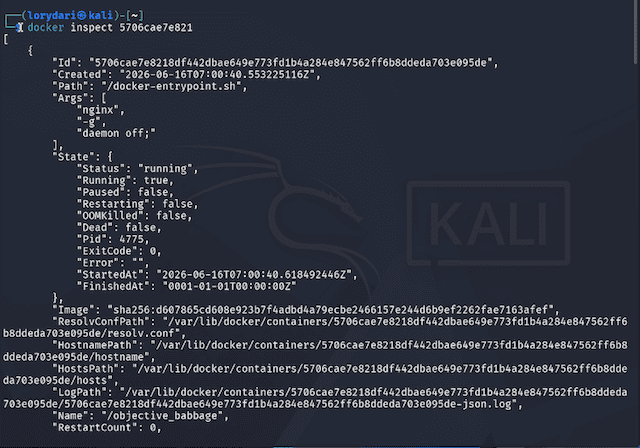

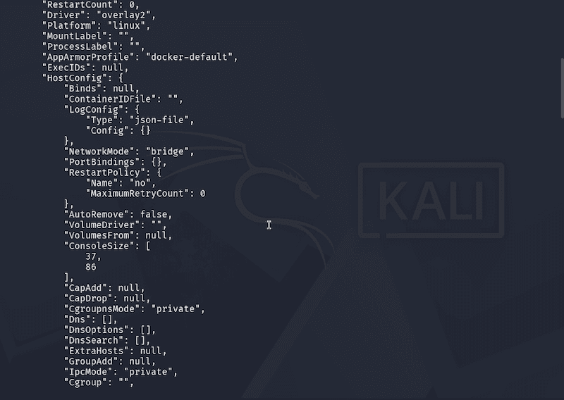

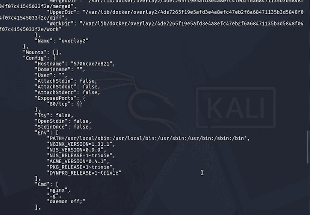

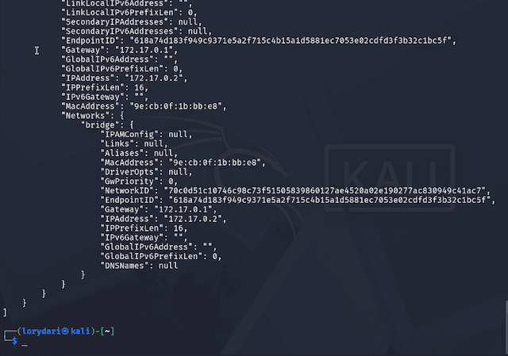

- Остановка контейнера
```
docker stop 5706cae7e821
```

-  Проверка, что контейнер остановлен
```
docker ps
```

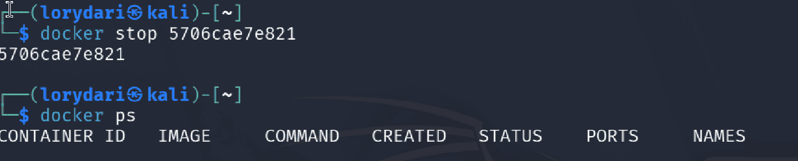

- Запуск контейнера с пробросом портов 80 и 443
```
docker run -d -p 80:80 -p 443:443 nginx
```
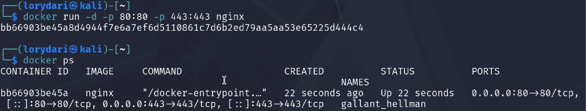

- Проверка доступности nginx по адресу localhost:80
```
curl -s http://127.0.0.1:80
```
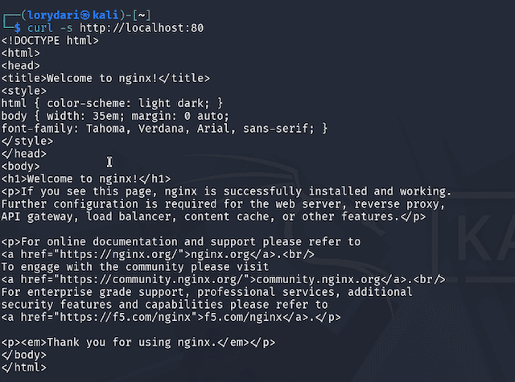


Стартовая страница **nginx** доступна по адресу `127.0.0.1:80` (заголовок: "Welcome to nginx!").

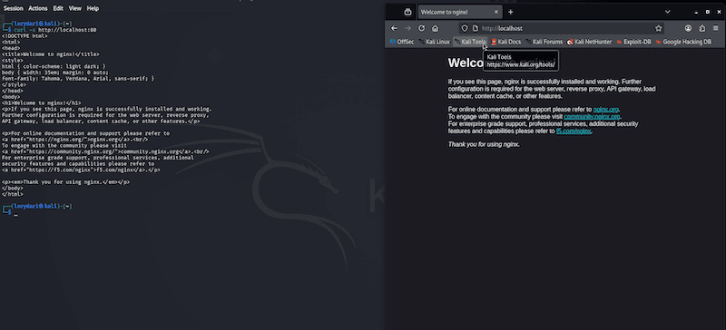

- Перезапуск контейнера
```
docker restart
# Заново запускал контейнер  поэтому id контейнера изменился на 649430a9d8b3
docker ps
```
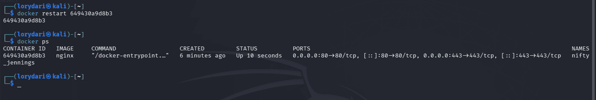

Контейнер успешно перезапущен: статус `Up`.

## 2. Операции с контейнером

- Прочитал конфигурационный файл nginx.conf внутри докер контейнера через команду exec.

```
docker exec 649430a9d8b3 cat /etc/nginx/nginx.conf

user  nginx;
worker_processes  auto;

error_log  /var/log/nginx/error.log notice;
pid        /run/nginx.pid;


events {
    worker_connections  1024;
}


http {
    include       /etc/nginx/mime.types;
    default_type  application/octet-stream;

    log_format  main  '$remote_addr - $remote_user [$time_local] "$request" '
                      '$status $body_bytes_sent "$http_referer" '
                      '"$http_user_agent" "$http_x_forwarded_for"';

    access_log  /var/log/nginx/access.log  main;

    sendfile        on;
    #tcp_nopush     on;

    keepalive_timeout  65;

    #gzip  on;

    include /etc/nginx/conf.d/*.conf;
}

```
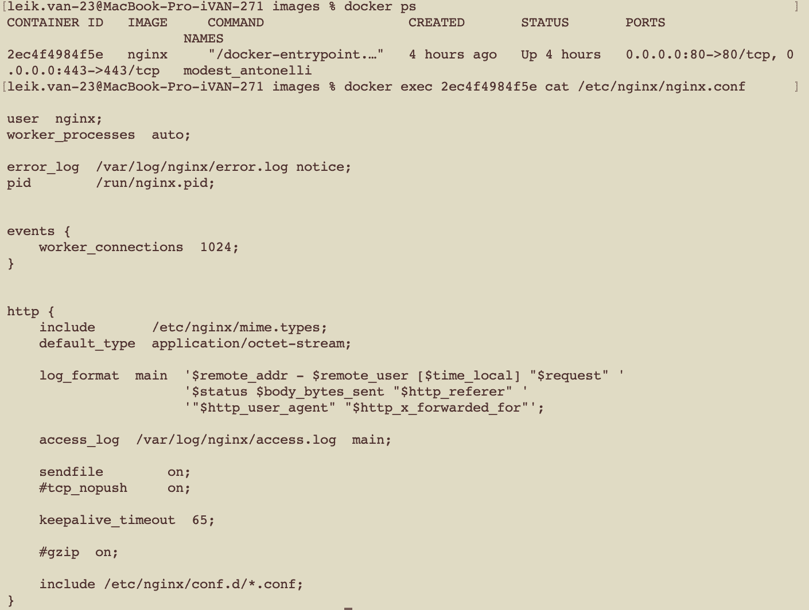

- Создал на локальной машине файл nginx.conf.

Создан файл `nginx.conf` с содержимым:
```
server {
    listen 80;
    server_name localhost;

    location /status {
        stub_status on;
        allow all;
        access_log off;
    }
}
```
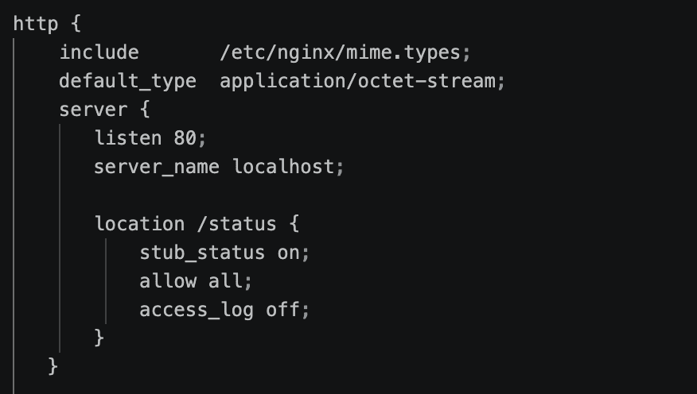

- Настроил в нем по пути /status отдачу страницы статуса сервера nginx.

Файл настроен. Server-блок со `stub_status` добавлен в `/etc/nginx/nginx.conf` внутрь директивы `http {}`.

- Скопировал созданный файл nginx.conf внутрь докер-контейнера через команду docker cp.

```
docker cp nginx.conf 2ec4f4984f5e:/etc/nginx/nginx.conf
```

- Перезапустил nginx внутри докер-контейнера через команду exec.

```
docker exec 2ec4f4984f5e nginx -s reload
```

- Проверил, что по адресу localhost:80/status отдается страничка со статусом сервера nginx.

```
curl http://127.0.0.1:80/status

Active connections: 1
server accepts handled requests
 7 7 4
Reading: 0 Writing: 1 Waiting: 0
```

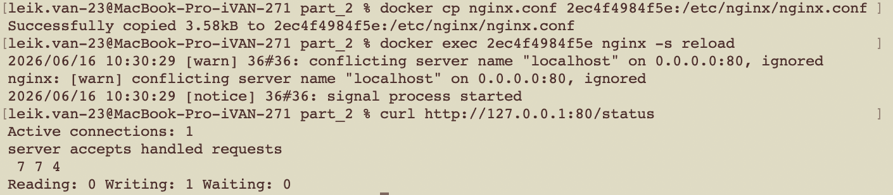

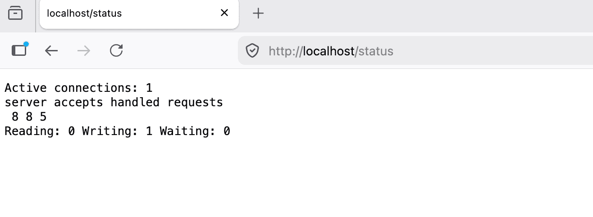


- Экспортировал контейнер в файл container.tar через команду export.

```
docker export 2ec4f4984f5e -o container.tar
```
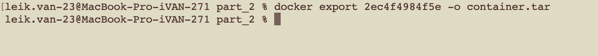

- Остановил контейнер.

```
docker stop 2ec4f4984f5e
```

- Удалил образ через docker rmi [image_id|repository], не удаляя перед этим контейнеры.

```
docker rmi -f nginx
```

- Удалил остановленный контейнер.

```
docker rm 2ec4f4984f5e
```
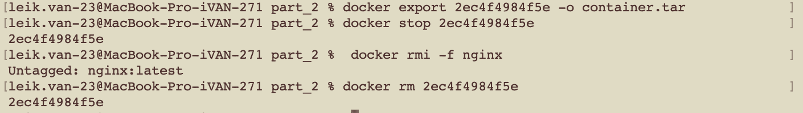

- Создал образ из файла container.tar через команду import.

```
docker import container.tar nginx:latest
```

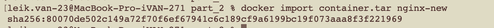

- Создал и запустил контейнер на основе импортированного образа.

```
docker run -d -p 80:80 -p 443:443 nginx-new nginx -g "daemon off;"
docker ps
```
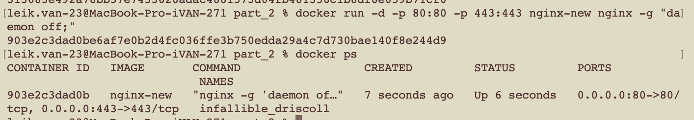

- Проверил, что по адресу localhost:80/status отдается страничка со статусом сервера nginx.

```
curl http://127.0.0.1:80/status
```
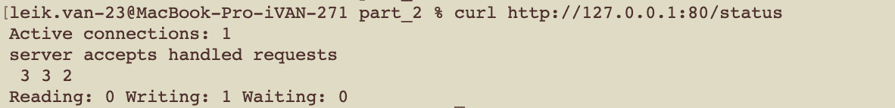

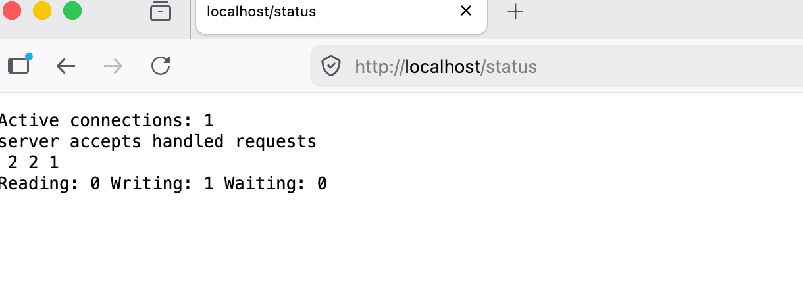

## 3. Мини веб-сервер

- Написал мини-сервер на C и FastCgi, возвращающий "Hello, World!"

Файл `src/server/hello.c`:
```c
#include <fcgiapp.h>

int main() {
    FCGX_Request req;
    FCGX_Init();
    FCGX_InitRequest(&req, 0, 0);

    while (FCGX_Accept_r(&req) >= 0) {
        FCGX_FPrintF(req.out, "Content-Type: text/html\n\n");
        FCGX_FPrintF(req.out, "<html><body><h1>Hello, World!</h1></body></html>");
        FCGX_Finish_r(&req);
    }

    return 0;
}
```
[файл hello.c](./server/hello.c)

Компиляция:
```
cd server
gcc -o hello hello.c -I/opt/homebrew/include -L/opt/homebrew/lib -lfcgi
```

- Запустил мини-сервер через spawn-fcgi на порту 8080

```
spawn-fcgi -p 8080 ./hello

ps aux | grep hello | grep -v grep && lsof -i :8080 | grep LISTEN
```
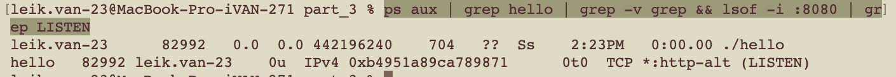

- Написал nginx.conf, проксирующий запросы с 81 порта на 127.0.0.1:8080

Файл [nginx.conf](./server/nginx.conf):
```nginx
events {
    worker_connections 1024;
}

http {
    server {
        listen 81;
        server_name localhost;

        location / {
            fastcgi_pass host.docker.internal:8080;
            include fastcgi_params;
        }
    }
}
```


- Запустил nginx в Docker с написанной конфигурацией

```
docker run -d -p 81:81 --name nginx-part3 nginx
docker cp nginx.conf [container_id]:/etc/nginx/nginx.conf
docker exec [container_id] nginx -s reload

curl http://127.0.0.1:81
<html><body><h1>Hello, World!</h1></body></html>
```
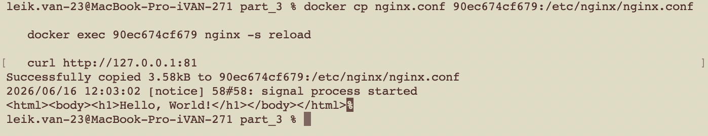

- Проверил, что по localhost:81 отдается страничка "Hello, World!"

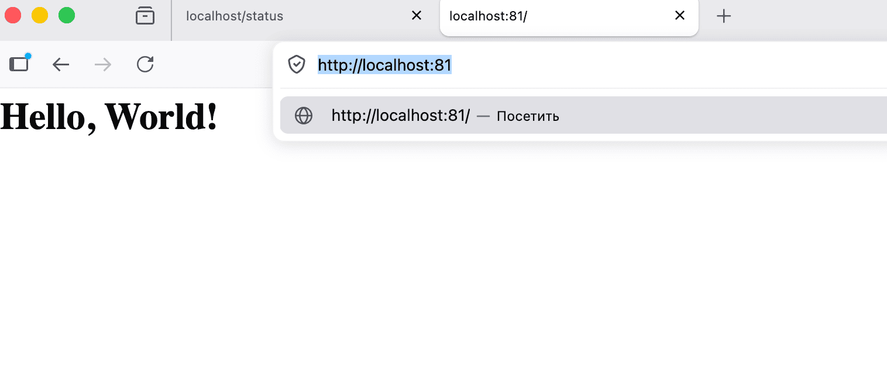

- Положил nginx.conf по пути ./nginx/nginx.conf

```
cd src
mkdir -p nginx
cp sever/nginx.conf nginx/nginx.conf
```


## 4. Свой докер

- Создал докерфайл  Dockerfile.part4

[Dockerfile.part4](Dockerfile.part4)

- Создал докер-образ через docker build при этом указав имя hello-fcgi и тег part_4
```
# Перейти в src
cd src

# Запускать из src
docker build -f Dockerfile.part4 -t hello-fcgi:part_4 .
```
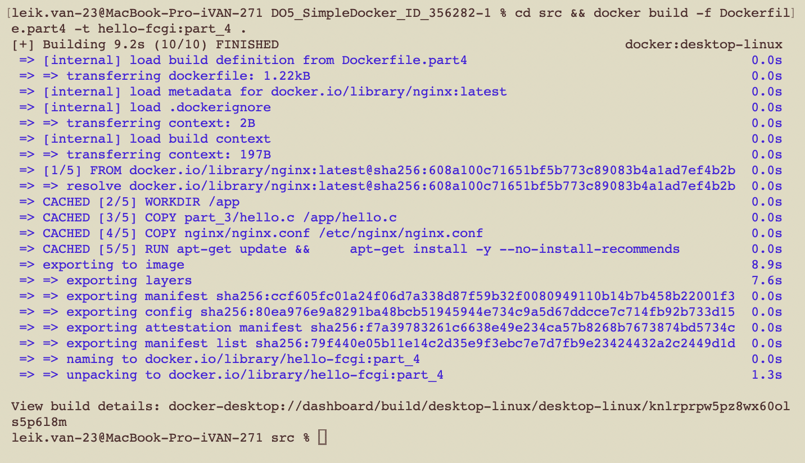

- Проверили через docker images hello-fcgi:part_4

```
docker images hello-fcgi:part_4
```

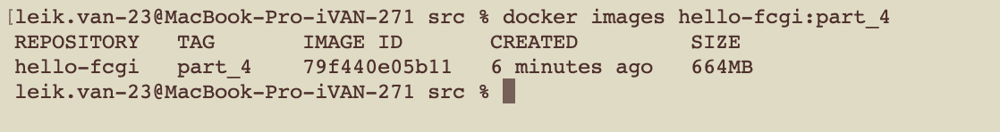

- Запустили контейнер докер-образ с маппингом 81 порта на 80 на локальной машине и маппингом папки ./nginx внутрь контейнера

```
docker run -d -p 80:81 -v $(pwd)/nginx/nginx.conf:/etc/nginx/nginx.conf hello-fcgi:part_4
```

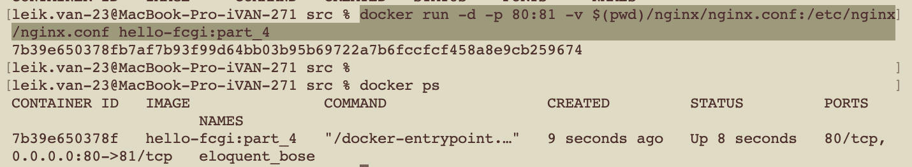

- Проверили что сайт доступен по адресу http://localhost:80

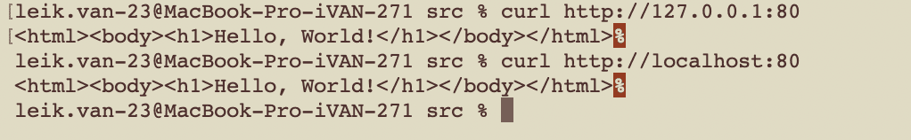]

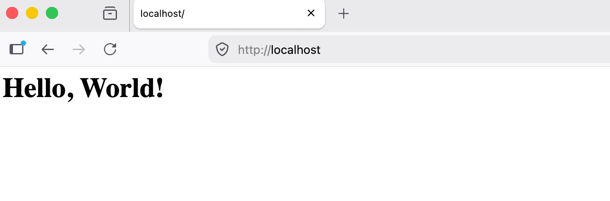]

- Допишим в ./nginx/nginx.conf проксирование странички /status, по которой надо отдавать статус сервера nginx.

```
location /status {                                                                                           
    stub_status on;
    allow all;
    access_log off;                                                                                           
}
```

[nginx.conf](./nginx/nginx.conf)

- Перезапустим docker

```
docker restart 7b39e650378f
```

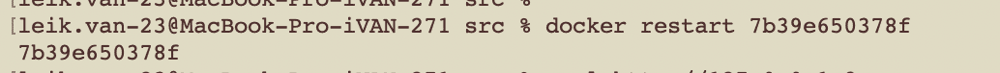

- Проверим, что теперь по localhost:80/status отдается страничка со статусом nginx

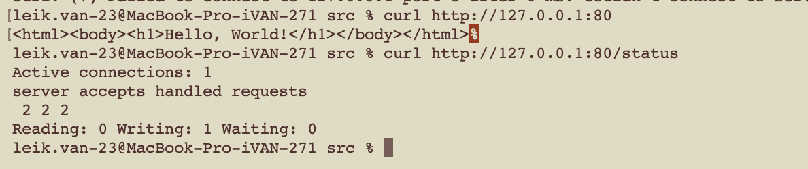

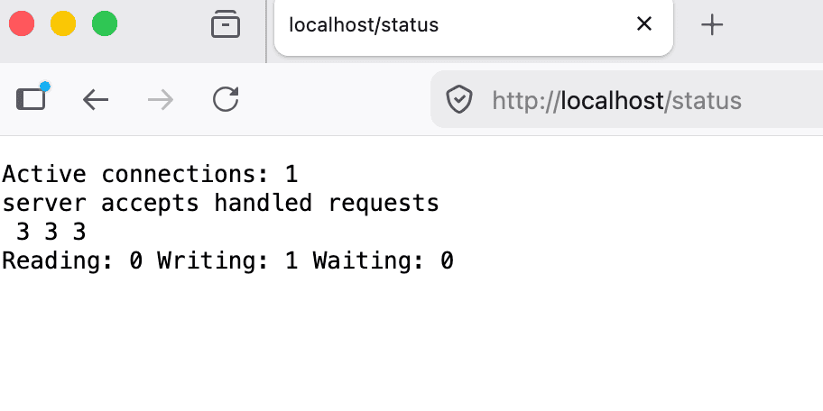]


## 5. Dockle

- Установим Dockle

- запустим dockle и проверим образ

```
dockle hello-fcgi:part_4
```

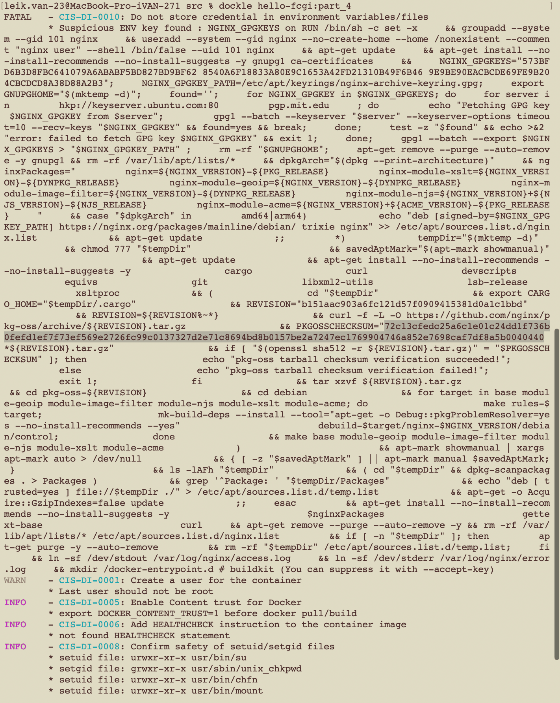

- Выявили следующие ошибки и предупреждения:

```
FATAL	- CIS-DI-0010: Не храните учетные данные в переменных/файлах среды.
WARN	- CIS-DI-0001: Создайте пользователя для контейнера
	* Последний пользователь не должен быть root
INFO	- CIS-DI-0005: Включить доверие к содержимому для Docker
	* export DOCKER_CONTENT_TRUST=1 перед извлечением/сборкой докера
INFO	- CIS-DI-0006: Добавьте инструкцию HEALTHCHECK в образ контейнера.
	* не найден оператор HEALTHCHECK
INFO	- CIS-DI-0008: Подтвердите безопасность файлов setuid/setgid.
```

- Исправили ошибки в Dockerfile.part5

[Dockerfile.part5](Dockerfile.part5)

- Забилдили новый образ

```
docker build -f Dockerfile.part5 -t hello-fcgi:part_5 .
docker images hello-fcgi:part_5
```

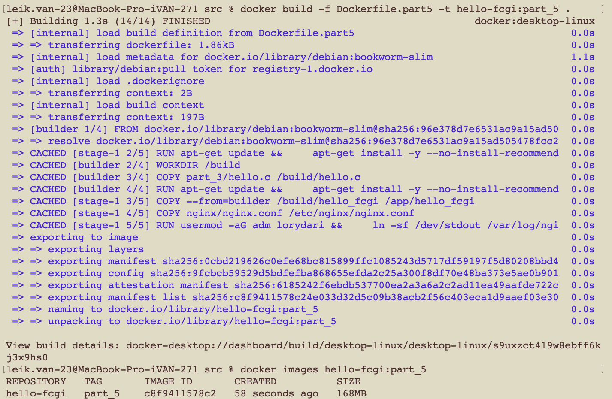

- Запустили скан на уязвимости 

```
dockle hello-fcgi:part_5
INFO	- CIS-DI-0008: Confirm safety of setuid/setgid files
# Можем проигнорировать
```

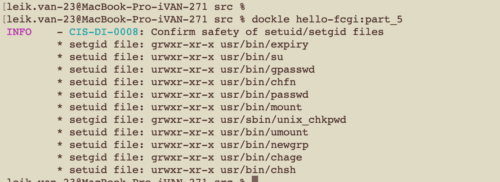

- Запустили контейнер и проверили, что все работает

```
sudo docker run -d -p 80:81 -v $(pwd)/nginx/nginx.conf:/etc/nginx/nginx.conf hello-fcgi:part_5
```

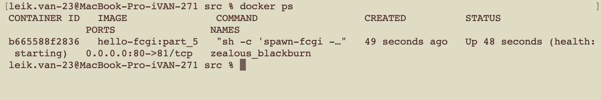

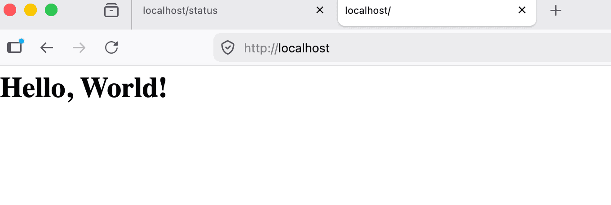]

## 6. Базовый Docker Compose

- Собрали docker-compose файл, который содержит:
  - докер-контейнер из Части 5 (он должен работать в локальной сети, т. е. не нужно использовать инструкцию EXPOSE и мапить порты на локальную машину).

  - докер-контейнер с nginx, который будет проксировать все запросы с 8080 порта на 81 порт первого контейнера.

  - Замапили 8080 порт второго контейнера на 80 порт локальной машины.

[docker-compose.yml](docker-compose.yml)


- Остановили все запущенные контейнеры.

```
docker stop $(docker ps -a -q)
```

- Запустили проект с помощью команд docker compose build и docker compose up.

```
docker ps
docker compose build
docker compose up
docker ps
```
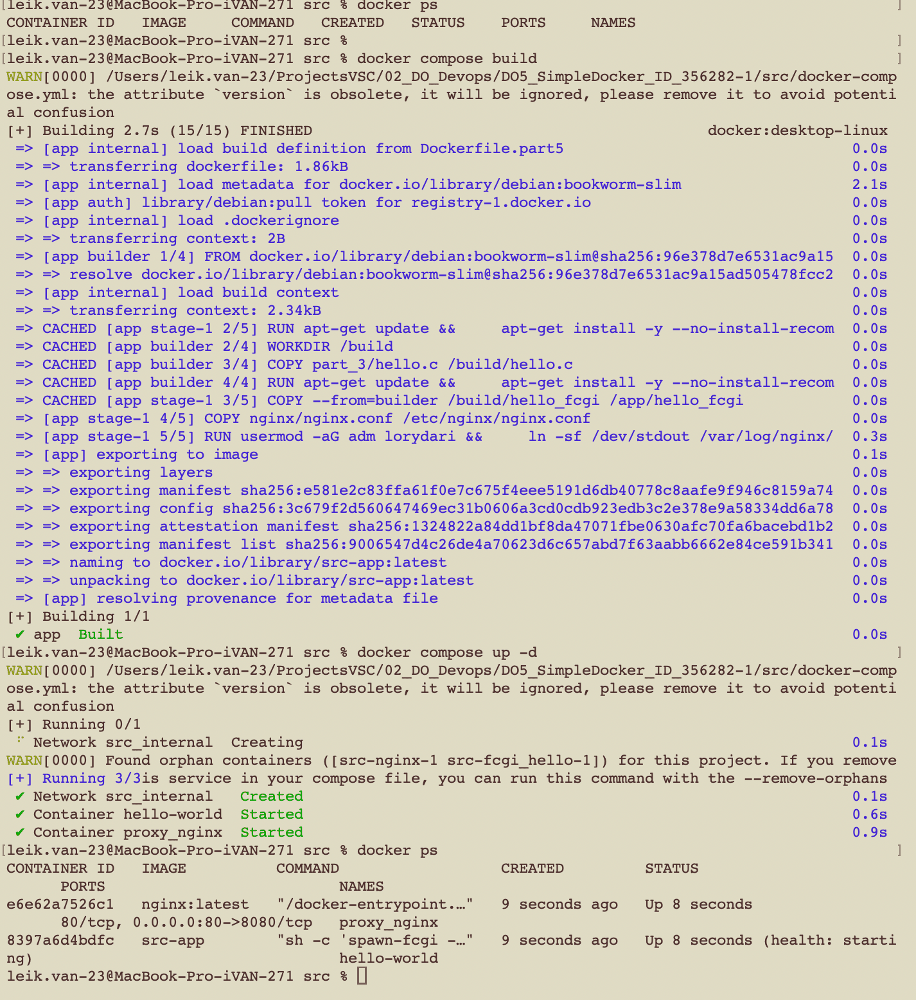


- Проверили, что в браузере по localhost:80 отдается написанная страничка, как и ранее

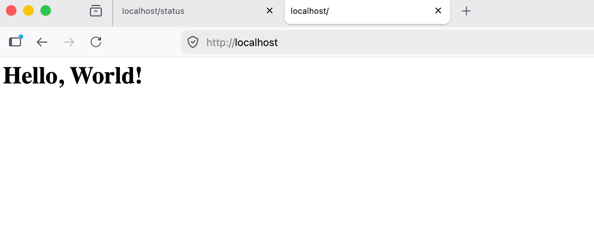

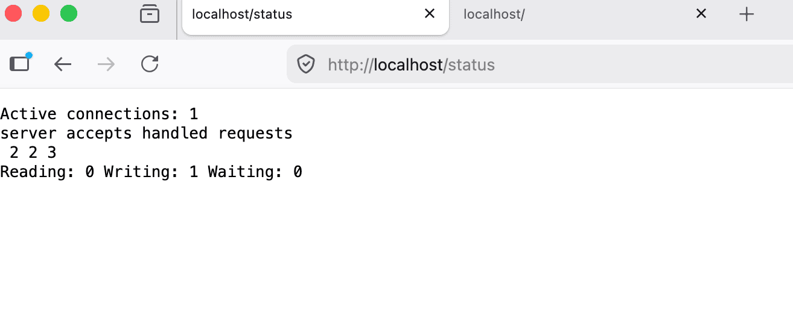
