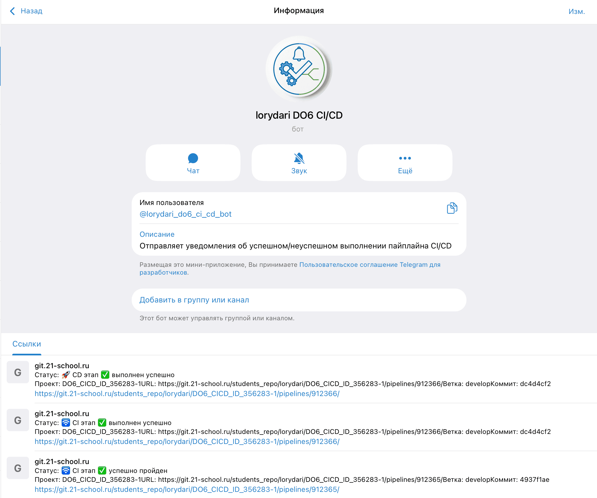
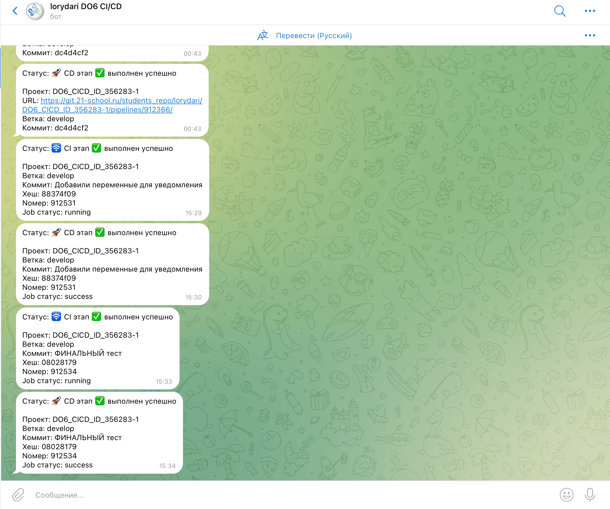

# Инструкция по работе с проектом Basic_CICD

## Подготовительный этап

### 1. Установка Multipass

На MacBook Pro M1 (Apple Silicon) используется **Multipass** — официальная утилита от Canonical (Ubuntu) для быстрого создания Ubuntu VM на ARM-архитектуре.

**Установка через Homebrew:**
```bash
brew install multipass
```

**Проверка установки:**
```bash
multipass version
```
Ожидаемый вывод:
```
multipass   1.16.3+mac
multipassd  1.16.3+mac
```

**Проверка драйвера (на M1 должен быть qemu):**
```bash
multipass get local.driver
```
Ожидаемый вывод: `qemu`

---

### 2. Создание виртуальных машин

Для проекта DO6_CICD создаются две ВМ:
- **ci-vm** — для GitLab Runner и CI/CD пайплайнов
- **deploy-vm** — для деплоя (продакшн)

#### Создание ci-vm (для CI/CD):
```bash
multipass launch 24.04 --name ci-vm --cpus 2 --memory 4G --disk 20G
```

#### Создание deploy-vm (для деплоя):
```bash
multipass launch 24.04 --name deploy-vm --cpus 1 --memory 2G --disk 10G
```

**Параметры:**
- `--cpus` — количество ядер CPU
- `--memory` — объём оперативной памяти
- `--disk` — объём дискового пространства

---

### 3. Базовые команды для работы с ВМ

#### Просмотр списка VM и их статуса:
```bash
multipass list
```

Ожидаемый вывод:
```
Name                    State             IPv4             Image
ci-vm                   Running           192.168.252.2    Ubuntu 24.04 LTS
deploy-vm               Running           192.168.252.3    Ubuntu 24.04 LTS
```

#### Подключение к VM:
```bash
# Интерактивный вход
multipass shell ci-vm
multipass shell deploy-vm

# Выполнение команды без входа
multipass exec ci-vm -- <команда>
multipass exec deploy-vm -- <команда>
```

#### Управление VM:

| Действие | Команда |
|----------|---------|
| Остановить ВМ | `multipass stop ci-vm` |
| Запустить ВМ | `multipass start ci-vm` |
| Перезапустить ВМ | `multipass restart ci-vm` |
| Удалить ВМ | `multipass delete ci-vm && multipass purge` |
| Информация о ВМ | `multipass info ci-vm` |

---

### 4. Установка дополнительных пакетов на ci-vm

#### 4.1. build-essential (make, gcc, g++)

```bash
multipass exec ci-vm -- sudo apt-get install -y build-essential
```

#### 4.2. clang-format (проверка кодстайла)

```bash
multipass exec ci-vm -- sudo apt-get install -y clang-format
```

---

### 5. Настройка статических IP через netplan

По умолчанию Multipass выдаёт IP по DHCP. Статический IP нужен, чтобы адреса ВМ не менялись после перезагрузки — иначе скрипт деплоя перестанет работать.

#### 5.1. Узнать текущие настройки сети

Зайти в ВМ и выполнить:
```bash
# Посмотреть шлюз
ip route | grep default

# Посмотреть DNS
resolvectl status | grep "DNS Servers"

# Посмотреть имя интерфейса
ip a
```

#### 5.2. Настроить статический IP на ci-vm

```bash
multipass exec ci-vm -- sudo bash -c 'cat > /etc/netplan/50-cloud-init.yaml << EOF
network:
  version: 2
  ethernets:
    enp0s1:
      dhcp4: false
      addresses:
        - 192.168.252.2/24
      routes:
        - to: default
          via: 192.168.252.1
      nameservers:
        addresses:
          - 192.168.252.1
EOF
'
multipass exec ci-vm -- sudo netplan apply
```

#### 5.3. Настроить статический IP на deploy-vm

```bash
multipass exec deploy-vm -- sudo bash -c 'cat > /etc/netplan/50-cloud-init.yaml << EOF
network:
  version: 2
  ethernets:
    enp0s1:
      dhcp4: false
      addresses:
        - 192.168.252.3/24
      routes:
        - to: default
          via: 192.168.252.1
      nameservers:
        addresses:
          - 192.168.252.1
EOF
'
multipass exec deploy-vm -- sudo netplan apply
```

#### 5.4. Проверка

```bash
multipass exec ci-vm -- ip a show enp0s1 | grep inet
multipass exec deploy-vm -- ip a show enp0s1 | grep inet
```

Ожидаемый вывод для ci-vm:
```
inet 192.168.252.2/24 brd ...
```
Ожидаемый вывод для deploy-vm:
```
inet 192.168.252.3/24 brd ...
```

---

### 6. Настройка SSH между ВМ

SSH нужен для этапа деплоя (Part 5) — скрипт будет копировать файлы с ci-vm на deploy-vm.

#### 6.1. Сгенерировать SSH-ключ на ci-vm

```bash
multipass exec ci-vm -- bash -c 'ssh-keygen -t ed25519 -N "" -f ~/.ssh/id_ed25519'
```

#### 6.2. Скопировать ключ на deploy-vm

```bash
multipass exec ci-vm -- bash -c 'cat ~/.ssh/id_ed25519.pub' | multipass exec deploy-vm -- bash -c 'mkdir -p ~/.ssh && cat >> ~/.ssh/authorized_keys && chmod 600 ~/.ssh/authorized_keys'
```

#### 6.3. Проверка SSH

```bash
multipass exec ci-vm -- ssh -o StrictHostKeyChecking=no ubuntu@192.168.252.3 "hostname"
```

Ожидаемый вывод: `deploy-vm`

---

## Выполнение проекта

### 1. Настройка gitlab-runner

#### 1.1. Установка gitlab-runner

```bash
# Добавить репозиторий GitLab Runner
multipass exec ci-vm -- sudo bash -c "curl -L 'https://packages.gitlab.com/install/repositories/runner/gitlab-runner/script.deb.sh' | bash"

# Установить gitlab-runner
multipass exec ci-vm -- sudo apt-get install -y gitlab-runner
```

#### 1.2. Проверка установки

```bash
multipass exec ci-vm -- gitlab-runner --version
```

#### 1.3. Регистрация runner-а для проекта

> **Важно:** Для регистрации понадобятся **URL** и **Registration Token** со страницы задания на платформе.

##### Способ 1 — интерактивная регистрация (через shell)

```bash
multipass shell ci-vm
sudo gitlab-runner register
```

В диалоге ввести:
1. **GitLab instance URL** — URL с платформы (например, `https://git.example.com`)
2. **Registration token** — токен с платформы
3. **Description** — описание runner-а (например, `CI Runner`)
4. **Tags** — теги (например, `ci`)
5. **Maintenance note** — заметка (необязательно, Enter)
6. **Executor** — ввести `shell`

После успешной регистрации:
```
Runner registered successfully.
Configuration saved in "/etc/gitlab-runner/config.toml"
```

##### Способ 2 — регистрация одной командой

```bash
multipass exec ci-vm -- sudo gitlab-runner register \
  --url "https://ВАШ_GITLAB_URL" \
  --registration-token "ВАШ_ТОКЕН" \
  --executor "shell" \
  --description "CI Runner" \
  --tag-list "ci" \
  --run-untagged="true" \
  --locked="false"
```

#### 1.4. Проверка регистрации

```bash
multipass exec ci-vm -- sudo gitlab-runner list
```
Ожидаемый вывод:
```
Listing configured runners
DO6 CI Runner  Executor=shell Token=glrtr-... URL=https://git.21-school.ru
```

#### 1.5. Запуск и статус

```bash
multipass exec ci-vm -- sudo gitlab-runner start
multipass exec ci-vm -- sudo gitlab-runner status
```

---

### Part 2. Сборка (Build)

#### 2.1. Создать файл `.gitlab-ci.yml` в корне репозитория

Файл `.gitlab-ci.yml` — конфигурация CI/CD пайплайна. GitLab автоматически читает его при каждом пуше.

#### 2.2. Добавить этап сборки

```yaml
stages:
  - build

build_job:
  stage: build
  tags:
    - do6
    - ci
  script:
    - echo "Начинаем процесс сборки DO ..."
    - cd code-samples
    - make
    - echo "Сборка DO завершена УСПЕШНО"
  artifacts:
    paths:
      - code-samples/DO
    expire_in: 30 days
```

**Что происходит:**
- `cd code-samples` — переход в папку с исходным кодом
- `make` — запуск сборки (компиляция `main.c` → `DO`)
- `artifacts` — сохранение бинарника `DO` на 30 дней для следующих этапов

#### 2.3. Закоммитить и запушить

```bash
git add .gitlab-ci.yml
git commit -m "Add build stage"
git push origin develop
```

После пуша GitLab автоматически запустит пайплайн. Проверить: GitLab → **Сборка** → **Конвейеры**.

---

### Part 3. Тест кодстайла (clang-format)

#### 3.1. Добавить этап code_style в `.gitlab-ci.yml`

```yaml
stages:
  - build
  - code_style

# ... build_job из Part 2 ...

code_style_job:
  stage: code_style
  tags:
    - do6
    - ci
  script:
    - echo "Начинаем процесс проверки кодстайла ..."
    # - cp docs/RUS/.clang-format code-samples/.clang-format
    - cd docs/RUS/
    - clang-format -n --Werror main.c
    - echo "Кодстайл пройден УСПЕШНО"
```

**Что происходит:**
- Копируется конфиг `.clang-format` (Google Style) в папку с кодом
- `clang-format -n --Werror main.c` — проверка стиля
- `--Werror` превращает предупреждения в ошибки → если код не отформатирован, пайплайн падает ❌
- Вывод предупреждений отображается в логах job-а

**Особенность:** `clang-format -n` сам по себе возвращает код 0, даже если есть предупреждения. Без `--Werror` пайплайн не упадёт.

---

### Part 4. Интеграционные тесты

#### 4.1. Создать скрипт интеграционных тестов `src/integration_tests.sh`

Скрипт тестирует программу `DO` на разных входных данных:

```bash
#!/bin/bash

DO_PATH="../code-samples/DO"
FAILED=0

echo "=== Интеграционные тесты для DO ==="

# Тест 1: без аргументов (ожидаем код -1)
echo "Тест 1: запуск без аргументов"
$DO_PATH > /dev/null 2>&1
if [ $? -eq 255 ]; then echo "  PASS"; else echo "  FAIL"; FAILED=1; fi

# Тест 2-7: аргументы 1-6 (ожидаем соответствующие сообщения)
for i in 1 2 3 4 5 6; do
  RESULT=$($DO_PATH $i)
  # проверка вывода для каждого номера
  ...
done

# Тест 8: неверный аргумент (ожидаем код -2)
# Тест 9: несколько аргументов (ожидаем код -1)

if [ $FAILED -eq 0 ]; then
    echo "=== ВСЕ ТЕСТЫ ПРОЙДЕНЫ ==="
    exit 0
else
    echo "=== ТЕСТЫ ПРОВАЛИЛИСЬ ==="
    exit 1
fi
```

**9 тестов:**
| Тест | Проверка |
|------|----------|
| 1 | Запуск без аргументов → код -1 |
| 2 | Аргумент `1` → "Learning to Linux" |
| 3 | Аргумент `2` → "Learning to work with Network" |
| 4 | Аргумент `3` → "Learning to Monitoring" |
| 5 | Аргумент `4` → "Learning to extra Monitoring" |
| 6 | Аргумент `5` → "Learning to Docker" |
| 7 | Аргумент `6` → "Learning to CI/CD" |
| 8 | Аргумент `99` → код -2 |
| 9 | Несколько аргументов → код -1 |

#### 4.2. Добавить этап integration_tests в `.gitlab-ci.yml`

```yaml
stages:
  - build
  - code_style
  - integration_tests

integration_test_job:
  stage: integration_tests
  tags:
    - do6
    - ci
  needs:
    - build_job
    - code_style_job
  script:
    - echo "Запуск интеграционных тестов..."
    - chmod +x src/integration_tests.sh
    - cd src
    - bash integration_tests.sh
    - echo "Интеграционные тесты пройдены УСПЕШНО"
```

**Особенности:**
- `needs` — запускается только если сборка и кодстайл прошли успешно
- Если тесты провалились → `exit 1` → пайплайн падает ❌

---

### Part 5. Этап деплоя (CD)

#### 5.1. Создать скрипт деплоя `src/deploy.sh`

```bash
#!/bin/bash

DEPLOY_IP="192.168.252.3"
DEPLOY_USER="ubuntu"
ARTIFACT_PATH="../code-samples/DO"
DEPLOY_PATH="/usr/local/bin"

echo "=== Этап деплоя ==="

# Копируем во временную директорию (в /tmp может писать любой пользователь)
scp -o StrictHostKeyChecking=no "$ARTIFACT_PATH" "$DEPLOY_USER@$DEPLOY_IP:/tmp/DO"
if [ $? -ne 0 ]; then
    echo "ОШИБКА: Не удалось скопировать файл!"
    exit 1
fi

# Перемещаем в /usr/local/bin через sudo (ubuntu имеет sudo без пароля)
ssh -o StrictHostKeyChecking=no "$DEPLOY_USER@$DEPLOY_IP" \
  "sudo mv /tmp/DO $DEPLOY_PATH/DO && sudo chmod 755 $DEPLOY_PATH/DO"

if [ $? -eq 0 ]; then
    echo "=== Деплой завершён успешно ==="
    exit 0
else
    echo "ОШИБКА: Не удалось переместить файл!"
    exit 1
fi
```

**Почему сначала `/tmp`, потом `sudo mv`?**
- `/usr/local/bin/` принадлежит root — `ubuntu` не может туда писать напрямую
- `/tmp` доступен всем — туда `scp` кладёт файл
- `sudo mv` перемещает из `/tmp` в `/usr/local/bin/` (ubuntu имеет sudo без пароля)

#### 5.2. Добавить этап deploy в `.gitlab-ci.yml`

```yaml
stages:
  - build
  - code_style
  - integration_tests
  - deploy

deploy_job:
  stage: deploy
  tags:
    - do6
    - ci
  needs:
    - build_job
    - code_style_job
    - integration_test_job
  when: manual
  script:
    - echo "Запуск деплоя..."
    - chmod +x src/deploy.sh
    - cd src
    - bash deploy.sh
    - echo "Деплой завершён УСПЕШНО"
```

**Особенности:**
- `when: manual` — запускается **вручную** кнопкой ▶️ в GitLab
- `needs` — доступен только если все предыдущие этапы прошли успешно

#### 5.3. Создать дампы образов ВМ

См. раздел **Финальный этап (Part 7)**.

---

### Part 6. Уведомления в Telegram (дополнительно)

#### 6.1. Создать Telegram-бота

1. Найти @BotFather в Telegram
2. Отправить `/newbot`
3. Имя бота: `[твой nickname] DO6 CI/CD`
4. Получить **token** (например `123456:ABC-DEF...`)

#### 6.2. Узнать свой Telegram ID

1. Написать @userinfobot в Telegram
2. Получить свой числовой **ID**

#### 6.3. Сохранить токен и ID на ci-vm (вне git)

Создать файл с переменными, который будет читать скрипт:

```bash
multipass exec ci-vm -- sudo bash -c 'cat > /home/gitlab-runner/telegram.env << EOF
TELEGRAM_BOT_TOKEN="твой_токен_бота"
TELEGRAM_USER_ID="твой_telegram_id"
EOF
'
multipass exec ci-vm -- sudo chown gitlab-runner:gitlab-runner /home/gitlab-runner/telegram.env
multipass exec ci-vm -- sudo chmod 600 /home/gitlab-runner/telegram.env
```

#### 6.4. Создать скрипт уведомления `src/notify.sh`

```bash
#!/bin/bash
source /home/gitlab-runner/telegram.env
STATUS="$1"
TEXT="Статус: ${STATUS}%0A%0AПроект: ${CI_PROJECT_NAME}%0AВетка: ${CI_COMMIT_REF_NAME}%0AКоммит: ${CI_COMMIT_TITLE}%0AХеш: ${CI_COMMIT_SHORT_SHA}%0ANомер: ${CI_PIPELINE_ID}"
curl -s --max-time 10 -d "chat_id=${TELEGRAM_USER_ID}&disable_web_page_preview=1&text=${TEXT}" "https://api.telegram.org/bot${TELEGRAM_BOT_TOKEN}/sendMessage" > /dev/null
```

#### 6.5. Переменные GitLab, доступные в скриптах

Где посмотреть полный список:
- В GitLab после запуска любого job — в самом верху лога выводятся доступные переменные
- Официальная документация: https://docs.gitlab.com/ee/ci/variables/predefined.html

**Основные для уведомления:**

| Переменная | Что даёт |
|-----------|----------|
| `CI_COMMIT_MESSAGE` | Полный текст коммита |
| `CI_COMMIT_TITLE` | Первая строка коммита |
| `CI_COMMIT_SHORT_SHA` | Короткий хеш (a8c471fd) |
| `CI_COMMIT_SHA` | Полный хеш |
| `CI_COMMIT_REF_NAME` | Название ветки |
| `CI_PROJECT_NAME` | Имя проекта |
| `CI_PIPELINE_ID` | Номер пайплайна |
| `CI_JOB_STATUS` | Статус job (success/failed) |

#### 6.6. Добавить уведомления в `.gitlab-ci.yml`

```yaml
stages:
  - build
  - code_style
  - integration_tests
  - notify_ci
  - deploy

# ... build_job, code_style_job, integration_test_job ...

notify_ci_success:
  stage: notify_ci
  tags:
    - do6
    - ci
  needs:
    - build_job
    - code_style_job
    - integration_test_job
  when: on_success
  script:
    - chmod +x src/notify.sh
    - bash src/notify.sh "✅ CI выполнен успешно"

notify_ci_failure:
  stage: notify_ci
  tags:
    - do6
    - ci
  needs:
    - build_job
    - code_style_job
    - integration_test_job
  when: on_failure
  script:
    - chmod +x src/notify.sh
    - bash src/notify.sh "❌ CI завершился ошибкой"

deploy_job:
  stage: deploy
  tags:
    - do6
    - ci
  needs:
    - build_job
    - code_style_job
    - integration_test_job
    - notify_ci_success
  when: manual
  script:
    - echo "Запуск деплоя..."
    - chmod +x src/deploy.sh
    - cd src
    - bash deploy.sh
    - echo "Деплой завершён УСПЕШНО"
  after_script:
    - chmod +x src/notify.sh
    - |
      if [ "$CI_JOB_STATUS" = "success" ]; then
        bash src/notify.sh "CD ✅ выполнен успешно"
      else
        bash src/notify.sh "CD ❌ завершился ошибкой"
      fi
```

**Особенности:**
- Токен бота хранится **только на ci-vm**, в git не попадает
- `notify_ci_success` — срабатывает при успешном CI (on_success)
- `notify_ci_failure` — срабатывает при ошибке CI (on_failure)
- Уведомление о деплое — в `after_script` внутри deploy_job

[Телеграм бот: lorydari DO6 CI/CD](https://t.me/lorydari_do6_ci_cd_bot)







---

### 7. Финальный этап

#### 7.1. Создание дампов образов ВМ

> ⚠️ **ВАЖНО: Ни в коем случае не сохраняй дампы в гит!**
> Дампы сохраняются в папку `src/dump/`, которая исключена из git через `.gitignore`.

Дампы — это архивы образов ВМ, чтобы можно было восстановить их в рабочем состоянии.

**Размер:**
- ci-vm: ~2 GB
- deploy-vm: ~1.8 GB
- После архивации (gzip): ~1-2 GB каждый

##### Создать архив ci-vm:
```bash
sudo tar -czf src/dump/ci-vm-dump.tar.gz \
  -C /var/root/Library/Application\ Support/multipassd/qemu/vault/instances/ ci-vm
```

##### Создать архив deploy-vm:
```bash
sudo tar -czf src/dump/deploy-vm-dump.tar.gz \
  -C /var/root/Library/Application\ Support/multipassd/qemu/vault/instances/ deploy-vm
```

##### Сменить владельца:
```bash
sudo chown $(whoami) src/dump/*.tar.gz
```

##### Проверить:
```bash
ls -lh src/dump/
```

#### 7.2. Восстановление ВМ из архива

Если ВМ была удалена или повредилась:

```bash
# Удалить текущую ВМ (если есть)
multipass delete ci-vm && multipass purge

# Распаковать архив в папку Multipass
sudo tar -xzf src/dump/ci-vm-dump.tar.gz \
  -C /var/root/Library/Application\ Support/multipassd/qemu/vault/instances/

# Запустить ВМ
multipass start ci-vm

# Проверить
multipass list
multipass exec ci-vm -- hostname
```

**Примечание:** После восстановления IP адреса могут измениться — нужно перенастроить статику через netplan (см. раздел 5).

#### 7.3. Финальный пайплайн

Перед сдачей проекта:
1. Сделать последний коммит и пуш
2. Убедиться, что пайплайн прошёл все этапы зелёным ✅
3. Нажать ▶️ Deploy для ручного этапа
4. После успешного деплоя сохранить дампы ВМ

---

### Приложение. Полезные alias для терминала

```bash
alias cish='multipass shell ci-vm'
alias desh='multipass shell deploy-vm'
alias cip='multipass info ci-vm'
alias vlist='multipass list'
```

Добавить в `~/.zshrc`:
```bash
echo alias cish=\'multipass shell ci-vm\' >> ~/.zshrc
echo alias desh=\'multipass shell deploy-vm\' >> ~/.zshrc
echo alias cip=\'multipass info ci-vm\' >> ~/.zshrc
echo alias vlist=\'multipass list\' >> ~/.zshrc
source ~/.zshrc
```
