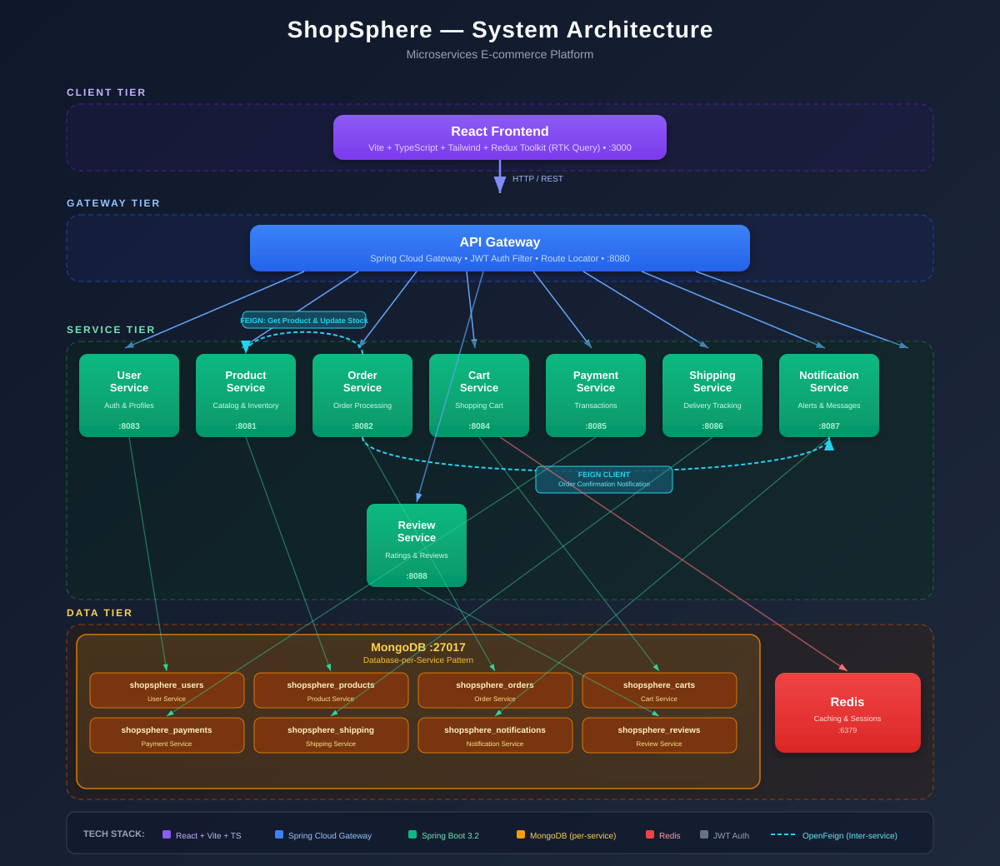
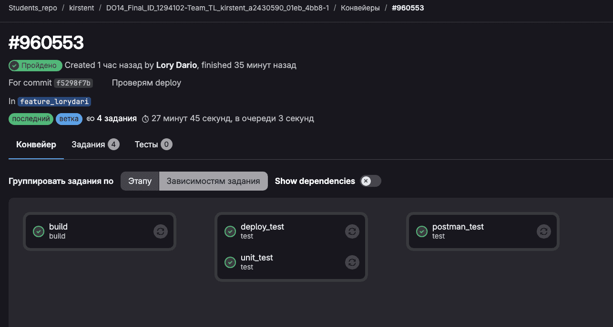
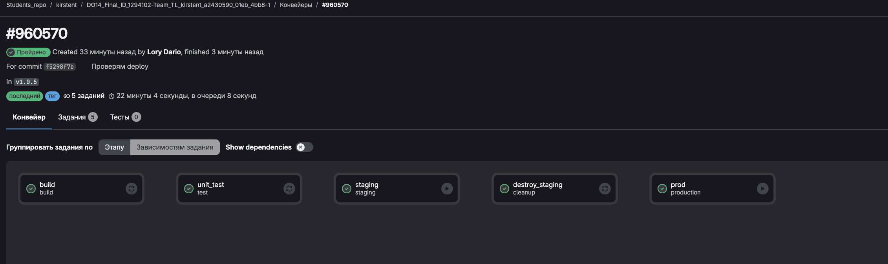
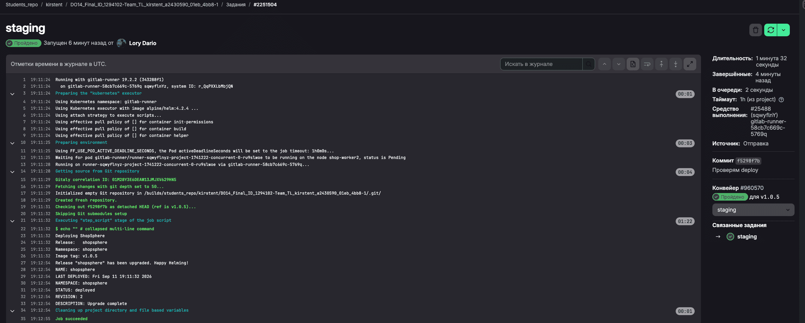
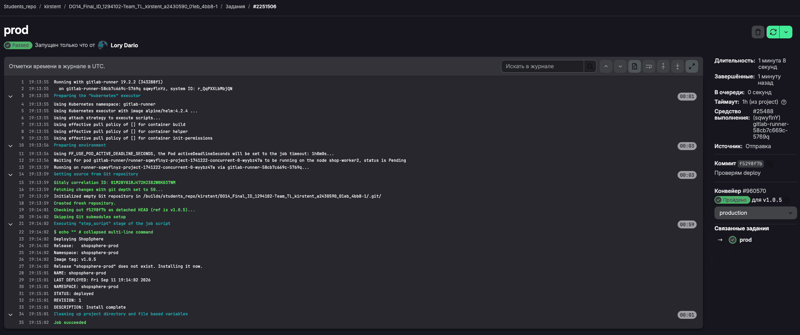

# Настройка CI и CD

## 1. Найти open-source проект на GitHub или GitLab, состоящий минимум из 3 микросервисов, сервиса с базой данных и фронтенда.

- подобрали проект на GitHub с MIT лицензией [ShopSphere---E-commerce-Microservice-Platform](https://github.com/kbhujbal/ShopSphere---E-commerce-Microservice-Platform)

- Склонировали в свой репозитарий

- Ознакомились с проектом и его структурой

### 1.1 Описание open-source проекта `ShopSphere---E-commerce-Microservice-Platform`

A production-grade e-commerce platform built with microservices architecture using Spring Boot, MongoDB, and a React frontend.

#### System Architecture

<p align="center">
  
</p>

The platform follows a **microservices architecture** where each service is independently deployable and owns its domain logic. All client requests flow through the API Gateway, which handles JWT authentication and routes to the appropriate service.

#### Services Overview

| Service | Port | Description |
|---------|------|-------------|
| **API Gateway** | 8080 | Routes requests, JWT authentication filter, rate limiting |
| **User Service** | 8083 | User registration, login, profile management, JWT token generation |
| **Product Service** | 8081 | Product catalog, inventory management, search, categories |
| **Order Service** | 8082 | Order creation, status tracking, order history |
| **Cart Service** | 8084 | Shopping cart CRUD, coupon application |
| **Payment Service** | 8085 | Payment processing, transaction records |
| **Shipping Service** | 8086 | Shipment creation, delivery tracking, status updates |
| **Notification Service** | 8087 | In-app notifications and alerts |
| **Review Service** | 8088 | Product reviews, ratings, moderation |
| **React Frontend** | 3000 | Customer storefront and admin dashboard |

#### Technology Stack

##### Backend
- **Framework**: Spring Boot 3.2.3 (Java 17)
- **API Gateway**: Spring Cloud Gateway
- **Inter-Service Communication**: Spring Cloud OpenFeign
- **Database**: MongoDB
- **Caching**: Redis
- **Authentication**: JWT (JSON Web Tokens)
- **Build Tool**: Maven
- **Mapping**: MapStruct
- **API Docs**: OpenAPI / Swagger

##### Frontend
- **Framework**: React 18 + TypeScript
- **Build Tool**: Vite
- **Styling**: Tailwind CSS
- **State Management**: Redux Toolkit (RTK Query)
- **Routing**: React Router v6
- **Icons**: Lucide React

#### Prerequisites

- JDK 17
- Maven
- Node.js 18+
- MongoDB
- Redis

### 1.2. Архитектура инфраструктуры

```
Спланируем архитектуры так:
HomeServer
│
├── shopsphere-master
│   ├── 2 CPU
│   ├── 2 GiB RAM
│   └── 20 GiB disk
│
├── shopsphere-worker-1
│   ├── 3 CPU
│   ├── 4 GiB RAM
│   └── 35 GiB disk
│
└── shopsphere-worker-2
    ├── 3 CPU
    ├── 4 GiB RAM
    └── 35 GiB disk
```

### 1.3. Развертывание Виртуальных машин

В качестве провайдера выберем [multipass от Canonical](https://canonical.com/multipass)
Multipass отвечает только за создание VM.
Сделаем воспроизводимую конфигурацию.

```
infrastructure/multipass/
|
└── create.sh
```
[create_vm.sh](./infrastructure/multipass/create_vm.sh)

```bash
# Развернем 3 vm машины

./infrastructure/multipass/create_vm.sh

Name                    State             IPv4             Image
shop-master             Running           10.181.19.10    Ubuntu 22.04 LTS
shop-worker1            Running           10.181.19.240    Ubuntu 22.04 LTS
shop-worker2            Running           10.181.19.41    Ubuntu 22.04 LTS
```

- скопируем ключи
```bash
ssh-keyscan -H 10.181.19.10 >> ~/.ssh/known_hosts
ssh-keyscan -H 10.181.19.240 >> ~/.ssh/known_hosts
ssh-keyscan -H 10.181.19.41 >> ~/.ssh/known_hosts
```

### 1.4. Настройка Виртуальных машин - Ansible (роли) 

- Установка Ansible и создание inventory-файла
[inventory-файла](./infrastructure/ansible/inventory/hosts.ini)

- Проверили доступность подключением модулем ping
```bash
ansible -i inventory/hosts.ini all -m ping
```
- Ответ:
```
shop-master | SUCCESS => {
    "changed": false,
    "ping": "pong"
}
shop-worker1 | SUCCESS => {
    "changed": false,
    "ping": "pong"
}
shop-worker2 | SUCCESS => {
    "changed": false,
    "ping": "pong"
}
```

- Создали роли и playbook

```
tree ./*
./common
└── tasks
    └── main.yml
./k3s_agent
└── tasks
    └── main.yml
./k3s_server
└── tasks
    └── main.yml
./kubeconfig
└── tasks
./playbook.yaml
```

- Запустили playbook ansible

```bash
ansible-playbook -i inventory/hosts.ini playbook.yaml
```
```
PLAY [Prepare all Kubernetes nodes] *****************************************************************************************************************************

TASK [Gathering Facts] ******************************************************************************************************************************************
ok: [shop-master]
ok: [shop-worker1]
ok: [shop-worker2]

TASK [common : Update apt cache] ********************************************************************************************************************************
changed: [shop-worker1]
changed: [shop-master]
changed: [shop-worker2]

TASK [common : Install required packages] ***********************************************************************************************************************
ok: [shop-worker2]
ok: [shop-master]
ok: [shop-worker1]

PLAY [Install K3s server] ***************************************************************************************************************************************

TASK [Gathering Facts] ******************************************************************************************************************************************
ok: [shop-master]

TASK [k3s_server : Check whether K3s server is already installed] ***********************************************************************************************
ok: [shop-master]

TASK [k3s_server : Install K3s server] **************************************************************************************************************************
changed: [shop-master]

TASK [k3s_server : Ensure K3s server is enabled and running] ****************************************************************************************************
ok: [shop-master]

TASK [k3s_server : Wait for K3s node token] *********************************************************************************************************************
ok: [shop-master]

TASK [k3s_server : Read K3s node token] *************************************************************************************************************************
ok: [shop-master]

TASK [k3s_server : Show K3s server status] **********************************************************************************************************************
ok: [shop-master]

TASK [k3s_server : Display K3s nodes] ***************************************************************************************************************************
ok: [shop-master] => {
    "k3s_nodes.stdout": "NAME          STATUS   ROLES    AGE   VERSION        INTERNAL-IP    EXTERNAL-IP   OS-IMAGE             KERNEL-VERSION               CONTAINER-RUNTIME\nshop-master   Ready    <none>   1s    v1.36.4+k3s1   10.181.19.10   <none>        Ubuntu 22.04.5 LTS   5.15.0-190-generic (amd64)   containerd://2.3.4-k3s1.36"
}

PLAY [Install K3s agents] ***************************************************************************************************************************************

TASK [Gathering Facts] ******************************************************************************************************************************************
ok: [shop-worker1]
ok: [shop-worker2]

TASK [k3s_agent : Check whether K3s agent is already installed] *************************************************************************************************
ok: [shop-worker1]
ok: [shop-worker2]

TASK [k3s_agent : Install K3s agent] ****************************************************************************************************************************
changed: [shop-worker1]
changed: [shop-worker2]

TASK [k3s_agent : Ensure K3s agent is enabled and running] ******************************************************************************************************
ok: [shop-worker2]
ok: [shop-worker1]

PLAY [Configure kubeconfig] *************************************************************************************************************************************

TASK [Gathering Facts] ******************************************************************************************************************************************
ok: [shop-master]

TASK [kubeconfig : Get K3s kubeconfig] **************************************************************************************************************************
ok: [shop-master]

TASK [kubeconfig : Create .kube directory] **********************************************************************************************************************
changed: [shop-master -> localhost]

TASK [kubeconfig : Save kubeconfig locally] *********************************************************************************************************************
changed: [shop-master -> localhost]

PLAY [Verify Kubernetes cluster] ********************************************************************************************************************************

TASK [Gathering Facts] ******************************************************************************************************************************************
ok: [shop-master]

TASK [Get Kubernetes nodes] *************************************************************************************************************************************
ok: [shop-master]

TASK [Display Kubernetes nodes] *********************************************************************************************************************************
ok: [shop-master] => {
    "kubernetes_nodes.stdout": "NAME           STATUS   ROLES           AGE   VERSION        INTERNAL-IP     EXTERNAL-IP   OS-IMAGE             KERNEL-VERSION            CONTAINER-RUNTIME\nshop-master    Ready    control-plane   55s   v1.36.4+k3s1   10.181.19.10    <none>        Ubuntu 22.04.5 LTS   5.15.0-190-generic (amd64)   containerd://2.3.4-k3s1.36\nshop-worker1   Ready    <none>          32s   v1.36.4+k3s1   10.181.19.240   <none>        Ubuntu 22.04.5 LTS   5.15.0-190-generic (amd64)   containerd://2.3.4-k3s1.36\nshop-worker2   Ready    <none>          6s    v1.36.4+k3s1   10.181.19.41    <none>        Ubuntu 22.04.5 LTS   5.15.0-190-generic (amd64)   containerd://2.3.4-k3s1.36"
}

TASK [Get Kubernetes pods] **************************************************************************************************************************************
ok: [shop-master]

TASK [Display Kubernetes pods] **********************************************************************************************************************************
ok: [shop-master] => {
    "kubernetes_pods.stdout": "NAMESPACE     NAME                                      READY   STATUS              RESTARTS     AGE\nkube-system   coredns-54996dc9b4-qgxs2                  1/1     Running             0            49s\nkube-system   helm-install-traefik-crd-xkfmv            1/1     Running             0          48s\nkube-system   helm-install-traefik-rwvrs                1/1     Running             1 (2s ago)   49s\nkube-system   local-path-provisioner-77b9867795-rsbps   1/1     Running             0            49s\nkube-system   metrics-server-6dc596dfb8-rk7gj           0/1     ContainerCreating   0            49s"
}

PLAY RECAP ******************************************************************************************************************************************************
shop-master                : ok=20   changed=4    unreachable=0    failed=0    skipped=0    rescued=0    ignored=0   
shop-worker1               : ok=7    changed=2    unreachable=0    failed=0    skipped=0    rescued=0    ignored=0   
shop-worker2               : ok=7    changed=2    unreachable=0    failed=0    skipped=0    rescued=0    ignored=0 
```


## 2. Если необходимо, написать докерфайлы для выбранного проекта.


### 2.1. Что сделали для проверки сборки проекта

*1.* **Проверили исходный проект из архива** и установили, что это Maven multi-module проект. Корневой `pom.xml` собирает общий модуль `common` и 9 микросервисов.

*2.* **Проверили сборку Maven.**
   Для `api-gateway` отдельно проверили effective POM:

   ```bash
   mvn help:effective-pom -DskipTests
   ```

   Команда завершилась `BUILD SUCCESS`, что подтвердило корректность Maven-конфигурации и наследования parent POM.

*3.* **Добавили Maven Wrapper**:

   ```text
   mvnw
   .mvn/wrapper/maven-wrapper.properties
   ```

   Это сделано для того, чтобы сборка была воспроизводимой и не зависела от конкретно установленной версии Maven на машине/Runner.

*4.* **Обнаружили проблему исходных Dockerfile.**
   Dockerfile отдельных сервисов предполагал сборку только в контексте самого сервиса, например:

   ```text
   api-gateway/
   ```

   Но Maven-проект использует **общий корневой parent POM и reactor**, поэтому сервис не может корректно собираться как полностью изолированный Maven-проект.

*5.* **Изменили Dockerfile всех 9 сервисов.**
   Docker build теперь использует **корень Maven-проекта как build context**:

   ```text
   DO14-ShopSphere-E-commerce-Microservice-Platform/
   ```

   В Docker-контекст попадает весь Maven reactor:

   ```text
   pom.xml
   common/
   api-gateway/
   product-service/
   order-service/
   ...
   ```

   После этого Maven может разрешить parent POM и межмодульные зависимости.

*6.* **Сборка конкретного сервиса выполняется через Maven reactor**, например:

   ```bash
   ./mvnw -pl cart-service -am clean package -DskipTests
   ```

   `-pl` выбирает нужный сервис, а `-am` добавляет необходимые зависимые модули, например `common`.

*7.* **Упростили Dockerfiles.**
   Вместо сложной/избыточной логики копирования отдельных POM и зависимостей используется стандартная схема:

   ```text
   полный Maven context
          ↓
   Maven build
          ↓
   target/*.jar
          ↓
   JRE runtime image
   ```

   Используется multi-stage build:

   ```text
   eclipse-temurin:17-jdk-alpine
             ↓
          build
             ↓
   eclipse-temurin:17-jre-alpine
             ↓
          готовый JAR
   ```

   Это разделяет окружение сборки и runtime.

*8.* **Привели версии инфраструктурных образов к фиксированным версиям** вместо `latest`:

   ```text
   mongo:8.0
   redis:7.4
   elasticsearch:8.12.1
   ```

   Цель — воспроизводимость сборки и отсутствие неожиданных изменений при обновлении `latest`.

*9.* **Исправили конфигурацию Docker Compose**, чтобы все 9 сервисов использовали единый корневой build context, но свой Dockerfile:

   ```yaml
   build:
     context: .
     dockerfile: api-gateway/Dockerfile
   ```

   и аналогично для остальных сервисов.

*10.* **Добавили `.dockerignore`**, чтобы в Docker build context не попадали `.git`, `target`, IDE-файлы, архивы и прочий мусор.

### 2.2. Результат проверки

После изменений выполнили:

```bash
docker compose build
```

- И получили:

```text
[+] Building 9/9
✔ api-gateway           Built
✔ cart-service          Built
✔ notification-service  Built
✔ order-service         Built
✔ payment-service       Built
✔ product-service       Built
✔ review-service        Built
✔ shipping-service      Built
✔ user-service          Built
```

То есть **все 9 Docker-образов backend-сервисов успешно собираются**.


Проверка сборки проекта
Проверили Maven multi-module структуру проекта и корректность pom.xml.
Добавили Maven Wrapper для воспроизводимой сборки.
Обнаружили, что исходные Dockerfile не учитывали общий Maven parent и зависимости между модулями.

Изменили Dockerfile всех 9 сервисов: теперь сборка выполняется из корня Maven-проекта с использованием общего reactor.
Использовали multi-stage Docker build: JDK для сборки → JRE для запуска.
В docker-compose.yml настроили единый корневой build context для всех сервисов.
Зафиксировали версии инфраструктурных образов MongoDB, Redis, Elasticsearch вместо latest.

Добавили .dockerignore.

Результат: docker compose build успешно собрал все 9 backend-образов.

### 2.3. Создаем Dockerfile для fronted

[fronted/Dockerfile](./shopsphere_e-commerce_microservice_platform/frontend/Dockerfile)

- Проверяем
```
docker build -t shopsphere-frontend:test -f frontend/Dockerfile .

Step 11/11 : CMD ["nginx", "-g", "daemon off;"]
 ---> Running in 1a695b509231
 ---> Removed intermediate container 1a695b509231
 ---> fd32296ef862
Successfully built fd32296ef862
Successfully tagged shopsphere-frontend:test
```

### 2.4. Проверим image и за таргетируем образы

```bash
docker images --format 'table {{.Repository}}\t{{.Tag}}\t{{.Size}}' | grep -E 'shopsphere|api-gateway|product-service|order-service|user-service|cart-service|payment-service|shipping-service|notification-service|review-service|frontend'
```

- Ответ
```
shopsphere-frontend                                                test                            94MB
shopsphere_e-commerce_microservice_platform-api-gateway            latest                          327MB
shopsphere_e-commerce_microservice_platform-order-service          latest                          361MB
shopsphere_e-commerce_microservice_platform-review-service         latest                          361MB
shopsphere_e-commerce_microservice_platform-shipping-service       latest                          361MB
shopsphere_e-commerce_microservice_platform-notification-service   latest                          364MB
shopsphere_e-commerce_microservice_platform-payment-service        latest                          379MB
shopsphere_e-commerce_microservice_platform-cart-service           latest                          361MB
shopsphere_e-commerce_microservice_platform-user-service           latest                          367MB
shopsphere_e-commerce_microservice_platform-product-service        latest                          389MB
shopsphere-api-gateway                                             test                            327MB
```

- Сделаем tag
```bash
docker tag shopsphere_e-commerce_microservice_platform-api-gateway:latest api-gateway:test
docker tag shopsphere_e-commerce_microservice_platform-product-service:latest product-service:test
docker tag shopsphere_e-commerce_microservice_platform-order-service:latest order-service:test
docker tag shopsphere_e-commerce_microservice_platform-user-service:latest user-service:test
docker tag shopsphere_e-commerce_microservice_platform-cart-service:latest cart-service:test
docker tag shopsphere_e-commerce_microservice_platform-payment-service:latest payment-service:test
docker tag shopsphere_e-commerce_microservice_platform-shipping-service:latest shipping-service:test
docker tag shopsphere_e-commerce_microservice_platform-notification-service:latest notification-service:test
docker tag shopsphere_e-commerce_microservice_platform-review-service:latest review-service:test
docker tag shopsphere-frontend:test frontend:test
```

### 2.5. Передаем образы для теста в репозитарий

- Перетаргетируем

```bash
docker tag frontend:test htclelik/frontend:test
docker tag api-gateway:test htclelik/api-gateway:test
docker tag product-service:test htclelik/product-service:test
docker tag order-service:test htclelik/order-service:test
docker tag user-service:test htclelik/user-service:test
docker tag cart-service:test htclelik/cart-service:test
docker tag payment-service:test htclelik/payment-service:test
docker tag shipping-service:test htclelik/shipping-service:test
docker tag notification-service:test htclelik/notification-service:test
docker tag review-service:test htclelik/review-service:test

# Запушим
docker push htclelik/frontend:test
docker push htclelik/api-gateway:test
docker push htclelik/product-service:test
docker push htclelik/order-service:test
docker push htclelik/user-service:test
docker push htclelik/cart-service:test
docker push htclelik/payment-service:test
docker push htclelik/shipping-service:test
docker push htclelik/notification-service:test
docker push htclelik/review-service:test
```

## 3. Если необходимо, написать модульные тесты для микросервисов с бизнес-логикой приложения.

- Дополнительно писать тесты не будем- есть модульный тест для одного сервиса 

```bash
helm test shopsphere -n shopsphere --logs
```
```
NAME: shopsphere
LAST DEPLOYED: Wed Sep  2 22:11:35 2026
NAMESPACE: shopsphere
STATUS: deployed
REVISION: 6
DESCRIPTION: Upgrade complete
TEST SUITE:     shopsphere-newman-test
Last Started:   Wed Sep  2 22:11:57 2026
Last Completed: Wed Sep  2 22:12:02 2026
Phase:          Succeeded
TEST SUITE:     shopsphere-test-connection
Last Started:   Wed Sep  2 22:12:02 2026
Last Completed: Wed Sep  2 22:12:09 2026
Phase:          Succeeded

POD LOGS: shopsphere-newman-test (newman)
newman

ShopSphere Functional Tests

❏ Public API
↳ GET products
  GET http://10.181.19.10/api/v1/products [200 OK, 295B, 44ms]
  ✓  HTTP 200
  ✓  Response is JSON
  ✓  success=true
  ✓  data is an array

↳ GET active products
  GET http://10.181.19.10/api/v1/products/active [200 OK, 295B, 14ms]
  ✓  HTTP 200
  ✓  Response is JSON
  ✓  success=true

↳ GET products page
  GET http://10.181.19.10/api/v1/products/page?page=0&size=10 [200 OK, 522B, 12ms]
  ✓  HTTP 200
  ✓  Response is JSON

❏ Authentication
↳ POST register test user
  POST http://10.181.19.10/api/v1/auth/register [200 OK, 994B, 59ms]
  ✓  HTTP 200
  ✓  Response is JSON
  ✓  success=true

↳ POST login
  POST http://10.181.19.10/api/v1/auth/login [200 OK, 982B, 58ms]
  ✓  HTTP 200
  ✓  Response is JSON
  ✓  success=true
  ✓  JWT token returned

↳ POST refresh token
  POST http://10.181.19.10/api/v1/auth/refresh [200 OK, 994B, 19ms]
  ✓  HTTP 200
  ✓  Response is JSON
  ✓  success=true
  ✓  New JWT token returned

❏ Authenticated API
↳ GET users
  GET http://10.181.19.10/api/v1/users [200 OK, 1.38kB, 14ms]
  ✓  HTTP 200
  ✓  Response is JSON

↳ GET user by id
  GET http://10.181.19.10/api/v1/users/6a9874fff92a316d57ad9bb0 [200 OK, 826B, 15ms]
  ✓  HTTP 200
  ✓  Response is JSON

↳ Create user cart
  POST http://10.181.19.10/api/v1/carts [200 OK, 467B, 16ms]
  ✓  HTTP 200
  ✓  Response is JSON
  ✓  success=true

↳ GET user cart
  GET http://10.181.19.10/api/v1/carts/user/6a9874fff92a316d57ad9bb0 [200 OK, 452B, 53ms]
  ✓  HTTP 200
  ✓  Response is JSON

↳ GET user orders
  GET http://10.181.19.10/api/v1/orders/user/6a9874fff92a316d57ad9bb0 [200 OK, 207B, 16ms]
  ✓  HTTP 200
  ✓  Response is JSON

↳ GET user notifications
  GET http://10.181.19.10/api/v1/notifications/user/6a9874fff92a316d57ad9bb0 [200 OK, 295B, 15ms]
  ✓  HTTP 200
  ✓  Response is JSON

↳ GET user reviews
  GET http://10.181.19.10/api/v1/reviews/user/6a9874fff92a316d57ad9bb0 [200 OK, 434B, 14ms]
  ✓  HTTP 200
  ✓  Response is JSON

┌─────────────────────────┬───────────────────┬──────────────────┐
│                         │          executed │           failed │
├─────────────────────────┼───────────────────┼──────────────────┤
│              iterations │                 1 │                0 │
├─────────────────────────┼───────────────────┼──────────────────┤
│                requests │                13 │                0 │
├─────────────────────────┼───────────────────┼──────────────────┤
│            test-scripts │                13 │                0 │
├─────────────────────────┼───────────────────┼──────────────────┤
│      prerequest-scripts │                13 │                0 │
├─────────────────────────┼───────────────────┼──────────────────┤
│              assertions │                35 │                0 │
├─────────────────────────┴───────────────────┴──────────────────┤
│ total run duration: 557ms                                      │
├────────────────────────────────────────────────────────────────┤
│ total data received: 4.18kB (approx)                           │
├────────────────────────────────────────────────────────────────┤
│ average response time: 26ms [min: 12ms, max: 59ms, s.d.: 18ms] │
└────────────────────────────────────────────────────────────────┘

POD LOGS: shopsphere-test-connection (wget)
{"status":"UP","groups":["liveness","readiness"]}
```

## 4. Разработать Helm-чарт для развертывания выбранного приложения.

- установка gitrunner
```
kubectl create namespace gitlab-runner
kubectl get namespace gitlab-runner
```

- Добавим конфиг для HELM kubernetes

```bash
export KUBECONFIG="$HOME/.kube/shop.yaml"
```

- Создаем секрет
```bash
# Если создаем впервые
kubectl create secret generic gitlab-runner-secret \
  -n gitlab-runner \
  --from-literal=runner-registration-token='MY_SECRET' \
  --from-literal=runner-token=''
```

- Если ошиблись и надо перезаписать токен
```bash
kubectl create secret generic gitlab-runner-secret \
  -n gitlab-runner \
  --from-literal=runner-registration-token='MY_SECRET' \
  --from-literal=runner-token=''
  --dry-run=client -o yaml \
| kubectl apply -f -
```

- Проверяем конфиг на ошибки
```bash
helm lint helm-shopsphere   --set global.image.registry=registry.example.com/shopsphere   --set global.image.tag=test
==> Linting helm-shopsphere
[INFO] Chart.yaml: icon is recommended

1 chart(s) linted, 0 chart(s) failed
```

- Строим полный шаблон helm
```bash
helm template shopsphere helm-shopsphere \
  --set global.image.registry=registry.example.com/shopsphere \
  --set global.image.tag=test \
  > /tmp/shopsphere-rendered.yaml

less /tmp/shopsphere-rendered.yaml
```

- Создаем namespace shopsphere
```bash
kubectl create namespace shopsphere

kubectl apply --dry-run=server \
  -n shopsphere \
  -f /tmp/shopsphere-rendered.yaml
```

- Обновляем конфиги и устанавливаем их
```bash
helm upgrade --install gitlab-runner \
  gitlab/gitlab-runner \
  --version 0.91.2 \
  --namespace gitlab-runner \
  --values runner-values.yaml \
  --set-file runners.config=runner-config.toml
```

- Добавляем в helm fronted

```bash
helm template shopsphere ./helm-shopsphere \
  --set global.image.registry=registry.example.com/shopsphere \
  --set global.image.tag=test \
  > /tmp/shopsphere-rendered.yaml


kubectl apply --dry-run=server \
  -n shopsphere \
  -f /tmp/shopsphere-rendered.yaml
```

- Ответ
```  
configmap/shopsphere-config created (server dry run)
persistentvolumeclaim/elasticsearch-pvc created (server dry run)
persistentvolumeclaim/mongodb-pvc created (server dry run)
persistentvolumeclaim/redis-pvc created (server dry run)
service/elasticsearch created (server dry run)
service/frontend created (server dry run)
service/mongodb created (server dry run)
service/redis created (server dry run)
service/api-gateway created (server dry run)
service/cart-service created (server dry run)
service/frontend created (server dry run)
service/notification-service created (server dry run)
service/order-service created (server dry run)
service/payment-service created (server dry run)
service/product-service created (server dry run)
service/review-service created (server dry run)
service/shipping-service created (server dry run)
service/user-service created (server dry run)
deployment.apps/api-gateway created (server dry run)
deployment.apps/cart-service created (server dry run)
deployment.apps/frontend created (server dry run)
deployment.apps/notification-service created (server dry run)
deployment.apps/order-service created (server dry run)
deployment.apps/payment-service created (server dry run)
deployment.apps/product-service created (server dry run)
deployment.apps/review-service created (server dry run)
deployment.apps/shipping-service created (server dry run)
deployment.apps/user-service created (server dry run)
deployment.apps/elasticsearch created (server dry run)
deployment.apps/frontend created (server dry run)
deployment.apps/mongodb created (server dry run)
deployment.apps/redis created (server dry run)
ingress.networking.k8s.io/shopsphere-ingress created (server dry run)
pod/shopsphere-test-connection created (server dry run)
```

- Пробуем собрать helm

```bash
helm upgrade --install shopsphere ./helm-shopsphere \
  -n shopsphere \
  --set global.image.registry=htclelik \
  --set global.image.tag=test
```

```bash
kubectl get pods -n shopsphere
```
```
NAME                                    READY   STATUS    RESTARTS   AGE
api-gateway-5bbdc9fdd7-hkgqn            1/1     Running   0          23m
api-gateway-5bbdc9fdd7-r5rpz            1/1     Running   0          22m
cart-service-977c5849-8fq62             1/1     Running   0          23m
cart-service-977c5849-9rrx6             1/1     Running   0          22m
elasticsearch-0                         1/1     Running   0          4m23s
frontend-6df5cffbc7-mnxrm               1/1     Running   0          55m
frontend-6df5cffbc7-vshx8               1/1     Running   0          55m
mongodb-0                               1/1     Running   0          9m
notification-service-56b67c7b6b-4v885   1/1     Running   0          22m
notification-service-56b67c7b6b-cwv4m   1/1     Running   0          23m
order-service-66574d89b5-88rsl          1/1     Running   0          22m
order-service-66574d89b5-g9nm6          1/1     Running   0          23m
payment-service-cdfb44b74-8xmqr         1/1     Running   0          23m
payment-service-cdfb44b74-l5k9v         1/1     Running   0          22m
product-service-96c44946b-6lx2j         1/1     Running   0          22m
product-service-96c44946b-kgrzt         1/1     Running   0          23m
redis-0                                 1/1     Running   0          6m37s
review-service-98785578f-jhk7m          1/1     Running   0          23m
review-service-98785578f-wht8t          1/1     Running   0          22m
shipping-service-84b9658d55-9klrf       1/1     Running   0          22m
shipping-service-84b9658d55-jh9hp       1/1     Running   0          23m
user-service-fffb57fbb-cjkmf            1/1     Running   0          23m
user-service-fffb57fbb-vhwll            1/1     Running   0          22m


===============
helm status shopsphere -n shopsphere
NAME: shopsphere
LAST DEPLOYED: Wed Sep  2 21:08:10 2026
NAMESPACE: shopsphere
STATUS: deployed
REVISION: 5
DESCRIPTION: Upgrade complete
RESOURCES:
==> v1/StatefulSet
NAME            READY   AGE
elasticsearch   1/1     2m29s
mongodb   1/1   7m6s
redis   1/1   4m43s

==> v1/Ingress
NAME                 CLASS     HOSTS              ADDRESS                                   PORTS   AGE
shopsphere-ingress   traefik   shopsphere.local   10.181.19.10,10.181.19.240,10.181.19.41   80      53m

==> v1/ConfigMap
NAME                DATA   AGE
shopsphere-config   12     53m

==> v1/PersistentVolumeClaim
NAME                STATUS   VOLUME                                     CAPACITY   ACCESS MODES   STORAGECLASS   VOLUMEATTRIBUTESCLASS   AGE
elasticsearch-pvc   Bound    pvc-d9ae421c-0f56-4063-a471-7db80bca069e   10Gi       RWO            local-path     <unset>                 53m
mongodb-pvc   Bound   pvc-310ec80a-f8b6-4344-a853-0e2da74aee44   5Gi   RWO   local-path   <unset>   53m
redis-pvc   Bound   pvc-0e34b4ed-06a8-4676-a6c7-4c5b6c4071dd   2Gi   RWO   local-path   <unset>   53m

==> v1/Service
NAME            TYPE        CLUSTER-IP    EXTERNAL-IP   PORT(S)    AGE
elasticsearch   ClusterIP   10.43.23.88   <none>        9200/TCP   53m
frontend   ClusterIP   10.43.182.255   <none>   80/TCP   53m
mongodb   ClusterIP   10.43.54.77   <none>   27017/TCP   53m
redis   ClusterIP   10.43.230.119   <none>   6379/TCP   53m
api-gateway   ClusterIP   10.43.190.215   <none>   8080/TCP   53m
cart-service   ClusterIP   10.43.215.229   <none>   8084/TCP   53m
notification-service   ClusterIP   10.43.180.43   <none>   8087/TCP   53m
order-service   ClusterIP   10.43.29.123   <none>   8082/TCP   53m
payment-service   ClusterIP   10.43.149.190   <none>   8085/TCP   53m
product-service   ClusterIP   10.43.44.64   <none>   8081/TCP   53m
review-service   ClusterIP   10.43.29.76   <none>   8088/TCP   53m
shipping-service   ClusterIP   10.43.10.134   <none>   8086/TCP   53m
user-service   ClusterIP   10.43.4.168   <none>   8083/TCP   53m

==> v1/Deployment
NAME          READY   UP-TO-DATE   AVAILABLE   AGE
api-gateway   2/2     2            2           53m
cart-service   2/2   2     2     53m
notification-service   2/2   2     2     53m
order-service   2/2   2     2     53m
payment-service   2/2   2     2     53m
product-service   2/2   2     2     53m
review-service   2/2   2     2     53m
shipping-service   2/2   2     2     53m
user-service   2/2   2     2     53m
frontend   2/2   2     2     53m

==> v1/Pod(related)
NAME                           READY   STATUS    RESTARTS   AGE
api-gateway-5bbdc9fdd7-hkgqn   1/1     Running   0          21m
api-gateway-5bbdc9fdd7-r5rpz   1/1     Running   0          20m
cart-service-977c5849-8fq62   1/1   Running   0     21m
cart-service-977c5849-9rrx6   1/1   Running   0     20m
notification-service-56b67c7b6b-4v885   1/1   Running   0     20m
notification-service-56b67c7b6b-cwv4m   1/1   Running   0     21m
order-service-66574d89b5-88rsl   1/1   Running   0     20m
order-service-66574d89b5-g9nm6   1/1   Running   0     21m
payment-service-cdfb44b74-8xmqr   1/1   Running   0     21m
payment-service-cdfb44b74-l5k9v   1/1   Running   0     20m
product-service-96c44946b-6lx2j   1/1   Running   0     20m
product-service-96c44946b-kgrzt   1/1   Running   0     21m
review-service-98785578f-jhk7m   1/1   Running   0     21m
review-service-98785578f-wht8t   1/1   Running   0     20m
shipping-service-84b9658d55-9klrf   1/1   Running   0     20m
shipping-service-84b9658d55-jh9hp   1/1   Running   0     21m
user-service-fffb57fbb-cjkmf   1/1   Running   0     21m
user-service-fffb57fbb-vhwll   1/1   Running   0     20m
frontend-6df5cffbc7-mnxrm   1/1   Running   0     53m
frontend-6df5cffbc7-vshx8   1/1   Running   0     53m
elasticsearch-0   1/1   Running   0     2m29s
mongodb-0   1/1   Running   0     7m6s
redis-0   1/1   Running   0     4m43s

==============================
kubectl get svc -n shopsphere
kubectl get ingress -n shopsphere
NAME                   TYPE        CLUSTER-IP      EXTERNAL-IP   PORT(S)     AGE
api-gateway            ClusterIP   10.43.190.215   <none>        8080/TCP    34m
cart-service           ClusterIP   10.43.215.229   <none>        8084/TCP    34m
elasticsearch          ClusterIP   10.43.23.88     <none>        9200/TCP    34m
frontend               ClusterIP   10.43.182.255   <none>        80/TCP      34m
mongodb                ClusterIP   10.43.54.77     <none>        27017/TCP   34m
notification-service   ClusterIP   10.43.180.43    <none>        8087/TCP    34m
order-service          ClusterIP   10.43.29.123    <none>        8082/TCP    34m
payment-service        ClusterIP   10.43.149.190   <none>        8085/TCP    34m
product-service        ClusterIP   10.43.44.64     <none>        8081/TCP    34m
redis                  ClusterIP   10.43.230.119   <none>        6379/TCP    34m
review-service         ClusterIP   10.43.29.76     <none>        8088/TCP    34m
shipping-service       ClusterIP   10.43.10.134    <none>        8086/TCP    34m
user-service           ClusterIP   10.43.4.168     <none>        8083/TCP    34m

NAME                 CLASS     HOSTS              ADDRESS                                   PORTS   AGE
shopsphere-ingress   traefik   shopsphere.local   10.181.19.10,10.181.19.240,10.181.19.41   80      34m
```

```bash
curl -i -H 'Host: shopsphere.local' http://10.181.19.10/
```
```
HTTP/1.1 200 OK
Accept-Ranges: bytes
Content-Length: 455
Content-Type: text/html
Date: Wed, 02 Sep 2026 17:51:21 GMT
Etag: "6a985269-1c7"
Last-Modified: Wed, 02 Sep 2026 16:44:25 GMT
Server: nginx/1.31.4

<!doctype html>
<html lang="en">
  <head>
    <meta charset="UTF-8" />
    <link rel="icon" type="image/svg+xml" href="/vite.svg" />
    <meta name="viewport" content="width=device-width, initial-scale=1.0" />
    <title>frontend</title>
    <script type="module" crossorigin src="/assets/index-fZdJgDOS.js"></script>
    <link rel="stylesheet" crossorigin href="/assets/index-CWuVHsD3.css">
  </head>
  <body>
    <div id="root"></div>
  </body>
</html>
```
```bash
curl -i -H 'Host: shopsphere.local' http://10.181.19.10/api/v1/
```
```
HTTP/1.1 404 Not Found
Content-Length: 121
Content-Type: application/json
Vary: Origin
Vary: Access-Control-Request-Method
Vary: Access-Control-Request-Headers
Date: Wed, 02 Sep 2026 17:51:32 GMT

{"timestamp":"2026-09-02T17:51:32.581+00:00","path":"/api/v1/","status":404,"error":"Not Found","requestId":"511001d9-1"}
----
kubectl get pods -n shopsphere -o wide
NAME                                    READY   STATUS    RESTARTS   AGE     IP           NODE           NOMINATED NODE   READINESS GATES
api-gateway-5bbdc9fdd7-hkgqn            1/1     Running   0          19m     10.42.1.13   shop-worker1   <none>           <none>
api-gateway-5bbdc9fdd7-r5rpz            1/1     Running   0          18m     10.42.2.17   shop-worker2   <none>           <none>
cart-service-977c5849-8fq62             1/1     Running   0          19m     10.42.2.15   shop-worker2   <none>           <none>
cart-service-977c5849-9rrx6             1/1     Running   0          18m     10.42.2.18   shop-worker2   <none>           <none>
elasticsearch-0                         1/1     Running   0          32s     10.42.1.21   shop-worker1   <none>           <none>
frontend-6df5cffbc7-mnxrm               1/1     Running   0          51m     10.42.0.12   shop-master    <none>           <none>
frontend-6df5cffbc7-vshx8               1/1     Running   0          51m     10.42.1.11   shop-worker1   <none>           <none>
mongodb-0                               1/1     Running   0          5m9s    10.42.2.20   shop-worker2   <none>           <none>
notification-service-56b67c7b6b-4v885   1/1     Running   0          18m     10.42.1.20   shop-worker1   <none>           <none>
notification-service-56b67c7b6b-cwv4m   1/1     Running   0          19m     10.42.1.14   shop-worker1   <none>           <none>
order-service-66574d89b5-88rsl          1/1     Running   0          18m     10.42.0.16   shop-master    <none>           <none>
order-service-66574d89b5-g9nm6          1/1     Running   0          19m     10.42.2.16   shop-worker2   <none>           <none>
payment-service-cdfb44b74-8xmqr         1/1     Running   0          19m     10.42.0.13   shop-master    <none>           <none>
payment-service-cdfb44b74-l5k9v         1/1     Running   0          18m     10.42.1.18   shop-worker1   <none>           <none>
product-service-96c44946b-6lx2j         1/1     Running   0          18m     10.42.1.19   shop-worker1   <none>           <none>
product-service-96c44946b-kgrzt         1/1     Running   0          19m     10.42.1.15   shop-worker1   <none>           <none>
redis-0                                 1/1     Running   0          2m46s   10.42.2.21   shop-worker2   <none>           <none>
review-service-98785578f-jhk7m          1/1     Running   0          19m     10.42.0.14   shop-master    <none>           <none>
review-service-98785578f-wht8t          1/1     Running   0          18m     10.42.2.19   shop-worker2   <none>           <none>
shipping-service-84b9658d55-9klrf       1/1     Running   0          18m     10.42.0.17   shop-master    <none>           <none>
shipping-service-84b9658d55-jh9hp       1/1     Running   0          19m     10.42.0.15   shop-master    <none>           <none>
user-service-fffb57fbb-cjkmf            1/1     Running   0          19m     10.42.1.16   shop-worker1   <none>           <none>
user-service-fffb57fbb-vhwll            1/1     Running   0          18m     10.42.1.17   shop-worker1   <none>           <none>
lorydari@homeserver:/data/workspace/projects/DO14/Devops-project$ 
```

```bash
helm list -n shopsphere
```
```
NAME            NAMESPACE       REVISION        UPDATED                                 STATUS          CHART                   APP VERSION
shopsphere      shopsphere      2               2026-09-02 20:49:28.719528039 +0300 MSK deployed        shopsphere-0.1.0        1.0.0      
```
```bash
kubectl get pvc -n shopsphere
```
```
NAME                STATUS   VOLUME                                     CAPACITY   ACCESS MODES   STORAGECLASS   VOLUMEATTRIBUTESCLASS   AGE
elasticsearch-pvc   Bound    pvc-d9ae421c-0f56-4063-a471-7db80bca069e   10Gi       RWO            local-path     <unset>     42m
mongodb-pvc         Bound    pvc-310ec80a-f8b6-4344-a853-0e2da74aee44   5Gi        RWO            local-path     <unset>     42m
redis-pvc           Bound    pvc-0e34b4ed-06a8-4676-a6c7-4c5b6c4071dd   2Gi        RWO            local-path     <unset>     42m
```

## 5. Разработать пайплайн для развертывания приложения, состоящий из четырех стадий:

### 5.1 Build

- Создаём Deploy Token на GitLab.com

GitLab прямо указывает, что для push нужны именно read_registry и write_registry [deploy-token](https://docs.gitlab.com/user/project/deploy_tokens/)

```
REGISTRY_HOST: "registry.gitlab.com"
REGISTRY_NAMESPACE: "devops-group5062834/devops-project"
```
> REGISTRY_NAMESPACE должен соответствовать реальному namespace/project в том Registry, куда мы пушим.
> Например, если в GitLab.com есть проект:
`gitlab.com/devops-group5062834/Devops-project`

> то Registry-путь обычно:
`registry.gitlab.com/devops-group5062834/devops-project`

```
Username: registry-ci
Token: glrt-xxxxxxxxxxxxxxxx
```
- Храним его в Kubernetes

Когда Deploy Token создан, на homeserver выполним:
```bash
kubectl create secret docker-registry gitlab-com-registry \
  -n gitlab-runner \
  --docker-server=registry.gitlab.com \
  --docker-username='ТВОЙ_DEPLOY_TOKEN_USERNAME' \
  --docker-password='ТВОЙ_DEPLOY_TOKEN'
```

После создания можем проверить только наличие Secret:
```bash
kubectl get secret gitlab-com-registry -n gitlab-runner
```
```
NAME                  TYPE                             DATA   AGE
gitlab-com-registry   kubernetes.io/dockerconfigjson   1      52s
```
```
[[runners.kubernetes.volumes.secret]]
      name = "gitlab-com-registry"
      mount_path = "/home/user/.docker"
      read_only = true

      [runners.kubernetes.volumes.secret.items]
        ".dockerconfigjson" = "config.json"
```
- Перезапуск

```bash
helm upgrade --install gitlab-runner \
  gitlab/gitlab-runner \
  --version 0.91.2 \
  --namespace gitlab-runner \
  --values infrastructure/gitlab-runner/runner-values.yaml \
  --set-file runners.config=infrastructure/gitlab-runner/config.toml
```
```
kubectl rollout status deployment/gitlab-runner -n gitlab-runner
kubectl get pods -n shopsphere -o wide
```
### 5.2. Test

- Добавляем права
```
infrastructure/gitlab-runner/shopsphere-deploy-rbac.yaml

kubectl apply -f infrastructure/gitlab-runner/shopsphere-deploy-rbac.yaml
role.rbac.authorization.k8s.io/gitlab-runner-shopsphere-deployer created
rolebinding.rbac.authorization.k8s.io/gitlab-runner-shopsphere-deployer created

kubectl auth can-i list secrets \
  --as=system:serviceaccount:gitlab-runner:default \
  -n shopsphere
yes

kubectl auth can-i create deployments \
  --as=system:serviceaccount:gitlab-runner:default \
  -n shopsphere
```

### 5.3. Деплой тест

```bash
kubectl get secret gitlab-com-registry \
  -n gitlab-runner \
  -o json \
| jq 'del(.metadata.namespace,.metadata.uid,.metadata.resourceVersion,.metadata.creationTimestamp,.metadata.managedFields)' \
| jq '.metadata.namespace="shopsphere"' \
| kubectl apply -f -
```
Кратко:

1. **Secret `gitlab-com-registry` в `gitlab-runner`** уже использовался Runner'ом для авторизации в GitLab Container Registry во время CI build/push.

2. Мы **скопировали этот Secret в `shopsphere`**, потому что Kubernetes Secret действует только в своём namespace. Приложения в `shopsphere` не могли использовать Secret из `gitlab-runner`.

3. В Helm `values.yaml` добавили:

```yaml
global:
  imagePullSecrets:
    - gitlab-com-registry
```

4. В **backend `deployment.yaml`** и **frontend `frontend-deployment.yaml`** добавили `imagePullSecrets`, чтобы Pod'ы ShopSphere могли аутентифицироваться в:

```text
registry.gitlab.com/devops-group5062834/devops-project
```

5. `helm template` проверил, что Secret реально попадает во **все 10 Deployment'ов**.

6. **`config.toml` Runner не меняли**, потому что он отвечает за CI job Pod'ы, а не за Pod'ы самого ShopSphere.

7. **`IMAGE_TAG` не меняли** — он был рабочим. Pipeline по-прежнему сам использует `$CI_COMMIT_SHORT_SHA` для feature-ветки.

### Итог

Было:

```text
GitLab Runner
    ↓
gitlab-com-registry
    ↓
registry.gitlab.com
```

но:

```text
ShopSphere Pod
    ↓
shopsphere namespace
    ↓
❌ нет registry Secret
    ↓
ImagePullBackOff / не может скачать приватный образ
```

Стало:

```text
ShopSphere Pod
    ↓
imagePullSecrets
    ↓
gitlab-com-registry
    ↓
registry.gitlab.com
    ↓
    может скачать приватный образ
```

То есть мы **не переделывали CI/CD**, а дали уже развёрнутому приложению доступ к тому же приватному Registry.


### 5.3. STAGING

- Добавили STAGING

```yaml
# STAGING
# Manual only, TAG pipeline only
staging:
  extends: .deploy_template
  stage: staging

  variables:
    RELEASE_NAME: "shopsphere"
    NAMESPACE: "shopsphere"
    IMAGE_TAG: "$CI_COMMIT_TAG"

  needs:
    - unit_test

  rules:
    - if: '$CI_COMMIT_TAG'
      when: manual
```


### 5.4. PRODUCTION

- Добавили PRODUCTION

```yaml
# PRODUCTION
# Manual only, TAG pipeline only
prod:
  extends: .deploy_template

  stage: production

  variables:
    RELEASE_NAME: "shopsphere-prod"
    NAMESPACE: "shopsphere-prod"
    IMAGE_TAG: "$CI_COMMIT_TAG"

  needs:
    - staging

  rules:
    - if: '$CI_COMMIT_TAG'
      when: manual

```

- Настроим права RBAC для namespaces  `shopsphere-prod`

[role for  shopsphere-prod](./infrastructure/gitlab-runner/shopsphere-deploy-rbac.yaml)

- Создадим namespaces и прмиеним права( в будуще лучше сразу прописывать права в ansible)
```bash
kubectl create namespace shopsphere-prod
```
```
namespace/shopsphere-prod created`
```

```bash
kubectl apply -f infrastructure/gitlab-runner/shopsphere-deploy-rbac.yaml
```
```
role.rbac.authorization.k8s.io/gitlab-runner-shopsphere-deployer unchanged
rolebinding.rbac.authorization.k8s.io/gitlab-runner-shopsphere-deployer unchanged
role.rbac.authorization.k8s.io/gitlab-runner-shopsphere-deployer created
rolebinding.rbac.authorization.k8s.io/gitlab-runner-shopsphere-deployer created
```

Мы **уже предусмотрели правильную схему** для `gitlab-com-registry`:

```text
gitlab-runner
    │
    └── gitlab-com-registry
             │
             ├── shopsphere
             │
             └── добавить → shopsphere-prod
```

И Helm уже ожидает:

```yaml
global:
  imagePullSecrets:
    - gitlab-com-registry
```

Сначала исправляем **только инфраструктурное состояние production**

1. Скопировать registry Secret

```bash
kubectl get secret gitlab-com-registry \
  -n gitlab-runner \
  -o json \
| jq 'del(.metadata.namespace,.metadata.uid,.metadata.resourceVersion,.metadata.creationTimestamp,.metadata.managedFields)' \
| jq '.metadata.namespace="shopsphere-prod"' \
| kubectl apply -f -
```

Проверяем:

```bash
kubectl get secret gitlab-com-registry -n shopsphere-prod
```

Ожидаем:

```text
NAME                  TYPE                             DATA
gitlab-com-registry   kubernetes.io/dockerconfigjson   1
```

2. Скопировать `shopsphere-secrets`

Копируем `shopsphere-secrets` из `shopsphere` в `shopsphere-prod`

```bash
kubectl get secret shopsphere-secrets \
  -n shopsphere \
  -o json \
| jq 'del(.metadata.namespace,.metadata.uid,.metadata.resourceVersion,.metadata.creationTimestamp,.metadata.managedFields)' \
| jq '.metadata.namespace="shopsphere-prod"' \
| kubectl apply -f -
```

Проверяем:

```bash
kubectl get secret shopsphere-secrets -n shopsphere-prod
```

Ожидаем:

```text
NAME                TYPE     DATA
shopsphere-secrets  Opaque    8
```

Проверяем, что оба Secret'а действительно доступны:

```bash
kubectl get secrets -n shopsphere-prod
```

и затем состояние production:

```bash
kubectl get pods -n shopsphere-prod
```

## 6. Настроить CI/CD для развертывания приложения с помощью GitLab Runner в Kubernetes.

Запустили pipeline для развертывания приложения с помощью GitLab Runner в Kubernetes
все jobs со статусом succes






